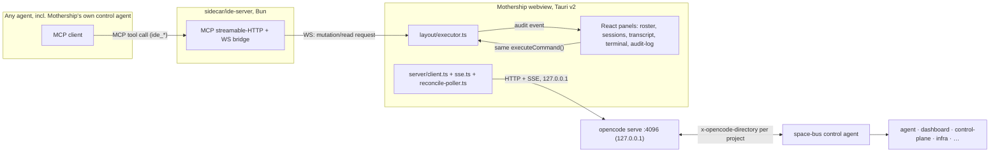

# mothership — Architecture

How Mothership works and why it's shaped this way. For where things live, see `STRUCTURE.md`. For the non-negotiable rules this document explains, see `AGENTS.md`.

## Thesis

Mothership is a **renderer for the bus**. `opencode serve` owns all agent state — sessions, transcripts, questions, agent memory. Mothership owns UI state only: layout, panel preferences, audit log of who moved what. It never calls an LLM; natural language becomes typed commands handled by whatever agent received it. Every network call the app makes — to `opencode serve`, to the `ide_*` sidecar, to space-bus — stays on `127.0.0.1`/`::1`. There is no telemetry and no off-machine call at runtime.

That framing resolves most design questions by itself: if a feature would require Mothership to remember something the server could tell it again, the feature is wrong. If a feature would require an LLM call inside the app, it belongs in an agent instead.

## Invariants, and where they live

These are stated in full in `AGENTS.md`; here's what enforces each one in code.

- **Renderer for the bus** — `src/server/session-store.ts` is a *reconcilable* cache, not a store of record: it's rebuilt from `opencode serve` responses on every reconcile tick and SSE event, never the other way around. Nothing under `src/` writes session/transcript data back to disk.
- **Layout parity** — `src/layout/executor.ts` is the single choke point: `executeCommand` is the only path that mutates the dockview instance, and both the React UI handlers and the sidecar's `ide_*` MCP tools call it. See "The typed command layer" below.
- **No embedded model** — there is no LLM client anywhere in `src/` or `src-tauri/`. The prompt bar (`src/promptbar/`) serializes structured input and dispatches it to a target agent; it does not interpret it.
- **Mechanical detection** — `src/detect/detectors.ts` and `manifest.ts` build the interface manifest from filesystem probes (package.json fields, directory shape) with no network or model calls, verified by `detectors.test.ts`.
- **Localhost only** — `src/server/client.ts` and `src/workspace/config.ts` construct URLs against the workspace's `spacebus.json`, which is itself validated to `127.0.0.1`/`::1` hosts (`workspace/config.ts`); the `ide_*` sidecar binds a loopback-only port (`ide_sidecar.rs`).
- **Sandboxed skill panels** — not yet built (MCP Apps / SEP-1865 panels are a planned panel type); when added, the panel type's `index.ts` must render skill content only inside a sandboxed iframe over postMessage, never in the main webview context.
- **Design for deletion** — each panel type under `src/panels/<type>/` is self-contained (view module + `index.ts` registration); removing a panel type means deleting its directory and its one line in `src/layout/bootstrap.ts`.
- **Tokens-only styling** — components read exclusively from `src/styles/tokens.css`; the Impeccable skill and CI's `impeccable detect` gate catch ad-hoc color literals.

## Runtime topology

Two independent flows converge on the same layout state: an external agent driving the UI through `ide_*` tools, and the human driving it through React. Both funnel through `executeCommand`. Separately, the webview talks to `opencode serve` to render live session/transcript state — that traffic never touches the `ide_*` sidecar.

## The typed command layer (layout parity)

`src/layout/commands.ts` defines a discriminated union of layout mutations (`open_panel`, `close_panel`, `split`, `focus`, `move_panel`, `set_layout`) and two reads (`list_panels`, `get_layout`), validated with a schema. `src/layout/executor.ts`'s `executeCommand` is the only function that touches the `DockviewAdapter` seam (`src/layout/adapter.ts`) wrapping dockview's imperative API.

Both callers hit the identical function:

- UI event handlers (button clicks, drag-drop) call `executeCommand` directly.
- The `ide_*` sidecar relays MCP tool calls over the WS bridge (`src/layout/bridge.ts` + `bridge-protocol.ts`) to the same `executeCommand`, tagging the source as `mcp_tool` vs `user` for the audit log.

This is why "layout parity" isn't a policy to remember — it's structural. There is no second code path to add a UI-only mutation; adding a layout command means adding one case to `commands.ts` and `executor.ts`, and it's automatically available to both callers. `registry.ts` additionally lets a panel type opt out of MCP-driven opening (`mcpOpenable: false`, used by the terminal panel — see "Sidecar security boundary" below); `executeCommand` rejects such commands from `mcp_tool` sources before they reach the adapter, including inside `set_layout` payloads that merely contain the type.

## Live-data architecture: hybrid poll + single SSE

Session/transcript state comes from `opencode serve`. The naive approach — open one `/event` SSE stream per roster project — breaks past ~6 projects: WKWebView caps HTTP/1.1 connections at roughly 6 per host, so a 6-project roster saturates the pool and starves every other REST call. `client.ts`'s `AbortSignal.timeout(30s)` then synthesizes `status:599` on the resulting hangs — the roster gets stuck "Loading", every project reports 599, transcript backfill fails. (Documented in `docs/solutions/documentation-gaps/opencode-server-sse-contract-facts-2026-07-04.md`.)

The fix, split across two mechanisms:

1. **`src/server/reconcile-poller.ts`** — every roster project is reconciled on a ~2500ms interval via short-lived REST calls (`listSessions`, `getSessionStatus`, `listQuestions`), which return their socket to the pool immediately. Projects are reconciled *sequentially* within a tick, not `Promise.all`'d — simplest way to stay under the connection cap, and sequential ticks still comfortably finish inside the interval against a loopback server. Overlapping ticks are guarded: a slow tick delays the next tick's scheduling rather than running concurrently.
2. **`DockviewShell.tsx`'s `connectActiveDirectorySse`** — exactly one live SSE stream is held open, bound to whichever project directory is currently active/focused (opencode's `/event` endpoint is directory-scoped — there's no cross-project multiplex to ask for instead). Switching the active directory tears down the old stream and opens a new one.

Combined, total concurrent connections stay at roughly 2–3 regardless of roster size, and the active project still gets sub-second event-driven updates while inactive projects get "fresh within ~2.5s" polling.

## Sidecar security boundary

`sidecar/ide-server` is a Bun process exposing 8 `ide_*` MCP tools (6 mutations, 2 reads) over MCP streamable-HTTP, bridged over WebSocket into the webview's `executeCommand`. It runs outside the Tauri sandbox, so its boundary is deliberate and layered:

- **Token rendezvous** (`src-tauri/src/ide_sidecar.rs`) — a 64-hex-char bearer token is generated per launch and passed to the child via the `MOTHERSHIP_IDE_TOKEN` env var, never argv (argv is visible to every local user via `ps`). The child reports its bound port on stdout; Rust writes `{port, token}` to a `0600` rendezvous file (`~/Library/Application Support/com.marcusrbrown.mothership/ide-bridge.json`) that external MCP clients (opencode) read to connect.
- **HTTP bearer auth** (`sidecar/ide-server/http-auth.ts`) — every request without a matching `Bearer` token gets an identical empty 401, regardless of path or method, so there's no oracle for probing which routes exist.
- **WS first-frame auth** (`sidecar/ide-server/ws-bridge.ts`) — the webview's WS connection to the sidecar is itself authenticated on the first frame before any command relaying begins.
- **Allowlist read serializers** (`sidecar/ide-server/redact.ts`) — `ide_list_panels` / `ide_get_layout` return only panel type, title, and structural position through explicit `PanelSummary`/`SafePanelEntry` shapes; raw panel state (which may carry filesystem paths) never crosses the boundary.
- **No subprocess reach** — the terminal panel is registered with `mcpOpenable: false` (`src/layout/bootstrap.ts`), and `executeCommand` enforces it. No `ide_*` call, however constructed, can open a shell.

The result: an external agent that dials `ide_*` can rearrange panels and read layout structure, and nothing else — it cannot read files, spawn processes, or see session content it doesn't already have through its own MCP session with `opencode serve`.

## Process supervision (Rust)

Two independently-supervised child processes, sharing one pattern (`src-tauri/src/supervisor_common.rs` holds the pure decision functions — restart-window math, spawn-race resolution — factored out for unit testing without spawning real processes):

- **`server_supervisor.rs`** — supervises `opencode serve`, either spawning it or adopting one already listening on `127.0.0.1:4096`. Health-probed on an interval; restarts up to `MAX_RESTARTS` within a rolling window, then gives up and surfaces a failed state rather than restart-looping forever.
- **`ide_sidecar.rs`** — the same spawn/monitor/restart shape for the Bun `sidecar/ide-server` process, plus the token rendezvous described above. `resolve_sidecar_command` picks a dev-mode source path vs. a bundled binary path depending on build type, so the same Rust code runs the sidecar from source in `bun run dev` and from a packaged binary in a release build.
- **`pty.rs`** — owns portable-pty terminal session lifecycle for the terminal panel (spawn, read/write, resize, kill), decoupled from both supervisors.

Both supervisors emit state to the frontend over Tauri events (`server_state`, equivalent for the sidecar) so the UI can show "server starting / running / failed" without polling Rust state.

## Release architecture (pointer)

macOS builds are signed and notarized, the `ide_*` sidecar ships as a packaged `externalBin`, the release build's CSP is strict (`src-tauri/tauri.release.conf.json`), and updates verify against a pinned Tauri updater public key. Signing/notarization credentials and the updater private key live only in the GitHub Actions `release` environment (required reviewers; no `pull_request`/`pull_request_target`/`workflow_run`/`workflow_call` triggers) — see `AGENTS.md`'s invariant and `docs/release/v0-1-release-runbook.md` + `docs/release/signing-key-custody.md` for the full mechanics, rollback procedure, and key custody. `docs/plans/2026-07-06-001-feat-v0-1-release-pipeline-plan.md` is the plan that shipped this pipeline.

## Boundary with space-bus

Mothership is a pure **attacher**, not a daemon manager. `src/workspace/tauri-fs.ts` calls `resolveManagedServer` from `@fro.bot/space-bus/attach` — the browser-safe half of space-bus's public surface — to find or wait for an already-managed `opencode serve`/control-agent process. space-bus owns discovery, spawning, and supervision of that managed daemon; Mothership never re-implements or second-guesses it. `src/workspace/config.ts` parses `spacebus.json` (localhost-guarded) to learn the project roster, and `src/workspace/context.ts` builds the `BusContext` the rest of the app reads from. Space-bus's own internals — how it supervises `opencode serve`, its control-agent protocol — are out of scope here; see the space-bus repository.

## See also

- `STRUCTURE.md` — where each module lives, and where to add new code.
- `AGENTS.md` — the invariants this document explains, and repo verification commands.
- `docs/brainstorms/2026-07-03-workspace-mission-control-requirements.md` — the tracer requirements (R1–R15) this architecture satisfies.
- `docs/plans/2026-07-06-001-feat-v0-1-release-pipeline-plan.md` — release pipeline plan.
