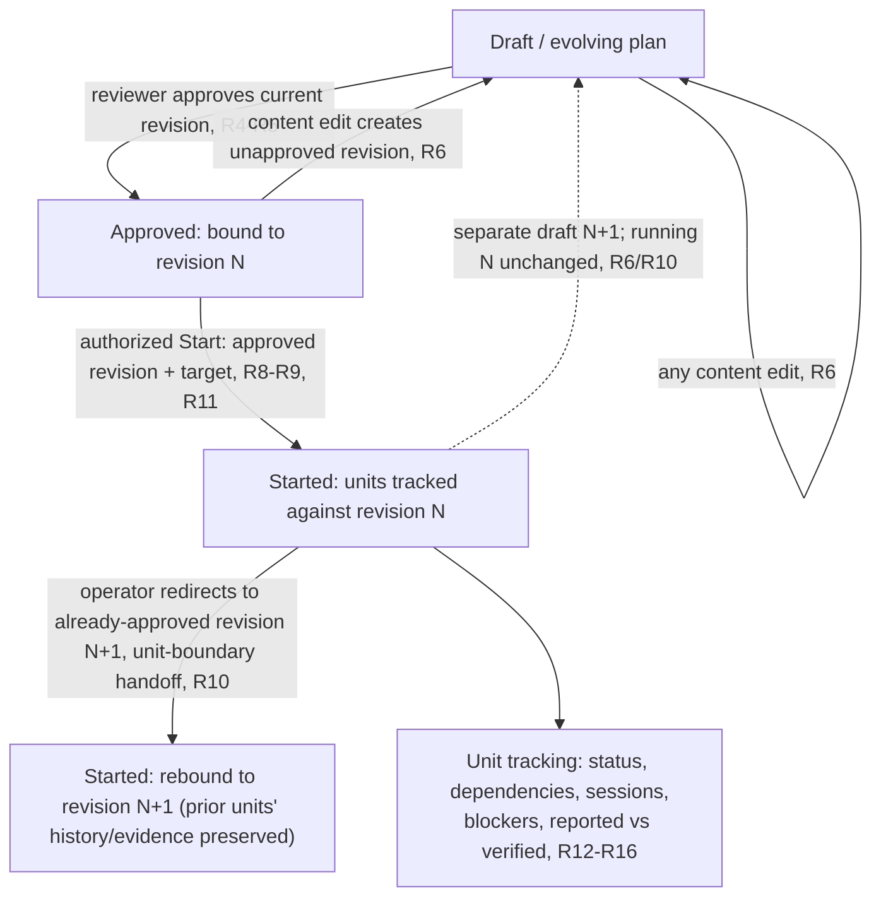

# Agent-Native Planning Lifecycle

## Summary

Mothership gains a full planning lifecycle: project Markdown plans, reviewable agent feedback, revision-bound approval, a separate Start action, and unit-level execution tracking. Humans and authorized agents use shared typed controls to inspect dependencies, linked sessions, blockers, and reported versus verified outcomes. Execution and session state remain backend-owned.

---

## Problem Frame

Plans today live as Markdown files edited by hand outside the app — the repo's own `docs/plans/*.md` convention and `ce:plan`-style workflows produce them. The original workspace requirements defer rich-text planning surfaces (R14), while the product-identity brainstorm's R18 names a "plan editor with immediate AI feedback" as a vision-tier candidate. But nothing established what a plan's lifecycle looks like once it becomes an app surface. An operator steering several concurrent agent sessions has no single place to see whether a plan was drafted, fed back on, approved, or is executing; no way to know whether the revision an agent is executing against is the one actually approved; and no way to tell an agent's self-reported "done" from a verified result. That state isn't missing — it's scattered across file edits, session transcripts, and operator memory — but Mothership provides no unified app control surface for it.

---

## Actors

- A1. Operator (human): drafts and edits plans, requests agent feedback, approves revisions, starts execution, and delegates approval or Start authority to agents.
- A2. Approving reviewer: a human or an agent with explicit approval delegation; reviews a revision and approves or withholds approval. Agent approval delegation does not confer Start authority.
- A3. Participating agents: co-author plans, provide feedback, or execute approved work and report progress. Agent approval and Start actions require their respective delegations.

---

## Key Flows

- F1. Draft and evolve a plan
  - **Trigger:** A1 creates a new plan document or opens an existing one for editing.
  - **Actors:** A1, A3 (when feedback is requested)
  - **Steps:** A1 drafts or edits plan content → A1 optionally requests agent feedback → the agent's proposed changes surface as a distinguishable, reviewable proposal — acceptable, editable, or rejectable — never a silent overwrite of A1's draft → A1 accepts, edits, or rejects the proposal, or requests another pass.
  - **Outcome:** a plan document, still plain project Markdown, reflecting the current draft state.
  - **Covered by:** R1, R2, R3

- F2. Approve a plan revision
  - **Trigger:** A1 or A2 reviews a specific plan revision and decides it is ready.
  - **Actors:** A1, A2
  - **Steps:** reviewer opens the plan at its current revision and compares it against the last-reviewed revision, if any → reviewer approves or withholds approval → approval, if given, is recorded against that exact revision → any later content edit, however small, produces a new revision requiring its own separate approval; withholding approval leaves the revision unapproved and blocks Start.
  - **Outcome:** the plan has (or lacks) a valid approval tied to one specific revision; approval by itself changes nothing about execution.
  - **Covered by:** R4, R5, R6, R7, R8

- F3. Start execution and track units
  - **Trigger:** A1, or an agent holding Start-authority delegation, chooses Start on an approved revision with a chosen execution target.
  - **Actors:** A1, A3
  - **Steps:** the Start-authorized party selects the approved revision and an execution target → Start dispatches work bound to that revision → Mothership tracks each unit's status (unstarted, running, waiting/blocked, reported finished, failed, or cancelled), its dependencies, linked agent session, and any reported blockers → verified completion — recorded evidence plus an identified verifier — attaches to a unit separately from its reported status.
  - **Outcome:** unit-level status, dependencies, blockers, and verified-versus-reported completion are visible without leaving the app; a failed, stale, or disconnected unit shows honestly as such, with its last-known state preserved and marked rather than silently updated.
  - **Covered by:** R9, R10, R11, R12, R13, R14, R15, R16

- F4. Resolve external or concurrent edits
  - **Trigger:** An external or concurrent edit conflicts with an open draft.
  - **Actors:** A1, A3
  - **Steps:** preserve both versions → compare the changes → resolve by an explicit merge or choice of content → save the resulting revision without carrying approval over changed content.
  - **Outcome:** neither version is silently discarded, and the resulting plan follows the normal approval rules.
  - **Covered by:** R17, R18

---

## Requirements

**Plan document lifecycle**

- R1. Humans and authorized agents can create, open, and edit project Markdown plans through shared UI/agent controls in Mothership.
- R2. Plan documents remain plain Markdown files on disk at all times, readable and editable with any external tool outside Mothership.
- R3. The operator can request agent feedback on a draft plan; the agent's proposed changes surface as a distinguishable, reviewable proposal — the reviewer sees the actual proposed content and can accept it, edit it, or reject it — never a silent overwrite of the operator's draft.

**Approval**

- R4. A human may approve a plan revision; an agent requires explicit approval delegation, checked when approval is invoked. Missing or revoked agent delegation blocks approval and never confers Start authority (R11).
- R5. Approval records the specific plan revision approved; it does not carry forward automatically to a later, edited revision.
- R6. Any edit to plan content creates a revision requiring its own approval before Start, including wording or typo changes. Historical approval remains attached to the revision it covered and never transfers to the changed content.
- R7. Feedback comments, review annotations, and execution-status updates do not themselves invalidate an existing approval; only edits to the plan's actual content do (R6).
- R8. Approval alone never dispatches or starts execution.

**Start and execution binding**

- R9. Starting execution requires both an approved revision and an explicitly chosen execution target; Start is a distinct, explicit action separate from approval.
- R10. Redirecting started execution work to a different revision requires the operator's explicit request and a destination revision that is itself already approved. Redirect takes effect at unit boundaries: units already running or completed under the prior revision keep their existing history and evidence untouched, while units not yet started adopt the newly bound revision. Editing the plan does not itself cancel or interrupt running work, and no unit is automatically cancelled, rolled back, or re-dispatched as a side effect of a redirect.
- R11. A human may invoke Start; an agent requires separate Start delegation, checked when invoked. Missing or revoked agent delegation blocks Start, and neither agent grant implies the other; existing bearer/session authentication is not proof of either grant.

**Unit-level execution tracking**

- R12. Mothership tracks a started plan's implementation units, their declared dependencies, and each unit's current status.
- R13. Each unit's tracked status links to the agent session executing it, when execution is underway.
- R14. Blockers and dependency relationships reported for a unit are visible against that unit, distinguishable from ordinary status, with blocking/blocked-by units linked.
- R15. Verified completion requires a passing assessment of the unit's declared acceptance criteria, with recorded evidence and an identified authorized verifier bound to that unit and revision. A self-report or unchecked log is insufficient; missing or failed verification remains unverified, and late evidence cannot qualify a different revision. Verification may be automated, human, or delegated review without a mandatory per-unit human gate.
- R16. Unit status distinguishes at minimum: unstarted, running, waiting/blocked, reported finished, failed, and cancelled — kept separate from the verified/unverified axis (R15) and from connection freshness. When Mothership loses a reliable, current observation of a unit's backend/session state, it preserves the last known status with a stale or disconnected marker rather than showing it as complete or silently updating it; a unit with no reliable observation ever recorded shows as unknown. No unit is automatically re-dispatched, replayed, or rescheduled without explicit operator action, and Mothership does not introduce its own app-owned scheduler or a per-unit Start gate — Start applies to the plan's chosen execution target, not to individual units.

**Markdown editing safety**

- R17. When a plan document changes outside Mothership while a session has it open with local unsaved edits, Mothership preserves both the external version and the local version, presents a comparison between them, and requires an explicit merge or choice of which content to save — it never silently discards either side.
- R18. Concurrent edits to the same plan document (two operator sessions, or operator and agent) are handled the same way: both versions are preserved, compared, and resolved by an explicit merge or choice, never a silent clobber. Whatever content is actually saved as a result is a new plan revision subject to the normal approval rule (R6) — resolving a conflict never carries forward a prior approval.

---

## Acceptance Examples

- AE1. **Covers R5, R6.** Given a plan approved at revision 3, when the operator makes any content edit to the plan producing revision 4 — however small — then revision 4 requires its own approval before Start, and the earlier approval of revision 3 does not carry over.
- AE2. **Covers R8, R9.** Given a plan revision that has just been approved, when approval completes, then no execution begins until the Start-authorized party separately chooses Start and an execution target.
- AE3. **Covers R4.** Given an agent session with no delegated approval authority, when it attempts to approve a plan revision, then the approval is denied.
- AE4. **Covers R7.** Given an approved plan revision, when a reviewer leaves a feedback comment or a unit's execution status updates, then the existing approval remains valid.
- AE5. **Covers R10.** Given execution started against approved revision 2, when the operator explicitly redirects to revision 3 (itself already approved), then units already running or completed under revision 2 keep their revision-2 history and evidence untouched, newly starting units adopt revision 3, and the redirect is shown as an explicit handoff between the two started states — not a reversion to "Approved."
- AE6. **Covers R16.** Given a unit whose executing agent session disconnects mid-run, when Mothership next renders that unit's status, then it shows disconnected or stale rather than complete, and nothing re-dispatches the unit automatically.
- AE7. **Covers R17.** Given a plan document open in Mothership with local unsaved edits, when the underlying file changes on disk from an external editor, then Mothership preserves both versions, shows a comparison, and requires an explicit merge or choice before anything is saved — it never silently overwrites either version.
- AE8. **Covers R15.** Given a unit an agent reports as "done," when no automated check, human, or delegated reviewer has recorded verification evidence for it, then the unit remains shown as reported-finished but not verified.
- AE9. **Covers R4, R11.** Given an agent holding delegated approval authority but no delegated Start authority, when it attempts to Start execution on a revision it validly approved, then Start is denied even though its approval remains valid.
- AE10. **Covers R4, R9, R11.** Given a human operator reviewing a plan, when they approve it and later choose Start with an execution target, then no agent-delegation grant is required for those human actions.
- AE11. **Covers R15.** Given a recorded verification failure with an identified verifier, when the result is displayed, then the unit remains unverified despite having an evidence record.
- AE12. **Covers R18.** Given concurrent operator and agent edits to the same plan, when a save conflict is detected, then both versions remain available until an explicit resolution determines the saved content; changed content requires its own approval.

---

## Success Criteria

- The operator can move a plan from blank draft, through feedback and approval, to Start and tracked unit completion, entirely inside Mothership, with the current approval/execution state legible at every step.
- A downstream planner or implementer can read this document without inventing who may approve, who may Start, what either requires beyond the other, how conflicting edits are surfaced, or how reported-versus-verified completion is distinguished.

---

## Scope Boundaries

- Not a general-purpose code editor: plan editing is scoped to plan/requirements-style Markdown documents, not arbitrary source files.
- Not an MCP App host: plan surfaces are native Mothership panels, not sandboxed skill-provided UI.
- Not an automation-flow designer (n8n-style): execution units are tracked, not visually orchestrated as a flow graph.
- Release packaging and the #19 Impeccable in-session feedback hook are separate tracks, not covered here.
- No new execution engine or replacement backend: actual execution and session state remain backend-owned. Plan-unit structure and associations are plan data; the technical plan must establish the backend support needed for tracking rather than assume it already exists.
- No per-unit mandatory human-approval gate: plan-revision approval (R4-R8) applies to the whole revision, not each unit's execution; per-unit completion verification (R15) is a separate, narrower check that also does not require a human specifically.
- No remote/cloud collaboration product scope, and no new paid-tier or licensing decisions.

---

## Key Decisions

- Approval binds to a reviewed revision, not to the plan's identity: changed content needs new approval while the earlier approval remains historical evidence.
- Humans may approve and Start; agents need separate per-action delegations checked when invoked. Approval alone never triggers execution.
- Feedback annotations and execution-status updates never invalidate approval; only edits to the plan's actual content do, so routine status churn doesn't force repeated review loops.
- Redirecting started work to a new revision requires the destination already be approved, adopts at unit boundaries, and never rolls back the running work's displayed state to "Approved" or cancels/replays units as a side effect.
- "Verified" requires a passing assessment with evidence and an identified authorized verifier bound to the unit and revision; recording a failed result does not make the unit verified.

---

## Dependencies / Assumptions

- Relies on the existing `ide_*` session-control surface (dispatch, transcript reads, pending questions) as the mechanism for linking tracked units to live agent sessions; this document does not propose a new backend session model, and does not assume that surface already exposes all the unit/dependency/status/evidence data this document describes — extending it is left to planning.
- Assumes the existing project-Markdown storage convention (tracer R14) as the plan format; this document does not introduce a new plan schema or file structure.
- Fine-grained agent delegation requires technical design; existing bearer/session authentication must not be assumed to supply the required per-action authority.

---

## Outstanding Questions

### Deferred to Planning

- [Affects R4, R11][Technical] How are agent identity, the applicable per-action delegation, and revocation verified at approval or Start time?
- [Affects R12][Technical] Where implementation-unit and dependency structure is parsed from within a plan document (heading convention, structural markers, etc.) is left to planning, not prescribed here.
- [Affects R15][Technical] How verification evidence is captured, transported, and stored, and what backend/session extensions are needed to attach it to a specific unit and revision, is left to planning.
- [Affects R12, R15, R16][Technical] Whether the existing `ide_*` / OpenCode session-control surface already exposes the unit, dependency, status, and evidence data this document assumes, or requires backend extensions, is not established here and is left to planning.

---

## Diagram: revision, approval, and Start binding

