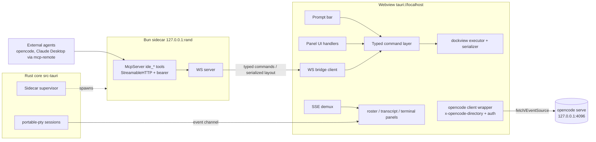

# feat: Mothership Phase 0–1 — de-risk spikes and tracer bullet

## Overview

Take the repo from spec-only (13 hand-authored files, zero app code) to the v1 tracer: a Tauri v2 shell whose dockview layout is driven by one typed command layer shared between UI handlers and an `ide_*` MCP server, reading a `spacebus.json` workspace, streaming live session state from a local opencode server over SSE, and dispatching prompts to a control agent. Phase 0 spikes retire the three load-bearing risks first; Phase 2 (Storybook panel, MCP Apps host, diff panel) is outlined for a follow-up plan.

## Problem Frame

Marcus runs a fleet of OpenCode agents coordinated by space-bus but has no operational surface: no live view of which delegates are busy or blocked, no inline steering, and no way for agents to shape their own workspace. The requirements doc (see origin) defines mission control as a renderer over `opencode serve` — the server owns all agent state; the app owns UI state only.

## Requirements Trace

| Req | Summary | Covered by |
|---|---|---|
| R1 | Tauri v2 shell; core owns process lifecycle | U0.1, U0.3 (PTY), U1.9 (`opencode serve` supervision) |
| R2 | dockview chassis, layout persists per workspace | U1.1 |
| R3 | Read-only diff-centric code view; xterm terminals | U1.4 (terminal); diff panel → Phase 2 |
| R4 | Mechanical pluggable detection, typed manifest | U1.2 |
| R5 | Detector match → panel offered per project | U1.2 (placeholder tab); real Storybook panel → Phase 2 (AE1) |
| R6 | Detection failure degrades to universal panels | U1.2 |
| R7 | `spacebus.json` roster + live per-project status | U1.2, U1.3 |
| R8 | Transcripts stream via SSE; no polling | U1.3 |
| R9 | Blocked question → needs-attention + inline answer | U1.3 (AE2) |
| R10 | MCP server with typed layout tools; UI/tool parity | U1.7 (AE3) |
| R11 | NL → `ide_*` by receiving agent; no embedded model | U1.7 (AE3) |
| R12 | MCP Apps host (SEP-1865) | Phase 2 (AE4) |
| R13 | Tiptap prompt bar, @-mentions, slash commands | U1.5, U1.6 |
| R14 | Rich-text doc surfaces round-tripping markdown | **Deferred** — not in Phase 0–2 scope |
| R15 | Localhost only, env creds, sandboxed iframes, no telemetry | Cross-cutting: U1.2 (localhost guard), U1.7 (loopback + token), U0.2 (sandbox posture) |

## Scope Boundaries

Hard boundaries from the origin doc: no writable editor, no bespoke panel format, no embedded model, no ACP, no voice, no cloud/remote workspaces, no collaboration, space-bus tool surface frozen. Additionally out of scope for this plan: Windows/Linux webview quirks (macOS-first), authenticated-SSE support (documented workaround only), multiwebview (`unstable` Tauri flag — rejected).

### Deferred to Separate Tasks

- **Claude Desktop connection**: requires embedding the bearer token in `claude_desktop_config.json` (user-readable, iCloud-backed) — conflicts with the creds-from-env invariant. Dropped from the tracer; AE3 uses an OpenCode agent (env-based token). Revisit post-tracer with a transport that avoids static config.
- **Phase 2 (Storybook panel, MCP Apps host via `@mcp-ui/client`, diff panel, polish)**: outlined under Phased Delivery; gets its own plan after the Phase 1 gate. Storybook dev-server lifecycle supervision extends U1.9's supervisor there.
- **R14 rich-text doc surfaces**: future iteration.
- **MCP SDK v2 migration**: v2 stable lands ~2026-07-28 with a codemod; contained behind the sidecar boundary.

## Context & Research

### Relevant Code and Patterns

- `fro-bot/space-bus` (local checkout at `~/src/github.com/fro-bot/space-bus`) is the proven client of the same server: `src/config.ts` (zod manifest, `~` expansion, localhost guard on `server.baseUrl`), `src/core.ts` (auth header from env, `x-opencode-directory` on every request, 30s timeouts, `redirect: "error"`, `.passthrough()` zod posture, diff fallback chain), `src/tools/bus_task.ts` (question-reply vs follow-up steering discrimination). Mirror these semantics; do not import the package.
- `design/tokens.css` → copied to `src/styles/tokens.css` in U1.1; dockview themes via `--dv-*` CSS custom properties mapped from tokens.
- `.github/workflows/ci.yaml` design-check gate arms itself the moment `src/` exists.

### Verified Server Facts (July 2026, corrects HANDOFF assumptions)

- **CORS is free**: the opencode server's hardcoded allowlist includes `tauri://localhost` / `http(s)://tauri.localhost`. No `--cors` flag, no Rust proxy needed. (Repo is now `anomalyco/opencode`, not `sst/opencode`.)
- **`GET /vcs/status` does not exist** — it's `GET /vcs` (`{branch}`) + `GET /file/status`.
- `POST /session` body is `{parentID?, title?}`; `POST /session/:id/prompt_async` takes the full PromptPayload and returns 204; `POST /question/:id/reply` body `{answers: [[string]]}` verified; `POST /question/:id/reject` also exists.
- **SSE `GET /event`**: one global stream filtered by directory; every event `{id, type, properties}` on `event: message`; first event `server.connected`; heartbeat `server.heartbeat` every 10s; `id:` set so `Last-Event-ID` resume works; no `retry:` directive (browser default ~3s). `message.part.updated` carries `delta` for streaming text (append when present; `part.text` is authoritative when absent).
- **Question-event presence on `/event` is UNVERIFIED** — `Question.Asked/Replied/Rejected` publish to the bus but weren't in the SDK-generated event union. Treat the union as open; verify live in U0.4.
- For GET/HEAD the SDK moves `x-opencode-directory` into `?directory=`; header works for other methods. Sibling `x-opencode-workspace` exists.

### Stack Facts (versions verified 2026-07-04)

- Tauri 2.11.x; `bun create tauri-app` generates Vite + `src/` + `src-tauri/`; scripts must use `bun --bun run tauri ...` (Bun CJS/ESM shim issue).
- dockview 6.6.x: `src=` iframes **reload on drag-reparent** (issue #162, open); `srcdoc` survives. `renderer: 'onlyWhenVisible'` mandatory for iframe panels (popout issue #486). `onShow`/`onHide` lifecycle hooks available (PR #1158). Theming via `--dv-*` CSS vars. Popout via `addPopoutGroup` + self-hosted `popout.html`.
- `@xterm/xterm` 6.0.0: canvas renderer removed — DOM or `@xterm/addon-webgl` only.
- `portable-pty` ^0.9 (wezterm's PTY lib) — `tauri-plugin-pty` is a thin early-stage wrapper over it.
- `@codemirror/merge` 6.12.x: `unifiedMergeView` + `EditorView.editable.of(false)` + `mergeControls: false` for read-only diffs (Phase 2).
- Tiptap v3 (3.27.x): `starter-kit`, `extension-mention`, `suggestion`, `extension-floating-menu` all MIT since June 2025; floating UI via `@floating-ui/dom`.
- `@modelcontextprotocol/sdk` 1.29.0 stable (2025-03-26 spec); v2 beta, stable expected 2026-07-28 + codemod.
- **MCP Apps verified**: SEP-1865 Final, spec version `2026-01-26` in `modelcontextprotocol/ext-apps`; `ui://` scheme, MIME `text/html;profile=mcp-app`, tools link UI via `_meta.ui.resourceUri`, sandboxed iframe mandatory, JSON-RPC over postMessage. `@mcp-ui/client` 7.x is the mature host SDK. Resolves HANDOFF's Phase 2 unknown.

### Flow Analysis (must-address items folded into units)

1. Missing `spacebus.json` → virtual single-project workspace; present-but-malformed → loud error surface, not silent fallback (U1.2).
2. SSE reconnect must trigger full reconciliation (`GET /session/status` + `GET /question`) — never trust deltas across a gap (U1.3).
3. `ide_*` mutations return the updated serialized layout, not bare success (U1.7).
4. Every panel carries project context; the fetch wrapper injects `x-opencode-directory` from it (U1.2).
5. Startup handshake: connection-status screen until the server answers (U1.2); the app spawns and owns `opencode serve` when none is running (U1.9).

## Key Technical Decisions

- **Direct webview → server networking** (fetch + native EventSource): CORS allowlist makes proxying unnecessary. Rust-core proxy rejected as solving a problem we don't have. Auth: support `OPENCODE_SERVER_PASSWORD` header injection for REST; tracer targets an unauthenticated loopback server (we control both ends); authenticated SSE documented as a known gap (EventSource can't set headers — fetch-based parser is the upgrade path if ever needed).
- **PTY: `portable-pty` directly in `src-tauri/`** (Marcus-confirmed), not `tauri-plugin-pty`. High-volume PTY output flows over a dedicated Tauri event channel; wrapped behind one `Terminal` TS interface so the choice is reversible.
- **MCP SDK v1.29.0 now** (Marcus-confirmed); migrate via codemod after v2 stabilizes.
- **`ide_*` server topology: Bun sidecar supervised by the Rust core.** The SDK's `StreamableHTTPServerTransport` needs a real HTTP listener; the command executor lives in the webview. Sidecar hosts MCP on `127.0.0.1:<OS-assigned port>` gated by a per-launch bearer token; tool handlers relay typed commands to the webview over a token-authed localhost WebSocket; the webview executes them through the same executor UI handlers use and returns the serialized layout. Rust-side rmcp rejected (stack lock); hand-rolled streamable-HTTP framing in Rust rejected (reimplements the SDK). Also considered: replacing the WS leg with Tauri IPC relayed through the Rust core — rejected because it adds a double-(de)serialization Rust hop and loses TS-to-TS shared typing of the command union; the WS bridge is the simpler sidecar topology.
- **Token and rendezvous contract (R15).** Rust core generates a cryptographically random token (32+ bytes, per launch — restart invalidates old tokens) and passes it to the sidecar via env var, never argv (`ps`-visible). Sidecar binds an OS-assigned loopback port and reports readiness + port to the Rust core on stdout; Rust writes `{port, token}` to a `0600` rendezvous file under `~/Library/Application Support/<app-id>/` (the "env-readable location" external MCP clients read) and delivers both to the webview via Tauri IPC — the token is never stored on `window` or in webview-global scope. External MCP clients read the rendezvous file; clients whose config would persist the token to disk (Claude Desktop) are out of tracer scope (see Scope Boundaries). Pre-auth HTTP requests get a uniform empty 401 regardless of path/method. WS auth: browser `WebSocket` can't set headers, so the bridge authenticates via first-frame token within a timeout — unauthenticated connections are closed before any command flows.
- **Tool set (settles the R10/HANDOFF naming drift)**: command union `open_panel | close_panel | split | focus | move_panel | set_layout` → tools `ide_open_panel`, `ide_close_panel`, `ide_split`, `ide_focus`, `ide_move_panel`, `ide_set_layout`, plus reads `ide_list_panels`, `ide_get_layout`. `ide_layout` (requirements doc spelling) is dropped in favor of the get/set pair. Read tools return project *names*, not absolute paths — filesystem paths stay on the bus's designated surface (`bus_roster`), not the UI-introspection tools. `ide_*` tools accept no file path, URL, or shell input and have zero filesystem/subprocess access; the command-union type enforces this boundary.
- **SSE posture**: treat the event union as open — switch on known `type` strings, log unknowns; reconcile on every (re)connect; parse failures skip the frame, never kill the stream. EventSource can't set headers, so the `/event` URL carries `?directory=` (the server SDK itself rewrites the header to this query param for GETs). If the server turns out to be auth-enabled (`OPENCODE_SERVER_PASSWORD` set), the startup handshake fails loud with the documented constraint — the tracer does not silently degrade.
- **iframe panels**: `renderer: 'onlyWhenVisible'` always; `srcdoc` for content we control, `src=` only for live dev servers (accepting reload-on-reparent; Phase 2 mitigates via deep-linking).
- **Config parsing**: mirror space-bus schema `{server: {baseUrl}, projects: [{name, path, description}]}` exactly, including the localhost-hostname guard (R15). Parse once at the boundary; typed thereafter.
- **Layout persistence**: dockview `toJSON()` keyed by workspace path in `localStorage` for the tracer (UI state only, per invariant); file-backed storage is a later concern.
- **Lint/test tooling**: `biome` + `bun test` + `tsc --noEmit`, following the space-bus precedent. Biome is a dev-dep addition — flagged here for Marcus's sign-off with the rest of this plan.
- **Panel deletability**: each panel type is one directory under `src/panels/` registered in a single registry map — removable in one commit (AGENTS.md invariant).

## Open Questions

### Resolved During Planning

- CORS strategy: none needed — default allowlist covers Tauri origins (verified in server source).
- MCP Apps spec identity: SEP-1865 Final, `2026-01-26`, `_meta.ui.resourceUri` (verified in spec text).
- PTY path and MCP SDK version: Marcus chose `portable-pty` in core and SDK v1.29.0.
- Diff sourcing (Phase 2): adopt space-bus fallback chain (session diff → `summary.diffs` → per-turn aggregation → working tree with caveat label), correcting the last hop to `GET /vcs` + `GET /file/status`.

### Deferred to Implementation

- Exact question-event `type` strings on `/event`: probe live in U0.4; U1.3's reconciliation makes correctness independent of the answer.
- dockview popout behavior inside WKWebView (`window.open` in Tauri): exercised in U0.2; if popout windows are broken, popout support is cut from the tracer (not load-bearing for any AE).
- Whether `bun test` needs a DOM shim for any command-layer tests: prefer restructuring to pure logic over adding a dep.
- WebSocket bridge reconnect/heartbeat cadence: heartbeat-less means per-command timeouts are the only failure detector and will false-fire on slow commands — baseline when implemented: 5s ping/pong, 2 missed pongs = dead.

## Output Structure

    mothership/
    ├── package.json              # bun --bun run tauri dev/build; typecheck/test/lint
    ├── tsconfig.json             # strict
    ├── biome.json
    ├── vite.config.ts
    ├── index.html
    ├── src/
    │   ├── main.tsx / App.tsx    # shell, startup handshake screen
    │   ├── styles/tokens.css     # copied from design/tokens.css
    │   ├── layout/               # command union, executor, persistence, dockview wrapper, panel registry
    │   ├── panels/
    │   │   ├── roster/
    │   │   ├── sessions/
    │   │   ├── transcript/
    │   │   ├── terminal/
    │   │   └── placeholder/      # manifest-driven stub tabs (Storybook etc.)
    │   ├── detect/               # manifest types + detectors (opencode, storybook)
    │   ├── server/               # opencode client wrapper, SSE demux, zod boundary types
    │   ├── workspace/            # spacebus.json parsing, workspace state
    │   └── promptbar/            # plain dispatch → Tiptap
    ├── src-tauri/                # Rust: PTY (portable-pty), sidecar supervision, window mgmt
    ├── sidecar/ide-server/       # Bun MCP server (SDK v1.29), WS bridge client types shared from src/layout
    ├── spikes/
    │   ├── 0a-iframe-stress/
    │   ├── 0b-pty/
    │   └── 0c-server-connectivity/
    └── docs/solutions/           # spike findings, YAML frontmatter

## High-Level Technical Design

> *This illustrates the intended approach and is directional guidance for review, not implementation specification. The implementing agent should treat it as context, not code to reproduce.*

Layout parity invariant made concrete: `UI handler → command` and `ide_* tool → WS → command` converge on the same executor; the executor is the only code that touches dockview's imperative API; every command execution appends to the visible audit log.

## Implementation Units

### Phase 0 — Scaffold and de-risk spikes (each spike is a STOP gate)

- [ ] **U0.1: Scaffold + verification baseline**

**Goal:** Real Tauri shell and green verification commands so spikes run in-tree and the CI design gate arms.

**Requirements:** R1 (shell), working-rules verification contract.

**Dependencies:** None. CI job additions need Marcus's ack (ask-first boundary).

**Files:**
- Create: `package.json`, `tsconfig.json`, `biome.json`, `vite.config.ts`, `index.html`, `src/main.tsx`, `src/App.tsx`, `src/styles/tokens.css`, `src-tauri/` (scaffold), `.github/workflows/ci.yaml` (extend: typecheck/lint/test jobs)

**Approach:** `bun create tauri-app` (React-TS); scripts `dev`/`build` via `bun --bun run tauri`; `typecheck: tsc --noEmit`, `test: bun test`, `lint: biome check .`; copy `design/tokens.css` → `src/styles/tokens.css` verbatim.

**Test scenarios:** Test expectation: none — scaffolding. Gate is all four verification commands passing on the fresh scaffold (impeccable detect now scans real `src/`).

**Verification:** `bun run typecheck && bun run test && bun run lint` green; `npx impeccable detect --json src` → `[]`; `bun --bun run tauri dev` opens a window on macOS.

- [ ] **U0.2: Spike 0a — webview/iframe stress (STOP gate)**

**Goal:** Prove the Tauri single-webview bet: dockview with ≥6 panels including 3 live iframes survives real manipulation.

**Requirements:** De-risks R2, R5, R12.

**Dependencies:** U0.1.

**Files:**
- Create: `spikes/0a-iframe-stress/` (runnable route/entry in the real shell), `docs/solutions/` finding doc

**Approach:** Panels: real Storybook dev server (`src=`), localhost page (`src=`), sandboxed `srcdoc` frame, plus 3 plain panels. Exercise drag/split/tab/close/popout repeatedly. Explicitly characterize: `src=` reload-on-reparent (dockview #162), `renderer: 'onlyWhenVisible'` behavior, popout viability under WKWebView, memory after closing panels (Activity Monitor before/during/after).

**Test scenarios:** Test expectation: none — spike; exit criteria are the test. Exit: no crashes, no frozen frames after re-dock, memory returns to sane baseline after closing panels.

**Verification:** Finding doc records pass/fail per exit criterion + the iframe-reload characterization. **If it fails, STOP — single-webview-iframe vs Electron fallback is Marcus's call.**

- [ ] **U0.3: Spike 0b — PTY via portable-pty (STOP gate)**

**Goal:** Working terminal: `portable-pty` in `src-tauri` streaming to `@xterm/xterm` 6 over a Tauri event channel.

**Requirements:** R1 (PTY lifecycle), R3 (terminals).

**Dependencies:** U0.1.

**Files:**
- Create: `spikes/0b-pty/`, `src-tauri/src/pty.rs` (spike-grade), `docs/solutions/` finding doc

**Approach:** Spawn shell, wire resize/kill/data; xterm 6 + `@xterm/addon-fit` + `@xterm/addon-webgl` (canvas is gone in v6). Define the `Terminal` TS interface (spawn/write/resize/kill/onData/onExit) as the reversibility seam. Measure throughput with a `yes`/large-cat burst; verify no event-channel backpressure collapse.

**Test scenarios:** Test expectation: none — spike. Exit: interactive shell usable; resize correct; process cleanup on panel close verified (no orphan PTYs in `ps`).

**Verification:** Finding doc records the decision rationale (per HANDOFF: document why plugin was skipped) and throughput observations.

- [ ] **U0.4: Spike 0c — server connectivity + SSE contract probe**

**Goal:** Live-verify the researched server contract from the actual webview origin.

**Requirements:** De-risks R7, R8, R9.

**Dependencies:** U0.1; a running `opencode serve` with the space-bus fixture workspace.

**Files:**
- Create: `spikes/0c-server-connectivity/`, `docs/solutions/` finding doc

**Approach:** From the webview: `fetch` + native `EventSource` against `127.0.0.1:4096` (expect default CORS allowlist to admit `tauri://localhost` — verify, don't assume). Tail `/event` from a real delegated session. Kill/restart the server: confirm reconnect + `Last-Event-ID` behavior and design the reconciliation trigger. **Probe question events**: drive a delegate into an interactive question and record the exact event `type` strings and shapes that appear on `/event`.

**Test scenarios:** Test expectation: none — spike. Exit: live event tail from a real delegated session; reconnect works; question-event shapes recorded (or their absence documented → reconciliation-only design confirmed).

**Verification:** Finding doc includes the recorded event-type inventory and any contract deviations from the research (report, don't reinterpret).

### Phase 1 — Tracer bullet (thin slice of F1 + F2 + F3)

- [ ] **U1.1: Typed command layer + dockview shell**

**Goal:** The one command layer both UI and MCP will call; themed dockview shell; layout persistence.

**Requirements:** R2; foundation for R10 parity.

**Dependencies:** U0.2 (spike findings shape iframe/panel policy).

**Files:**
- Create: `src/layout/commands.ts` (discriminated union), `src/layout/executor.ts`, `src/layout/persistence.ts`, `src/layout/registry.ts`, `src/layout/DockviewShell.tsx`, `src/panels/placeholder/`
- Test: `src/layout/executor.test.ts`, `src/layout/persistence.test.ts`

**Approach:** Commands as a discriminated union (`open_panel | close_panel | split | focus | move_panel | set_layout`); executor is the sole owner of dockview's imperative API and returns the serialized layout after every mutation; panel registry maps panel-type → component + default config (one dir per type, deletable in one commit); the registry contract requires every panel to define loading, empty, and error states from tokens — no panel ships happy-path-only. Persistence keyed by workspace path; dockview chrome themed from `src/styles/tokens.css` via `--dv-*` vars only. Default first-open layout (directional, refined via `/impeccable shape`): roster docked left, sessions + transcript tabbed center, terminal bottom strip, audit log as a collapsible bottom-right drawer — saved layout always wins over the default.

**Execution note:** Implement the executor test-first against a stubbed dockview adapter — the command semantics are pure logic.

**Test scenarios:**
- Happy path: each command variant → expected adapter calls and updated serialized layout returned.
- Happy path: serialize → restore round-trip preserves panels, groups, active panel.
- Edge case: restore referencing an unregistered panel type → placeholder panel, hydration continues.
- Edge case: `focus`/`close_panel` on nonexistent panel id → typed error result, no throw.
- Error path: `set_layout` with malformed layout JSON → typed error, current layout untouched.

**Verification:** Shell renders themed panels; layout survives app restart; design gate green.

- [ ] **U1.2: Workspace open (F1 minimal) + server client wrapper**

**Goal:** Open a `spacebus.json` workspace; roster and per-project session list panels; detection manifests driving placeholder tabs; startup handshake.

**Requirements:** R4, R5 (placeholder), R6, R7 (read side), R15 (localhost guard).

**Dependencies:** U1.1.

**Files:**
- Create: `src/workspace/config.ts`, `src/server/client.ts`, `src/server/types.ts`, `src/detect/manifest.ts`, `src/detect/detectors.ts`, `src/panels/roster/`, `src/panels/sessions/`, `src/App.tsx` (handshake screen)
- Test: `src/workspace/config.test.ts`, `src/detect/detectors.test.ts`, `src/server/client.test.ts`

**Approach:** Mirror space-bus `config.ts` semantics (zod, `~` expansion, localhost-hostname guard). Missing `spacebus.json` → virtual single-project workspace from the opened directory; present-but-malformed → blocking error surface with the zod message; valid-but-empty `projects: []` → roster renders an empty state pointing at the manifest (not a crash, not a silent blank shell). Client wrapper injects `x-opencode-directory` from per-panel project context on every call, `Authorization` from env if set, 30s timeout, `redirect: "error"`; responses cross zod `.passthrough()` boundaries once. Detectors: `.opencode/` presence; Storybook config (`.storybook/` dir or `storybook` in package.json) → typed manifest → placeholder tab in that project's tab set. Startup: connection-status screen until `GET /session/status` answers.

**Test scenarios:**
- Happy path: valid manifest → typed projects with `expandedPath`; roster renders all projects.
- Happy path: `.opencode/` + Storybook fixtures → manifest entries; Storybook placeholder tab offered only where detected (AE1 shape, placeholder-grade).
- Edge case: missing `spacebus.json` → single-project virtual workspace, universal panels only.
- Edge case: valid manifest with `projects: []` → roster empty state, app remains usable.
- Edge case: project path doesn't exist → roster shows MISSING PATH state, other projects unaffected.
- Error path: malformed manifest → blocking error surface, no partial workspace.
- Error path: non-localhost `baseUrl` → refusal (credentials never leave the machine).
- Integration: client wrapper sets `x-opencode-directory` per project on outgoing requests (assert on a stub server).

**Verification:** Opening the space-bus fixture workspace shows roster + session lists; undetected project shows universal panels only (R6).

- [ ] **U1.3: SSE demux + live session surfaces (F2 watch side)**

**Goal:** One `/event` connection fanned out by session; live busy/idle roster; streaming transcript; needs-attention + inline answer.

**Requirements:** R7 (live), R8, R9 (AE2).

**Dependencies:** U1.2; U0.4 findings (question-event shapes).

**Files:**
- Create: `src/server/sse.ts`, `src/server/demux.ts`, `src/panels/transcript/`, roster badge wiring
- Test: `src/server/demux.test.ts`, `src/server/sse.test.ts`

**Approach:** Native EventSource; on every (re)connect run full reconciliation (`GET /session/status` + `GET /question` + refetch open transcripts) — deltas are never trusted across a gap. Demux switches on known `type` strings, logs unknowns, skips malformed frames without killing the stream. Transcript applies `message.part.updated` deltas (append on `delta`, replace on whole `part.text`). Blocked-on-question renders a needs-attention badge (magenta emphasis token) with inline answer box; answer posts `/question/:id/reply` (`{answers: [[label]]}`), falling back to `prompt_async` follow-up when no pending question matches (space-bus steering semantics); optimistic lock (input disabled, sending state) until `session.status` confirms unblock — reply failure unlocks with a visible error and the answer preserved. Multiple pending questions render independently per session; the badge clears only when that session's pending set is empty.

**Test scenarios:**
- Happy path: status event → roster badge flips busy/idle; part-update with `delta` appends; without `delta` replaces.
- Happy path: pending question (from reconciliation or event) → badge + answer box; reply payload shape `[[label]]`.
- Edge case: reconnect after gap → reconciliation restores a question raised during the gap (AE2 resilience).
- Edge case: multiple pending questions across sessions → each tracked independently.
- Edge case: `session.deleted` for an open transcript → panel flips to read-only historical state.
- Error path: malformed event JSON → frame skipped, stream continues, diagnostic logged.
- Integration: answer → optimistic lock → `session.status` busy → badge clears (assert full state machine against a scripted event sequence).

**Verification:** AE2 against a real blocked delegate: needs-attention within one SSE cycle; inline answer unblocks; no polling loops anywhere (R8).

- [ ] **U1.4: Minimal terminal panel**

**Goal:** Promote the spike PTY into a registered `terminal` panel type so AE3's "terminal at the bottom" has a real target.

**Requirements:** R3 (terminal), R1 (PTY lifecycle).

**Dependencies:** U0.3, U1.1.

**Files:**
- Create: `src/panels/terminal/`, `src-tauri/src/pty.rs` (promoted), shared `Terminal` interface
- Test: `src/panels/terminal/terminal.test.ts` (interface-level, PTY stubbed)

**Approach:** xterm 6 + fit + webgl behind the `Terminal` interface from U0.3; PTY killed on panel close (design-for-deletion: whole dir removable); `onlyWhenVisible` renderer; pause/resume rendering on `onShow`/`onHide`.

**Test scenarios:**
- Happy path: spawn on mount, data round-trip through the interface, kill on unmount.
- Edge case: resize propagates rows/cols to the PTY.
- Error path: PTY exit → panel shows exited state, no zombie process.

**Verification:** Interactive shell in a dockview panel; close leaves no orphan PTY.

- [ ] **U1.5: Prompt bar, plain (F2 dispatch side)**

**Goal:** Dispatch prompts to the workspace control-agent session; prove the F2 loop end-to-end.

**Requirements:** R13 (dispatch semantics; plain UI).

**Dependencies:** U1.2, U1.3.

**Files:**
- Create: `src/promptbar/PromptBar.tsx`, `src/promptbar/dispatch.ts`
- Test: `src/promptbar/dispatch.test.ts`

**Approach:** Textarea; submit → create-or-reuse control session (`POST /session {title}` → `prompt_async`, expect 204) against the workspace directory; dispatched session appears in the session list and streams in the transcript panel via U1.3.

**Test scenarios:**
- Happy path: first submit creates session + sends prompt; second submit reuses the session (follow-up).
- Error path: `prompt_async` non-204 → visible dispatch failure, prompt text preserved for retry.
- Integration: dispatch → session appears in list via SSE (scripted event assertion).

**Verification:** Dogfood floor: delegate a real task to `fro-bot/dashboard` from the prompt bar and watch it stream.

- [ ] **U1.6: Tiptap prompt bar with mentions**

**Goal:** Replace the textarea with the Tiptap MIT stack; @-mentions resolve to projects/sessions.

**Requirements:** R13.

**Dependencies:** U1.5.

**Files:**
- Modify: `src/promptbar/` (Tiptap editor, mention suggestion source)
- Test: `src/promptbar/mentions.test.ts`

**Approach:** `@tiptap/react` + `starter-kit` + `extension-mention` + `suggestion` (all MIT, v3); mention items sourced from the workspace roster (projects) and live session list; serialized prompt text carries mention references the control agent can resolve; keep the dispatch layer from U1.5 unchanged.

**Test scenarios:**
- Happy path: `@` opens suggestions filtered from roster + sessions; selection inserts a mention node; serialization includes the reference.
- Edge case: mention of a project that has since disappeared from the roster → plain text degradation, dispatch not blocked.
- Happy path: Enter dispatches, Shift+Enter newlines (parity with plain bar).

**Verification:** Mentioned project/session names arrive in the dispatched prompt text; `bun run lint`/design gate green.

- [ ] **U1.7: `ide_*` MCP server (F3)**

**Goal:** Agents mutate the layout through the same command layer; every mutation visibly audited.

**Requirements:** R10, R11 (AE3), R15.

**Dependencies:** U1.1 (command layer), U0.1 (sidecar supervision scaffold in Rust).

**Files:**
- Create: `sidecar/ide-server/` (McpServer, tools, WS server), `src/layout/bridge.ts` (WS client → executor), `src-tauri/` sidecar supervision, `src/panels/` audit-log surface (toast/log panel)
- Test: `sidecar/ide-server/tools.test.ts`, `src/layout/bridge.test.ts`

**Approach:** SDK v1.29 `McpServer` + streamable HTTP per the token/rendezvous contract in Key Technical Decisions (opencode MCP config connects directly via the rendezvous file, token in the config's `env` block; Claude Desktop dropped from the tracer — see Scope Boundaries). Boot ordering: sidecar rejects tool calls with an explicit `unavailable` error until the webview bridge has authenticated — never a hang. Every dispatched command carries a sequence ID and a timeout; on WS disconnect all pending commands reject immediately (`disconnected`), so a webview reload mid-call can't orphan the sidecar. Shutdown ordering: webview saves layout and drains the bridge → sidecar stops accepting and finishes/rejects pending → Rust core reaps (SIGTERM, SIGKILL fallback). Supervision: Rust health-checks the sidecar (health endpoint true only when the WS server is accepting), restarts with a capped-retry window, and surfaces restart reason (exit code/signal) in the audit log. Tools = the eight from Key Technical Decisions; zod schemas mirror the command union; mutations relay over the WS bridge to the webview executor and return the resulting serialized layout (never bare success). Reads (`ide_list_panels`, `ide_get_layout`) serve from the same serialized state, paths redacted to project names — the disclosure boundary for read tools is: panel types, panel titles, project names, session titles; nothing else. Trust model: all bearer-holders are equally privileged in the tracer (one operator, one token); per-call/per-client approval arrives with the MCP Apps approval UI in Phase 2. Audit log entries: timestamp, source (`ui` | `mcp_tool`), tool/command name, parameter summary, result — in-memory ring buffer rendered in-app; no durable storage (R15). Rate limiting deliberately omitted for the tracer (localhost self-DoS only); revisit in Phase 2 if dogfooding shows the need.

**Test scenarios:**
- Happy path: each mutation tool → executor command → serialized layout in the tool result.
- Happy path: `ide_list_panels`/`ide_get_layout` reflect prior mutations.
- Error path: missing/wrong bearer on HTTP → uniform empty 401 regardless of path/method; unauthenticated WS first-frame → connection closed.
- Error path: mutation targeting nonexistent panel → typed tool error mirroring U1.1 semantics.
- Edge case: webview bridge disconnected → tool returns explicit unavailable error, not a hang.
- Edge case: WS drops after dispatch, before response → pending commands reject with `disconnected`, none orphaned.
- Edge case: tool call before first bridge authentication (boot window) → `unavailable`, not a hang.
- Happy path: read-tool output contains project names only, no absolute paths.
- Integration: UI-initiated and tool-initiated mutations interleave through one executor; audit log records both with source attribution.

**Verification:** From a real OpenCode agent with the server configured: "put the terminal at the bottom and open the roster beside the session list" executes via tool calls only — tool-call log captured (AE3).

- [ ] **U1.9: Minimal `opencode serve` supervision**

**Goal:** The app owns the server lifecycle — R1 closed in-phase instead of deferred.

**Requirements:** R1.

**Dependencies:** U1.2 (handshake screen is the UX surface for supervision states).

**Files:**
- Create: `src-tauri/src/server_supervisor.rs`
- Modify: `src/App.tsx` (handshake states: starting / running / restarting / failed)

**Approach:** On launch, probe `127.0.0.1:4096`; if a server already answers, adopt it (do not spawn a second — external servers are never killed on quit). Otherwise spawn `opencode serve` as a supervised child (Tauri shell sidecar/child process), restart on crash with a capped-retry window, kill owned processes on app quit. Nothing fancier: no version management, no port negotiation beyond the default, no config mutation.

**Test scenarios:**
- Happy path: no server running → app spawns one, handshake completes.
- Happy path: server already running → adopted, no spawn, quit leaves it alive.
- Error path: spawned server crashes → restart with backoff; retry cap exceeded → failed state on the handshake screen with the exit reason.
- Edge case: app quit → owned server terminated, adopted server untouched, no orphans in `ps`.

**Verification:** Launch with and without a pre-running server; both paths reach a live roster; `ps` clean after quit.

- [ ] **U1.8: Phase 1 gate — demos, docs, deviations**

**Goal:** Close the phase with evidence, not claims.

**Requirements:** Phase 1 verification contract; definition of done.

**Dependencies:** U1.1–U1.7, U1.9.

**Files:**
- Create: `docs/solutions/` entries (spike findings finalized, AE2/AE3 evidence), README rewrite (real build/run instructions)
- Modify: deviations list (R1 supervision, R14, Phase 2 items) surfaced in the final report

**Approach:** Run all four verification commands; `/impeccable audit` on the tracer UI — address or consciously defer findings; capture AE2 against a real blocked delegate and AE3's tool-call log; dogfood floor demo. Reconcile AGENTS.md's layout claim that `src-tauri/` hosts the "MCP `ide_*` server transport" — the sidecar topology moves the transport to a Bun process (Rust core owns supervision only); update AGENTS.md to match.

**Test scenarios:** Test expectation: none — verification/documentation unit.

**Verification:** `bun run typecheck` + `test` + `lint` clean; `npx impeccable detect --json src` → `[]`; AE2 + AE3 evidence captured; README accurate from a clean checkout.

## System-Wide Impact

- **Interaction graph:** one executor is the choke point for UI, WS bridge, and (later) MCP Apps-originated layout changes — any new mutation source must route through it or parity breaks (R10 invariant).
- **Error propagation:** server errors surface per-panel (roster status error, transcript fetch error) — never a global crash; SSE failures degrade to reconnect + reconciliation; sidecar death is detected by Rust supervision and surfaced in the audit log.
- **State lifecycle risks:** PTY orphaning on panel close/app quit (U1.4 owns cleanup); localStorage layout referencing dead panel types (placeholder fallback); stale session panels after `session.deleted` (read-only flip); in-flight `ide_*` commands across webview reload/app quit (seq-ID timeout + reject-on-disconnect, shutdown ordering in U1.7).
- **API surface parity:** command union changes must propagate to `ide_*` tool schemas in the same commit — shared types across `src/layout` and `sidecar/` enforce this at typecheck time.
- **Integration coverage:** the scripted-event-sequence tests in U1.3 and the interleaved-mutation test in U1.7 are the cross-layer proofs unit mocks can't give.
- **Unchanged invariants:** space-bus tool surface untouched (frozen); server owns all agent state (no session/transcript persistence in the app); no telemetry, all traffic loopback.

## Risks & Dependencies

| Risk | Mitigation |
|---|---|
| Spike 0a fails (WKWebView iframe instability) | STOP gate; fallback fork (single-webview vs Electron) is Marcus's decision, not planned around |
| Question events absent/differently-shaped on `/event` | Reconciliation-on-reconnect makes AE2 correct regardless; U0.4 records reality |
| dockview popout broken under Tauri `window.open` | Popout cut from tracer; no AE depends on it |
| opencode server API drift (repo actively renamed/reorganized) | All contracts re-verified live in U0.4; deviations reported with evidence, R-IDs never silently reinterpreted |
| `@xterm` 6 WebGL issues in WKWebView | DOM renderer is the in-place fallback (one addon swap behind the Terminal interface) |
| MCP SDK v2 lands mid-build | v1.29 pinned; sidecar boundary isolates the migration; codemod exists |
| Bun/Tauri CLI friction | `bun --bun run tauri` pinned in scripts (known-issue workaround) |
| Supervised `opencode serve` fights an externally-managed server (port contention, double-spawn) | U1.9 adopt-don't-spawn probe; owned-vs-adopted distinction governs quit behavior |
| Panel web content (`src=` dev servers, `srcdoc`) reaching the WS bridge as a rogue MCP client | Bridge is token-authed and the token never lives on `window`/globals — only inside the bridge module via Tauri IPC; skill panels stay sandboxed (R15) |
| Biome/dep additions beyond the locked stack | Enumerated in this plan for sign-off; anything else stops and asks |

## Phased Delivery

### Phase 0 → 1 (this plan)
Spikes retire the platform bets; tracer proves F1/F2/F3 thin slices with AE2 + AE3 as gates.

### Phase 2 (follow-up plan after the Phase 1 gate)
1. Storybook detector → real panel: iframe with dev-server lifecycle owned by Rust core/sidecar (supervision lands here, completing R1); AE1 is the gate.
2. MCP Apps host via `@mcp-ui/client` 7.x against spec `2026-01-26`: sandbox proxy page, per-call tool approval UI, `_meta.ui.resourceUri` linkage; AE4 is the gate. Audit whether every mutation tool should keep returning the full serialized layout once Apps-originated calls arrive in tighter loops (ack + explicit read, or layout diff, are the alternatives).
3. Diff panel: CodeMirror `unifiedMergeView` read-only, space-bus diff fallback chain (corrected `GET /vcs` + `GET /file/status` last hop), `--color-diff-*` tokens only, working-tree caveat labeling.
4. `/impeccable polish` across the app; before/after screenshots in `docs/solutions/`.

## Documentation / Operational Notes

- Every spike lands a `docs/solutions/` doc with YAML frontmatter (`module`, `tags`, `problem_type`) — that dir is created by U0.2's first finding.
- README rewritten in U1.8 with real build/run instructions (replacing the aspirational scaffold text).
- Claude Desktop intentionally unsupported in the tracer (token-in-config conflicts with creds-from-env) — external access is via OpenCode agents reading the rendezvous file/env.
- CI additions (typecheck/lint/test jobs in U0.1) touch the pipeline — flagged for Marcus's approval before landing.

## Sources & References

- **Origin document:** [docs/brainstorms/2026-07-03-workspace-mission-control-requirements.md](../brainstorms/2026-07-03-workspace-mission-control-requirements.md)
- Build sequencing contract: `HANDOFF.md`; invariants: `AGENTS.md`; design context: `PRODUCT.md`, `DESIGN.md`
- space-bus reference implementation: `~/src/github.com/fro-bot/space-bus` (`src/config.ts`, `src/core.ts`, `src/tools/`)
- opencode server: https://opencode.ai/docs/server/ ; CORS allowlist in `packages/server/src/cors.ts` (anomalyco/opencode, dev branch)
- dockview: https://dockview.dev/ ; iframe issues #162, #486; lifecycle PR #1158
- MCP Apps: https://modelcontextprotocol.io/seps/1865-mcp-apps-interactive-user-interfaces-for-mcp ; spec `modelcontextprotocol/ext-apps` `specification/2026-01-26/apps.mdx`
- MCP TS SDK: https://github.com/modelcontextprotocol/typescript-sdk (v1.29.0; v2 beta timeline)
- xterm 6 release notes: https://github.com/xtermjs/xterm.js/releases/tag/6.0.0
- Tiptap v3 MIT boundary: https://tiptap.dev/blog/release-notes/were-open-sourcing-more-of-tiptap
