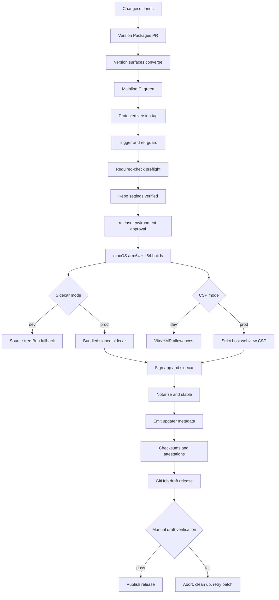
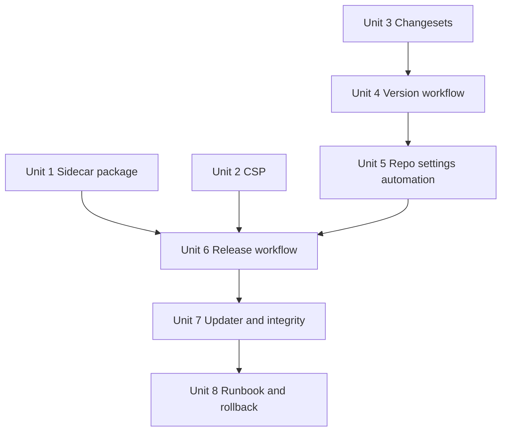

# feat: Build the v0.1 release pipeline

## Overview

This plan turns the release-blocking infrastructure slice into an executable path: packaged `ide_*` sidecar, strict Tauri CSP, Changesets-driven versioning, and a signed/notarized macOS release workflow with updater artifacts. It deliberately keeps Mothership as the local renderer/attacher; space-bus remains responsible for managed daemon supervision.

---

## Problem Frame

The reliability track made the app daily-driver plausible, but v0.1 cannot ship until the artifact itself is trustworthy. The current repo has no Changesets setup, no release workflow, no updater plugin/config, no packaged sidecar story, `bundle.targets: "all"`, and `app.security.csp: null`. Those gaps block the origin document's signed macOS release requirement and make the v0.1 checklist subjective instead of verifiable.

The critical path is narrow: make a local macOS build that packages the app plus Mothership-owned sidecar, signs/notarizes it under a human-gated release environment, emits updater metadata and integrity evidence, and refuses to leak release keys to agent-driven automation.

---

## Requirements Trace

- R1. Adopt Changesets for ship-when-ready 0.x versioning and changelog generation, including version synchronization across the JavaScript package, Tauri config, and Rust crate.
- R2. Build macOS-only release artifacts: signed and notarized DMG/app bundle, updater bundle/signature, GitHub Release assets, checksums, and build provenance.
- R3. Gate release secrets behind explicit human approval with environment-scoped credentials; PR, fork, and agent-triggered workflows must not receive signing or updater keys.
- R4. Package only Mothership-owned runtime pieces: Tauri shell, Rust core, static UI, and the `ide_*` MCP sidecar. Do not bundle or supervise the space-bus managed daemon or OpenCode runtime in managed mode.
- R5. Enforce a strict main-webview CSP that preserves Tauri IPC and literal loopback behavior while keeping remote content out of normal app runtime.
- R6. Keep v0.1 focused: defer non-macOS distribution, full update UX polish, product-site/docs polish, and broader repo security automation to the canonical scope-boundary list below.
- R7. Make the pipeline auditable: release runbook, signing/updater key custody notes, automated release-critical repo settings, and post-release verification are written down.

---

## Scope Boundaries

- The plan covers release infrastructure only: sidecar packaging, CSP, Changesets, updater config/artifacts, signing/notarization, release workflow, release-critical repo settings automation, checksums/provenance, and release-key custody docs.
- It does not implement full public docs, landing page, naming diligence, Fro Bot wiring, OpenSSF Scorecard, CodeQL, or dependency-review. Those remain separate checklist tracks from the origin document.
- It does not add automatic update checks on startup or a user-facing updater UX. Updater verification in this slice is maintainer-run artifact/feed verification only.
- It does not make Mothership supervise the space-bus managed daemon. Note #212 remains upstream space-bus work; Mothership's release packages only its own sidecar.

### Deferred to Separate Tasks

- **Release-adjacent but not blocking this slice:** full update UX polish, full public docs refresh, landing/product site, naming diligence, and community files outside the release-key custody/runbook docs.
- **Separate operational/security program:** Fro Bot wiring, OpenSSF Scorecard, CodeQL, dependency-review, and settings-as-code beyond the release-critical environment/tag/ruleset automation required by this plan.
- **Not in Mothership v0.1 scope:** Linux/Windows distribution and space-bus daemon supervisor/service work for managed mode.

---

## Context & Research

### Relevant Code and Patterns

- `src-tauri/tauri.conf.json` currently sets version `0.1.0`, `bundle.targets: "all"`, and `app.security.csp: null`; this is the central release config surface.
- `src-tauri/src/ide_sidecar.rs` currently launches the sidecar from the source tree through Bun in development; production needs bundle-resource or external-binary resolution with a dev fallback.
- `sidecar/ide-server/index.ts` is the Mothership-owned MCP sidecar; it is the only sidecar this release plan packages.
- `.github/workflows/ci.yaml` already has the pinned-action, read-only-permissions, typecheck/lint/test/design-check pattern to mirror.
- `package.json` has no Changesets scripts and no sidecar build/release scripts yet.
- `vite.config.ts` does not expose `TAURI_*` env prefixes today; keep it that way to avoid updater private key exposure in frontend bundles.

### Institutional Learnings

- `docs/solutions/documentation-gaps/mothership-phase1-tracer-deviations-2026-07-04.md` records the sidecar hardening residuals; parent-death/orphan handling and second-WS replacement are release-relevant.
- `docs/solutions/best-practices/pty-portable-pty-xterm6-decision-2026-07-04.md` is the capability precedent: Tauri permissions fail silently when required capabilities are missing.
- `docs/plans/2026-07-05-001-fix-reliability-track-plan.md` establishes that space-bus daemon lifetime is upstream; Mothership only verifies recovery UX and stays a pure attacher.
- Memory #6385 applies: this plan artifact belongs on the work branch and ships with the PR that performs the work.

### External References

- Tauri v2 sidecars: `bundle.externalBin` with target-triple-suffixed binaries under `src-tauri/binaries/`.
- Tauri v2 updater: config lives under `plugins.updater`; `bundle.createUpdaterArtifacts: true` emits updater bundles/signatures; the updater public key is literal config, while the private key is CI-only env.
- Tauri v2 CSP: config is an object; keep `script-src` tight, allow Tauri IPC, and avoid `dangerousDisableAssetCspModification`.
- Apple notarization: use `notarytool`, Developer ID Application certs, Hardened Runtime, stapling, and ephemeral CI keychains.
- Changesets for private apps: use `privatePackages.version/tag`, version PRs, and a custom publish/tag path rather than npm publishing.
- GitHub Actions environments and native artifact attestations provide the least-surprising human gate and provenance path for v0.1.

---

## Key Technical Decisions

- KTD1. **Release shape: version PR, protected tag, green CI, then GitHub Actions `release` environment.** Changesets opens a human-reviewed version PR; tag creation is a separate post-merge release step. The release workflow builds/signs/notarizes only from a protected version tag or maintainer dispatch tied to mainline state that has passed CI, and only after the protected, reviewer-gated GitHub Actions `release` environment approves secrets access.
- KTD2. **GitHub Releases are the v0.1 updater trust anchor, but the endpoint must be stable.** The app points at a stable `latest.json` URL backed by GitHub Releases, not a per-version asset URL that goes stale after the next release. CDN/static-site fallback is deferred until it has an explicit feed trust model.
- KTD3. **No automatic updater network call or update UX in this slice.** The updater plugin/config can exist for artifact generation, but app runtime must not poll off-machine on launch or background schedule. Any metadata/feed verification is maintainer-run and documented in the runbook.
- KTD4. **Package the `ide_*` sidecar, not space-bus/OpenCode.** Mothership owns and signs the sidecar it launches; managed daemon lifecycle remains in space-bus per note #212 and architecture memory.
- KTD5. **CSP starts strict and expands by exception.** The main webview allows Tauri IPC and literal loopback agent/server connections (`127.0.0.1` and, if required, `::1`), but no general remote script/content and no `localhost` hostnames. Future skill panels get isolated/sandboxed surfaces rather than weakening the host CSP.
- KTD6. **Release policy tests cover eligibility shape; release preflight proves CI truth.** Version-sync, event/ref eligibility, manifest validation, and checksum expectations should be pure enough for `bun test`. A pre-secrets release preflight checks required successful CI contexts for the exact tag SHA before any signing/notarization job can run.
- KTD7. **Dependency additions require explicit implementation-time approval.** The likely additions are `@changesets/cli`, Tauri updater plugin, and possibly shell/sidecar-related Tauri support. The plan names them; implementation must request approval before lockfile changes.
- KTD8. **Updater keys are permanent for the v0.x line.** The first public updater key is compiled into the app. Loss or compromise cannot be fixed by normal in-app rotation; recovery requires an old-key-signed transition or out-of-band reinstall. Key generation, backup, and compromise response are release blockers.
- KTD9. **Release toolchain versions are part of provenance.** Bun, Rust/Tauri, third-party actions, and release scripts must be pinned or recorded so a release can be rebuilt and audited without “latest” drift.
- KTD10. **v0.1 ships dual macOS release lanes.** Build and verify separate Apple Silicon and Intel/Rosetta macOS app+sidecar artifacts. Universal binaries are deferred unless implementation proves they reduce complexity without weakening updater metadata.
- KTD11. **Updater capability is conditional.** Add Tauri updater capabilities only if this slice introduces a runtime updater API. If verification remains outside app runtime, do not grant updater permissions preemptively.
- KTD12. **Release-critical repo settings are automated in this slice.** Required tag protection/rulesets, required checks, and the protected GitHub Actions `release` environment are implementation blockers, not runbook-only assumptions.

---

## Open Questions

### Resolved During Planning

- **Updater endpoint:** use a stable GitHub Releases-backed `latest.json` URL for v0.1; do not point the app at a version-specific release asset that becomes stale after the next release.
- **Notarization auth:** prefer App Store Connect API keys over Apple ID/app-password flow for CI durability.
- **App Sandbox:** do not enable App Sandbox for v0.1; it conflicts with developer workspace/PTY use. Keep Hardened Runtime and entitlements scoped to what signing/notarization requires.
- **space-bus daemon packaging:** do not package or supervise it in Mothership.
- **Sidecar entitlements:** the main app and compiled sidecar should use separate entitlements files. Sidecar-only JIT/DYLD exceptions must not be inherited by the main webview process.
- **Update verification scope:** v0.1 validates updater artifacts/feed as maintainer-run release checks only; user-facing update UX and previous-version update smoke are deferred until an RC/v0.1.1 path exists.
- **Architecture strategy:** v0.1 uses dual macOS release lanes for arm64 and x64/Rosetta.
- **Repo settings:** automate release-critical GitHub environment/tag/ruleset settings in this slice.

### Deferred to Implementation

- **Exact sidecar packaging path:** choose `externalBin` vs resource directory after testing Tauri's macOS bundle output with the compiled Bun sidecar.
- **Entitlement minimum set:** enumerate separate app and sidecar allowlists during implementation, then verify the signed app and compiled sidecar on both release lanes before freezing each entitlement file.

---

## High-Level Technical Design

> This illustrates the intended approach and is directional guidance for review, not implementation specification. The implementing agent should treat it as context, not code to reproduce.

Canonical release sequence: changeset -> version PR -> version surfaces converge -> mainline CI green -> protected tag -> trigger/ref guard -> required-check preflight for the tag SHA -> release-critical repo settings verified -> GitHub Actions `release` environment approval -> signed/notarized draft release -> maintainer verification -> atomic feed promotion/publish or abort. No PR-triggered or agent-triggered workflow gets release credentials.

---

## Implementation Units

- [x] **Unit 1: Package the `ide_*` sidecar for macOS**

**Goal:** Replace dev-only sidecar source launching with a production-bundled sidecar path while preserving the current development fallback.

**Requirements:** R2, R4.

**Dependencies:** None.

**Files:**
  - Modify: `package.json`
  - Modify: `src-tauri/tauri.conf.json`
  - Modify: `src-tauri/src/ide_sidecar.rs`
  - Modify: `sidecar/ide-server/index.ts`
  - Test: `src-tauri/src/ide_sidecar.rs`
  - Test: `sidecar/ide-server/index.test.ts`

**Approach:**
  - Add a sidecar build script that produces macOS target-triple binaries from `sidecar/ide-server/index.ts`.
  - Produce and verify both macOS release lanes: Apple Silicon (`aarch64-apple-darwin`) and Intel/Rosetta (`x86_64-apple-darwin`).
  - Configure Tauri to include the compiled sidecar in the app bundle for macOS.
  - Resolve the production sidecar from the app bundle/resource path using a deterministic build-mode split; keep source-tree Bun launch only in debug/dev builds.
  - Add parent-death/orphan handling in the sidecar so force-killed apps do not leave loopback servers behind.

**Execution note:** Start with characterization tests around dev-path resolution and production-path selection before changing launch behavior.

**Patterns to follow:** `src-tauri/src/supervisor_common.rs` for pure decision extraction; `src-tauri/src/ide_sidecar.rs` for bearer-token/env-token handling.

**Test scenarios:**
  - Happy path: production mode resolves the bundled sidecar path and does not require `sidecar/ide-server` source files.
  - Happy path: debug mode keeps the existing source-tree Bun fallback.
  - Edge case: production path resolution matches the Tauri bundle configuration for the active target triple.
  - Edge case: arm64 and x64 release lanes each include a matching-architecture sidecar binary.
  - Edge case: missing bundled sidecar produces an actionable startup error, not a silent timeout.
  - Error path: sidecar detects a dead parent process and exits.
  - Integration: signed app bundle contains the target sidecar binary for the built macOS target.

**Verification:** A macOS Tauri build can launch the `ide_*` sidecar from the packaged app bundle, and dev mode remains unchanged.

- [x] **Unit 2: Harden the Tauri webview CSP**

**Goal:** Replace disabled CSP with a strict policy that supports Tauri IPC and local agent/server connections without opening remote content in the main webview.

**Requirements:** R5.

**Dependencies:** None.

**Files:**
  - Modify: `src-tauri/tauri.conf.json`
  - Modify: `vite.config.ts`
  - Test: `src-tauri/tauri-conf.test.ts`

**Approach:**
  - Set production `app.security.csp` as an object, not `null`.
  - Enforce directive minimums: `default-src 'self'`, `script-src 'self'`, `form-action 'none'`, `base-uri 'self'`, `object-src 'none'`, and image/style directives scoped to current local assets.
  - Allow exact Tauri IPC origins (`ipc:` / `http://ipc.localhost`) while still forbidding general network `localhost` use in production.
  - Allow local assets and literal loopback HTTP/SSE/WebSocket connections only. Use `127.0.0.1` and `::1` if needed; do not allow production `localhost`, wildcard hosts, or scheme-less origins.
  - Permit inline styles only if current UI libraries require them; do not permit `unsafe-inline` or `unsafe-eval` in `script-src` without a documented scoped exception.
  - Add dev-only allowances for the current Vite dev origin/HMR (`localhost` or `127.0.0.1`) without leaking them into production.
  - Document a no-broadening rule: future CSP exceptions require review and scoped justification.
  - Keep `vite.config.ts` from exposing `TAURI_*` env vars to the frontend bundle.

**Patterns to follow:** AGENTS.md runtime invariants; existing `impeccable@3.2.0` CI pin discipline.

**Test scenarios:**
  - Happy path: config test passes only when production CSP is non-null and contains core hardening directives.
  - Edge case: dev CSP permits Vite dev/HMR only in dev config.
  - Error path: config test rejects production `localhost`, wildcard hosts, or scheme-less origins in CSP directives while allowing exact Tauri IPC origins.
  - Error path: config test fails if `script-src` adds broad `unsafe-*` allowances or if `vite.config.ts` exposes release-key-prefixed env vars.
  - Integration: `bun run ui:build` produces a frontend bundle that runs under the configured CSP.

**Verification:** Main app loads under the production CSP; no broad remote origins are allowed from the main webview.

- [x] **Unit 3: Add Changesets and version synchronization**

**Goal:** Make versioning and changelog generation objective for a private desktop app with no npm publish step.

**Requirements:** R1, R7.

**Dependencies:** Implementation-time dependency approval for `@changesets/cli`.

**Files:**
  - Create: `.changeset/config.json`
  - Create: `.changeset/README.md`
  - Create: `CHANGELOG.md`
  - Create: `scripts/sync-version.ts`
  - Create: `scripts/sync-version.test.ts`
  - Modify: `package.json`
  - Modify: `src-tauri/tauri.conf.json`
  - Modify: `src-tauri/Cargo.toml`

**Approach:**
  - Configure Changesets for a private app so version PRs update the root package and changelog without publishing to npm.
  - Add a version-sync script that propagates the package version into Tauri and Cargo metadata.
  - Run version sync during the Changesets version workflow and again as a release preflight check before build.
  - Add status/version scripts that CI can run before release.

**Patterns to follow:** colocated `*.test.ts` tests and pure file-transform tests instead of shell-only assertions.

**Test scenarios:**
  - Happy path: sync script updates `package.json`, `src-tauri/tauri.conf.json`, and `src-tauri/Cargo.toml` to the same semver.
  - Edge case: pre-existing matching versions are a no-op.
  - Error path: invalid semver or missing target file fails with a clear message.
  - Integration: Changesets version flow leaves no `.changeset/*.md` release notes pending after versioning.

**Verification:** A dry-run version bump creates a changelog entry and leaves all app version surfaces synchronized.

- [x] **Unit 4: Wire the Changesets version workflow**

**Goal:** Separate version PR creation from release artifact production so versioning remains reviewable and CI-gated.

**Requirements:** R1, R3, R7.

**Dependencies:** Unit 3.

**Files:**
  - Create: `.github/workflows/version.yml`
  - Create: `scripts/release-policy.ts`
  - Create: `scripts/release-policy.test.ts`
  - Modify: `.github/workflows/ci.yaml`
  - Modify: `package.json`

**Approach:**
  - Add a Changesets version workflow that opens/updates version PRs without publishing artifacts.
  - Keep tag creation/release triggering as a separate reviewed-mainline action after the version PR lands.
  - Add release-policy helpers for event/ref/tag eligibility; do not pretend these helpers can prove CI status.
  - Extend CI with version-sync/config smoke checks that run without release secrets.

**Patterns to follow:** `.github/workflows/ci.yaml` read-only permissions, pinned actions, and workflow linting.

**Test scenarios:**
  - Happy path: release policy accepts protected version-tag/manual release contexts tied to mainline state.
  - Edge case: release policy rejects non-version tags and non-main refs.
  - Error path: release policy rejects `pull_request_target`, `workflow_run`, `workflow_call`, PR/fork, and repository-dispatch-style contexts before any secrets-bearing job can start.
  - Integration: workflow lint passes; version workflow can create/update a version PR without accessing release secrets.

**Verification:** Version PR creation and version synchronization are automated, but no signing/notarization job can run from PR or fork context.

- [x] **Unit 5: Automate release-critical repo settings**

**Goal:** Make the GitHub settings that protect release secrets and tags reproducible instead of runbook-only assumptions.

**Requirements:** R3, R7.

**Dependencies:** Unit 4.

**Files:**
  - Create: `.github/rulesets/v0-1-release-tags.json`
  - Create: `scripts/apply-release-settings.ts`
  - Create: `scripts/verify-release-settings.ts`
  - Create: `scripts/verify-release-settings.test.ts`
  - Modify: `.github/CODEOWNERS`

**Approach:**
  - Define release-critical settings as code: protected version tags, required checks for release tag SHAs, required review of release workflow/config/entitlement changes, and protected GitHub Actions `release` environment requirements.
  - Implement an idempotent apply/verify script using GitHub's API/CLI for settings that can be automated.
  - Fail closed when GitHub exposes a setting that cannot be read/applied by the available token; document the exact manual API/UI step as a blocker in the runbook.
  - Keep settings automation separate from secret-bearing release jobs.

**Patterns to follow:** read-only/default-deny workflow posture from `.github/workflows/ci.yaml`; no broad GitHub token permissions outside the settings-application command.

**Test scenarios:**
  - Happy path: verifier accepts the configured release tag ruleset and protected `release` environment shape.
  - Edge case: verifier treats unknown/unreadable settings as blocking, not warning-only.
  - Error path: missing required checks, missing environment reviewers, or unprotected release tags fail verification.
  - Integration: release workflow preflight runs verifier before requesting the protected environment.

**Verification:** Release cannot reach signing/notarization until release-critical repo settings verify successfully.

- [x] **Unit 6: Build the human-gated macOS release workflow**

**Goal:** Add the CI path that signs, notarizes, staples, and uploads macOS release artifacts only after human-gated access to release secrets.

**Requirements:** R2, R3, R7.

**Dependencies:** Unit 1, Unit 2, Unit 4, Unit 5; implementation-time approval for Tauri updater/signing dependencies; GitHub Actions `release` environment configured with required reviewers and environment secrets.

**Files:**
  - Create: `.github/workflows/release.yml`
  - Create: `.github/CODEOWNERS`
  - Create: `src-tauri/Entitlements.plist`
  - Create: `src-tauri/sidecar-Entitlements.plist`
  - Create: `src-tauri/entitlements.allowlist.md`
  - Modify: `.github/workflows/ci.yaml`
  - Modify: `src-tauri/tauri.conf.json`
  - Modify: `src-tauri/Cargo.toml`
  - Modify: `src-tauri/src/lib.rs`

**Approach:**
  - Add a release workflow with read-only default permissions, serial release concurrency, pinned third-party actions, protected GitHub Actions `release` environment, and no PR-triggered secret access.
  - Add a first job that denies all unsupported event types before any environment-gated job or secret-bearing step can run.
  - Add a pre-secrets required-check preflight that verifies the exact tag SHA has all required CI contexts passing.
  - Split release responsibilities by permission: build without signing secrets, sign/notarize with Apple/updater secrets, attest with OIDC/attestation permissions, and publish with release-write permissions.
  - Add macOS signing/notarization configuration, ephemeral CI keychain setup/cleanup, Hardened Runtime entitlements, and updater plugin/config.
  - Enumerate minimal main-app and sidecar entitlements in separate allowlists; sidecar-only JIT/DYLD exceptions do not apply to the main webview process.
  - Add Tauri updater capabilities only if a runtime updater command/API is implemented; CI-only updater artifact generation does not grant runtime updater permission.
  - Add CODEOWNERS coverage for release workflows, Tauri config, capabilities, entitlements, and release scripts.
  - Extend CI with an unsigned Tauri/build-config smoke gate so config regressions fail before the release workflow.

**Patterns to follow:** `.github/workflows/ci.yaml` pinned-action comments, minimal job permissions, and design-check pinning.

**Test scenarios:**
  - Happy path: approved release run builds, signs, notarizes, staples, and creates a draft release.
  - Edge case: release waits for environment approval before accessing Apple or updater secrets.
  - Edge case: release refuses to proceed when required checks for the tag SHA are missing, pending, or failed.
  - Edge case: each job receives only the permissions and secrets needed for its responsibility.
  - Edge case: entitlement changes outside the allowlist fail review/config tests.
  - Error path: notarization failure stops the pipeline with actionable output and creates no publishable release from failed artifacts.
  - Error path: ephemeral keychain cleanup runs on success and failure.
  - Integration: workflow lint passes; unsigned build smoke verifies Tauri config, Rust compile, UI build, and sidecar packaging inputs.

**Verification:** A dry-run or draft release run reaches the environment approval gate before accessing signing/updater secrets, then produces signed/notarized macOS artifacts after approval.

- [x] **Unit 7: Emit updater metadata, checksums, and provenance**

**Goal:** Make each release artifact verifiable by users, GitHub, and the app updater.

**Requirements:** R2, R7.

**Dependencies:** Unit 6.

**Files:**
  - Create: `scripts/validate-updater-manifest.ts`
  - Create: `scripts/validate-updater-manifest.test.ts`
  - Modify: `.github/workflows/release.yml`
  - Modify: `src-tauri/tauri.conf.json`

**Approach:**
  - Ensure release artifacts include arm64 and x64 DMG/app artifacts, updater archives, updater signatures, stable `latest.json`, and standalone `SHA256SUMS` release asset.
  - Validate `latest.json` against the Tauri v2 updater manifest shape, contains only shipped macOS platforms, references signed updater artifacts, and never points to a lower version than the latest published release.
  - Record immutable artifact IDs/digests and hashes immediately after signing; verify downloaded release assets match those records immediately before publication.
  - Bind `SHA256SUMS` to provenance by generating it from signed artifacts and including its digest in the attestation/provenance verification flow.
  - Keep `latest.json` out of the stable feed until the final atomic promotion step after all assets, checksums, and attestations verify.
  - Add native GitHub artifact attestations with least-privilege `id-token`/attestation permissions.
  - Keep the updater private key in the protected release environment; commit only the public key.

**Patterns to follow:** allowlist-style validation from `sidecar/ide-server/redact.ts`; no denylist-based secret scrubbing.

**Test scenarios:**
  - Happy path: manifest validator accepts a complete macOS release manifest with expected platform entries.
  - Edge case: validator rejects Linux/Windows entries while v0.1 is macOS-only.
  - Error path: validator rejects missing signature, missing artifact URL, invalid version, downgrade metadata, or mismatched checksum file.
  - Error path: workflow fails if artifact attestation verification fails for any release artifact.
  - Integration: draft release contains updater metadata, `SHA256SUMS`, and provenance for every uploaded artifact, but does not expose stable `latest.json` until final promotion.

**Verification:** Maintainer-run release checks validate updater metadata/signatures/checksums/provenance before publish; no installed-app updater UX is required for v0.1.

- [x] **Unit 8: Document release custody, runbook, rollback, and checklist burn-down**

**Goal:** Capture the manual pieces that code cannot enforce and make v0.1 release readiness checkable before and after publication.

**Requirements:** R3, R7.

**Dependencies:** Unit 6, Unit 7.

**Files:**
  - Create: `docs/release/v0-1-release-runbook.md`
  - Create: `docs/release/signing-key-custody.md`
  - Create: `docs/release/v0-1-checklist.md`
  - Create: `docs/release/v0-1-post-release-smoke-checklist.md`
  - Create: `docs/release/v0-1-rollback-procedure.md`
  - Modify: `AGENTS.md`
  - Test expectation: none -- documentation/runbook changes are reviewed for factual accuracy against the implemented workflow.

**Approach:**
  - Document release environment setup, automated release settings, required reviewers, secret names/categories, credential preflight, key custody, key rotation constraint, and lost/compromised-updater-key consequences.
  - Document the old-key-signed transition procedure for updater key compromise/loss, plus the out-of-band reinstall fallback when transition is not possible.
  - Document toolchain versions used for releases and how they appear in provenance.
  - Document each signed binary in the bundle, its entitlements file, and the rationale for any entitlement exception.
  - Document the release sequence from changeset to version PR to protected tag to environment approval to draft release verification.
  - Document draft-to-publish checks: clean-machine DMG install/launch for both macOS lanes, updater metadata/signature validation, checksum/provenance match, CSP behavior, and no unintended network calls.
  - Document rollback triggers and response: leave/yank draft release, prevent `latest.json` promotion, publish a patch release rather than rewriting public history once a release is published.
  - Add the release pipeline, CSP, sidecar packaging, updater verification, rollback, and post-release smoke items to the v0.1 checklist.
  - Keep public-facing docs free of internal session/process language.

**Patterns to follow:** origin document's checklist burn-down rule; AGENTS.md invariant style.

**Test scenarios:**
  - Test expectation: docs-only unit; verification is review against implemented workflow and live draft-release evidence.

**Verification:** A maintainer can follow the runbook from a clean main branch to a draft signed release, verify or abort it, publish it, and perform post-release smoke checks with concrete evidence.

---

## System-Wide Impact

- **Release boundaries:** Release workflows become the only path that can access Apple signing credentials and the Tauri updater private key. PR/Fro Bot/agent workflows remain read-only or no-secrets.
- **Runtime network posture:** Normal app startup still makes no off-machine calls. Updater/feed network access in this slice is maintainer-run verification only unless a separate explicit runtime updater API is implemented.
- **Packaged runtime:** The app bundle adds the `ide_*` sidecar as a signed packaged artifact. It does not add space-bus/OpenCode managed daemon binaries.
- **Security model:** CSP and Tauri capabilities become part of the release bar; future panels must expand security policy by scoped exception, not by weakening the host webview.
- **Version lifecycle:** `package.json`, Tauri config, Cargo metadata, Changesets changelog, git tag, GitHub Release, and updater metadata must agree on version.
- **Development workflow:** `bun run tauri build` now depends on sidecar packaging inputs, CI gets an unsigned Tauri/config smoke gate, and every user-visible change needs a changeset unless deliberately waived.
- **Release artifact integrity:** Signing, notarization, checksum generation, updater manifest emission, provenance binding, and upload must be all-or-nothing for a publishable release. Partial failures leave draft/temporary artifacts only and must not update the stable updater metadata.
- **Workflow dependency graph:** Every action, release script, toolchain version, and sidecar build dependency in the signing/upload path is part of the release trust boundary. Actions are pinned; artifacts are hashed before and after signing/upload.
- **space-bus compatibility:** Mothership v0.1 depends on the compatible `@fro.bot/space-bus` package version declared in `package.json`; the updater updates Mothership only, not space-bus or OpenCode.
- **Future sandboxed panels:** New panel types that need different network/content rules get their own sandboxed iframe or dedicated webview policy; they do not wildcard-expand the main webview CSP.
- **CI permissions:** New smoke gates run on PRs and pushes without additional write permissions or release secrets. Settings-automation commands are explicit maintainer operations, not part of PR CI.
- **Unchanged invariants:** No embedded LLM, no telemetry, localhost-only app/server traffic, renderer-over-bus architecture, and layout/MCP parity remain unchanged.

---

## Risks & Dependencies

| Risk | Mitigation |
|------|------------|
| Signing/updater secrets leak through agent-editable workflow paths. | Environment-scoped release secrets, required reviewers, read-only defaults, CODEOWNERS, event/ref guard tests, and no release-adjacent `pull_request_target`, `workflow_run`, or unrestricted `workflow_call` triggers. |
| Compiled sidecar fails under Hardened Runtime or wrong architecture. | Build separate arm64 and x64/Rosetta release lanes, sign sidecar with each app bundle, verify both launch paths, and keep main-app and sidecar entitlements separate. |
| Main app inherits sidecar JIT/DYLD entitlement exceptions. | Maintain separate entitlements files for app and sidecar; CODEOWNERS covers both. |
| Updater key loss or compromise strands existing installs or allows malicious updates. | Treat the first updater key as permanent for v0.x; generate/store offline, document old-key transition and reinstall fallback, and block public release until custody is verified. |
| Stable updater URL breaks by pointing at a per-version release asset. | Use a stable GitHub Releases-backed `latest.json` endpoint and validate it during draft release checks; document any future CDN/static hosting change as a new trust decision. |
| Release workflow fails mid-pipeline, leaving partial artifacts. | Use idempotent jobs, delete temporary keychains/artifacts on failure, and never promote stable updater metadata until all release assets/provenance verify. |
| Notarization rejects the build for entitlement, signature, or dylib reasons. | Add pre-notarization signature assessment and document common rejection diagnostics in the runbook. |
| Developer ID certificate expires during a release window. | Add preflight credential validation and expiry tracking to the release runbook/checklist. |
| Compromised CI action or build dependency substitutes artifact after signing. | Pin actions, gate release-script changes with CODEOWNERS, hash artifacts immediately after signing, bind checksums to provenance, and verify uploaded assets match before publish. |
| Changesets versions drift from Tauri/Cargo metadata. | Version-sync script and tests block inconsistent release state. |
| CSP blocks legitimate Tauri IPC or local streaming. | Add config tests plus production smoke build; expand only literal loopback/Tauri IPC directives needed by current app. |
| GitHub Actions `release` environment/ruleset settings cannot be represented fully in repo files. | Settings verifier fails closed and documents exact manual blocker; release remains blocked until settings are confirmed. |
| External docs/examples drift or use stale Tauri v1 config. | Use Tauri v2 paths (`plugins.updater`, object CSP) and pin action versions/SHAs during implementation. |

---

## Documentation / Operational Notes

- Release artifacts must not mention internal agent workflow, session taxonomy, or planning process.
- The PR implementing this plan should include draft-release evidence or a documented reason the signing credentials were not yet available.
- If Apple Developer credentials are not provisioned during implementation, the workflow should still land a no-secrets unsigned smoke path and leave the signed release unit unchecked until credentials exist.
- Every working session on this slice should update `docs/release/v0-1-checklist.md`; an empty checklist remains the release trigger.
- Before the first signed release, verify Apple Developer ID cert validity, App Store Connect API key availability, updater key custody, GitHub Actions `release` environment reviewers, and automated tag/ruleset protection.
- `docs/release/signing-key-custody.md` must state that updater key rotation is not a normal in-app operation for v0.x, define the old-key-signed transition path, and document reinstall-class fallback.
- The first v0.1 release stays draft until draft-to-publish checks pass. A broken draft is deleted or superseded; a broken published release is corrected with a patch release rather than history rewriting.
- Post-release smoke checks compensate for intentionally absent telemetry/crash reporting: clean-machine install, app launch, CSP sanity, no unintended network calls, and artifact verification from the public release. Previous-version update-path smoke is deferred until an RC/v0.1.1 path exists.

---

## Sources & References

- Origin document: `docs/brainstorms/2026-07-05-product-identity-release-preparedness-requirements.md`
- Tracer contract: `docs/brainstorms/2026-07-03-workspace-mission-control-requirements.md`
- Reliability precedent: `docs/plans/2026-07-05-001-fix-reliability-track-plan.md`
- Sidecar deviation notes: `docs/solutions/documentation-gaps/mothership-phase1-tracer-deviations-2026-07-04.md`
- Tauri v2 docs: sidecars, macOS signing/notarization, updater, CSP, GitHub pipelines
- Apple docs: Developer ID notarization, `notarytool`, Hardened Runtime, stapling
- Changesets docs: versioning private apps and custom publish/tag flows
- GitHub docs: environments, environment secrets, required reviewers, artifact attestations, rulesets/tag protection
