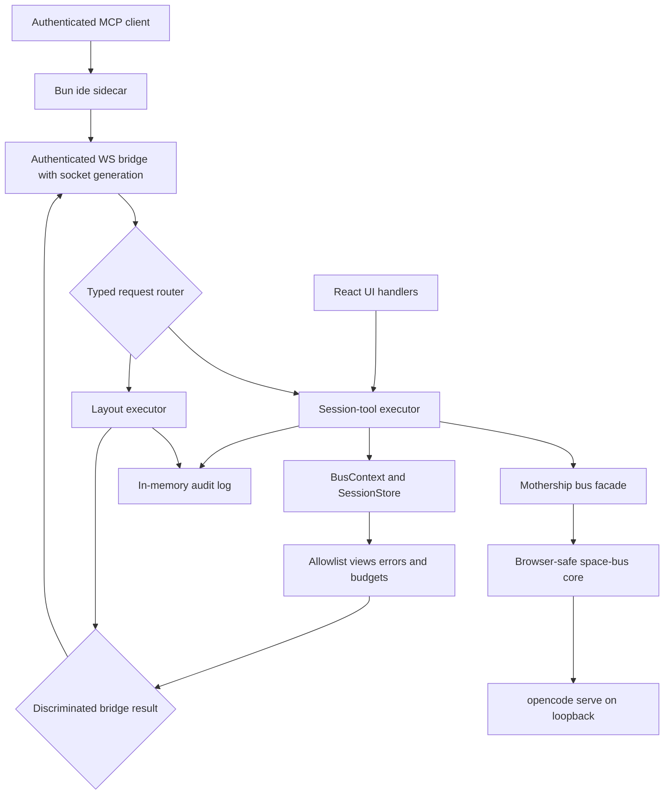
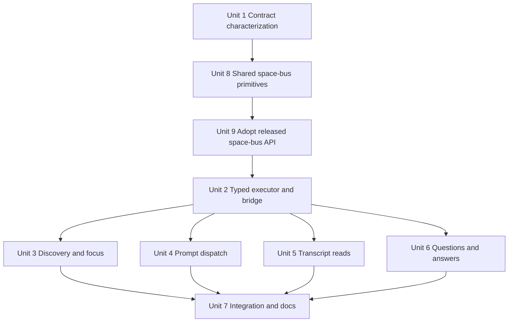
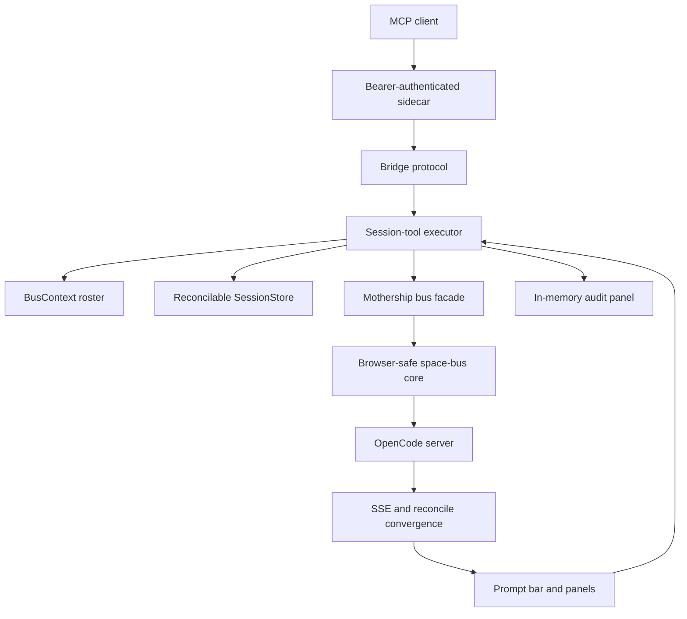

# feat: Add agent-native session tools

## Overview

Extend Mothership's authenticated `ide_*` relay from layout-only control into the session workflows that define the product: discover and focus projects/sessions, dispatch prompts, read bounded transcripts, inspect and answer pending questions, and discover the human's active context. The webview composes browser-safe `@fro.bot/space-bus/core` primitives behind typed UI/MCP services; missing shared primitives land in space-bus first rather than growing a second OpenCode client path in Mothership. The sidecar remains a credential-blind relay.

---

## Problem Frame

Mothership is positioned as an agent-native shell, but its own MCP surface can currently rearrange panels and inspect layout structure only. An agent cannot discover which session the human is viewing, continue work in a known session, read the transcript rendered beside it, or unblock a pending question. Those gaps force the agent and operator into separate control planes and leave the signature agent-native workflow shallow.

The existing architecture already has most required primitives. `@fro.bot/space-bus@0.13.1` provides browser-safe roster/snapshot/status/result/wait orchestration, explicit dispatch validation, prompt dispatch, managed-server attachment, and shared contract schemas. Mothership provides the reconcilable live store, transcript rendering, question UI, active-project/session handlers, authenticated sidecar bridge, and audit log. The missing shared pieces are full message reads, untruncated structured question reads, explicit question answers, and dispatch behavior that cannot silently reinterpret a follow-up as a question reply. Those belong in space-bus before Mothership exposes them.

This plan advances the origin document's agent-native trajectory and non-paywalled `ide_*` posture while preserving the original workspace mission-control behavior contract (see origin: `docs/brainstorms/2026-07-05-product-identity-release-preparedness-requirements.md`; tracer contract: `docs/brainstorms/2026-07-03-workspace-mission-control-requirements.md`).

---

## Requirements Trace

### Capability and parity

- R1. An authenticated MCP client can discover every project through space-bus `roster`/`snapshot`, list every currently reconciled session for a named roster project under the sessions panel's subagent-visibility policy, inspect the active project/session, and focus a visible project or session without receiving filesystem paths. Non-roster projects and sessions not owned by the current roster are never discoverable or selectable.
- R2. An authenticated MCP client can dispatch a prompt either to a named project as a new session or to an explicit session as a follow-up through space-bus `toDispatchArgs` and `dispatch`. Follow-up dispatch must explicitly refuse a pending question rather than silently converting prompt text into a question answer.
- R3. An authenticated MCP client can read a bounded snapshot of user/assistant text for a known session through a browser-safe space-bus message-read primitive. A transcript-specific serializer derived from normalized message data admits only explicit roles and part types; visible free text remains sensitive, bearer-protected, and unmodified rather than being falsely represented as secret-free.
- R4. An authenticated MCP client can list untruncated structured pending questions and submit the complete `string[][]` answer payload through browser-safe space-bus question primitives, using the question request ID rather than an SSE envelope ID.
- R5. Project/session focus, prompt dispatch, and question answers have one typed implementation used by both React handlers and MCP handlers. Agent-originated state changes are immediately reflected in the existing UI.

### Security and reliability

- R6. The Bun sidecar remains a bearer-authenticated, credential-blind relay. The per-launch bearer authorizes the complete v1 tool surface for the current OS user, lives only in the 0600 rendezvous file/environment, and rotates on app restart. The sidecar receives no OpenCode Basic-auth credentials, parses no workspace configuration, and never accepts an absolute directory from an MCP caller.
- R7. Every target is resolved inside the webview from the current `BusContext` or reconciled `SessionStore`. Roster project names are unique by configuration contract; unknown or ambiguous projects, stale/deleted sessions, mismatched question/session IDs, and cross-workspace probes fail before an OpenCode request is sent.
- R8. Transcript and pending-question reads use explicit allowlist serializers and bounded output. Truncation is visible and deterministic rather than silent; malformed or oversized payloads return typed tool errors without crashing the bridge.
- R9. Prompt dispatch, project/session focus, question answers, transcript reads, and pending-question reads create entries in the existing in-memory audit log through a closed metadata-only schema that cannot represent content fields. Audit entries identify the tool and logical target but cannot copy prompt, transcript, answer, question, credential, or path content.
- R10. Webview disconnect/replacement rejects every pending bridge request bound to the old socket generation; late responses are ignored and no tool call reports success after losing its relay. Failures distinguish pre-send from post-send/indeterminate outcomes. Non-idempotent dispatch/question mutations are never retried automatically; the caller must use the read surface to reconcile the target state first, and an outcome that cannot be uniquely proved remains explicitly indeterminate for operator decision.

### Contract and verification

- R11. Implementation characterizes the deployed OpenCode v1 contract before relying on undocumented behavior: `GET /doc`, message-limit ordering, question routes and reply shape, and session ownership resolution.
- R12. The full tool surface is verified through MCP SDK in-memory transport tests, bridge/executor tests, disclosure-negative tests, and a live dogfood sequence against a real roster and blocked session.
- R13. No new third-party dependency is required. The work does require an explicitly approved `@fro.bot/space-bus` version and lockfile update after the shared primitives ship; MCP SDK v1.29.0 and zod remain unchanged.
- R14. Mothership's new MCP operations call the `src/server/bus.ts` facade for shared server behavior. No new direct OpenCode request implementation is added under `src/ide/`; existing `src/server/client.ts` remains only for the settled live-data reconcile/SSE architecture until equivalent efficient shared primitives justify a separate migration.

---

## Scope Boundaries

- The active surface is `ide_list_projects`, `ide_list_sessions`, `ide_get_active_context`, `ide_select_project`, `ide_select_session`, `ide_dispatch_prompt`, `ide_get_transcript`, `ide_list_pending_questions`, and `ide_answer_question`.
- Transcript reads expose only allowlisted user/assistant text derived from normalized transcript data, subject to message/part/total-result budgets. They do not expose hidden model reasoning or raw tool-call payloads; returned free text is explicitly untrusted and may itself contain paths, secrets, or instructions entered into the conversation.
- The per-launch bearer authorizes the surface under the current single-operator trust model. Sensitive reads are visible in the in-memory audit log; they do not open approval popups.
- Selection tools synchronize the human-visible UI. Dispatch remains explicit: `project` starts a new session; `sessionId` continues that exact session. Selecting a session does not silently change dispatch semantics.
- Mothership remains a renderer and attacher. OpenCode/space-bus remain the source of truth; the app persists no new session, transcript, question, credential, or agent memory state.
- This is a coordinated two-repository epic: shared browser-safe server operations land and release from `fro-bot/space-bus` before Mothership adopts that package version. Publishing the package and changing Mothership's dependency/lockfile remain explicit implementation gates.

### Deferred to Separate Tasks

- Live transcript streaming or MCP subscriptions; agents use bounded snapshot reads in this epic.
- Session deletion, forking, sharing, summarization, shell/command execution, permission replies, question rejection, or any other destructive/OpenCode endpoint not named above.
- Per-client identities/scopes, project-level opt-outs, durable audit history, capability tokens, or MCP elicitation. Revisit when the trust model expands beyond one local operator and one per-launch bearer.
- General multi-client WS support, reconnect/restart-cap abuse, and app-crash orphan cleanup remain separate hardening work. Correctly evicting a replaced webview socket and rejecting its pending calls is in scope because the new mutations are non-idempotent; this does not turn the bridge into a multi-client server.
- OpenCode v2 `/api/*` migration and cursor pagination. The deployed v1 contract remains authoritative until v2 is stable and deliberately adopted.
- A wholesale rewrite or deletion of Mothership's `src/server/client.ts`. The hybrid poll/SSE path has different latency and connection constraints; only the new agent-tool operations are required to use shared space-bus primitives in this epic.
- Refactoring `DockviewShell` beyond extracting the exact project/session actions needed for shared UI/MCP execution.

---

## Context & Research

### Relevant Code and Patterns

- `src/layout/commands.ts`, `src/layout/executor.ts`, and `src/layout/bridge.ts` establish the typed-command parity pattern: validate once, execute once, tag the source, update the live UI, and audit the result.
- `sidecar/ide-server/mcp-server.ts`, `ws-bridge.ts`, and `redact.ts` establish the authenticated relay, typed transport errors, and allowlist-first disclosure boundary.
- `src/promptbar/dispatch.ts` and `src/promptbar/controller.ts` already implement project/session dispatch, stale-session recovery, and first-submit/follow-up behavior.
- `src/server/bus.ts` is the existing single audit-point facade over browser-safe `@fro.bot/space-bus/core`; new shared primitives extend this facade rather than being imported ad hoc.
- `src/server/client.ts`, `session-store.ts`, `reconcile-poller.ts`, `sse.ts`, and `demux.ts` provide the OpenCode REST/SSE boundary and reconcilable cache.
- `src/layout/DockviewShell.tsx` currently owns project/session selection and active-directory SSE switching; `src/panels/transcript/TranscriptPanel.tsx` currently owns question answers.
- `src/panels/audit-log/audit-store.ts` is the existing non-persistent operator-visible audit feed and remains the only audit destination.
- Installed `@fro.bot/space-bus@0.13.1` exports browser-safe `roster`, `snapshot`, `status`, `result`, `wait`, `dispatch`, `toDispatchArgs`, and contract schemas. `dispatch` currently treats a follow-up to a blocked session as a single-string question reply, while full messages/questions/answers have no public core primitive.

### Institutional Learnings

- `docs/solutions/documentation-gaps/opencode-server-sse-contract-facts-2026-07-04.md` records that SSE has no resumable wire `id:`, question replies use `properties.id` (`que_...`) rather than event IDs, event types are open, and question routes require live re-verification as the server evolves.
- `docs/solutions/documentation-gaps/mothership-phase1-tracer-deviations-2026-07-04.md` records the bearer rendezvous, authenticated fetch-based SSE, allowlist serializers, and remaining sidecar lifecycle hardening.
- `docs/plans/2026-07-05-001-fix-reliability-track-plan.md` establishes transient-error store integrity, deleted-session guards, nested SSE payload handling, generation-based transcript race protection, and the settled hybrid poll plus single-active-SSE topology.
- The current redaction tests assert what must not appear in serialized output. New transcript/session/question serializers should preserve that negative-testing posture.

### External References

- MCP TypeScript SDK v1.29.0: `https://github.com/modelcontextprotocol/typescript-sdk/tree/v1.29.0`.
- MCP server guidance and tool annotations: `https://raw.githubusercontent.com/modelcontextprotocol/typescript-sdk/v1.29.0/docs/server.md`.
- MCP security best practices: `https://modelcontextprotocol.io/docs/tutorials/security/security_best_practices`.
- OpenCode server v1 reference: `https://opencode.ai/docs/server/`; the running server's `GET /doc` remains the release-time contract.
- OpenCode question/session source references: `https://github.com/anomalyco/opencode/tree/dev/packages/opencode/src/server/routes/instance/httpapi/groups`.
- space-bus v0.13.1 source: `https://github.com/fro-bot/space-bus/tree/fbd1109521a332a96b20da5ffeea3d9938db4fcb`; exact package metadata: `https://registry.npmjs.org/@fro.bot/space-bus/0.13.1`.

---

## Key Technical Decisions

| ID | Decision | Rationale |
| --- | --- | --- |
| KTD1 | Keep one credential-blind sidecar and one authenticated WS relay. | Reusing the existing bearer boundary avoids duplicating workspace parsing, OpenCode auth, stores, or SSE state outside the webview. |
| KTD2 | Introduce a typed session-tool executor beside the layout executor and a discriminated bridge result. | Non-layout actions need a parity choke point without coupling server/session behavior to dockview. The executor wraps the existing `src/server/bus.ts` facade plus Mothership-local focus/store state; it does not implement HTTP. Layout results retain the layout serializer, while session results arrive already allowlisted/budgeted from the webview. |
| KTD3 | Callers name unique roster projects or opaque session IDs, never directories. | Enforcing unique project names at workspace-config parsing makes the human-facing name a safe logical identifier. Zero or multiple matches fail closed rather than selecting the first roster entry. |
| KTD4 | Dispatch uses space-bus `toDispatchArgs` and `dispatch`, with pending-question behavior made explicit upstream. | `project` means create a new session; `sessionId` means continue that session. v0.13.1's implicit question-reply branch violates that contract, so a backward-compatible option must make pending questions return a typed blocked outcome for `ide_dispatch_prompt`. |
| KTD5 | Transcript reads use a stricter disclosure view than the panel renderer. | Metadata-only output would not satisfy "read transcript," but the UI currently renders any text-bearing part. MCP admits only user/assistant text parts through a dedicated serializer, bounds them, and labels content as untrusted data; UI rendering is not the security boundary. |
| KTD6 | Use MCP text content containing allowlisted JSON; do not add `outputSchema` yet. | This matches every existing `ide_*` tool. SDK v1.29 would require `structuredContent` on every successful result once `outputSchema` is declared, with no current typed-client benefit. |
| KTD7 | Sensitive reads use bearer authorization plus visible audit, not consent popups. | Marcus selected autonomous local operation under the per-launch bearer. Audit provides operator visibility without breaking tool loops; stronger per-client scope is deferred. |
| KTD8 | Question answers use a shared question-domain validator, not the panel's current single-label widget contract. | Such a validator preserves multi-question, multi-select, and custom-answer semantics for UI and MCP. A model-set `confirm: true` flag is not human confirmation; the dedicated non-idempotent tool, target validation, annotations, and audit are the real controls. |
| KTD9 | Selection mirrors UI focus; authoritative reads own freshness. | A user click does not block on network reconciliation. Selection switches focus/SSE immediately, while list/transcript/question tools resolve the target and fetch or reconcile before returning authoritative data. |
| KTD10 | Session tools emit dedicated pre-minimized audit events; audit remains memory-only. | Raw session commands must never reach the layout command summarizer, which would stringify prompts/answers. Executors emit only tool, logical target, source, outcome, and byte/truncation metadata; the store also refuses known sensitive field names as defense-in-depth. |
| KTD11 | Stay on OpenCode v1 and characterize undocumented behavior first. | Public docs omit parts of the deployed question/message contract and v2 is explicitly unstable. A repeatable live probe gates the new space-bus primitives and their Mothership consumers. |
| KTD12 | Tool annotations describe actual effects. | Reads are closed-world/read-only; selections are idempotent UI mutations; dispatch and question answer are non-idempotent mutations. Hosts receive useful policy hints without changing server authorization. |
| KTD13 | Pending calls are bound to a webview socket generation. | Replacement rejects the old generation before accepting the new relay, late responses are ignored, and errors distinguish definitely-not-sent from post-send/indeterminate so callers can reconcile instead of replaying mutations. |
| KTD14 | MCP-facing errors are allowlisted separately from success payloads. | Raw OpenCode bodies, exception strings, and space-bus messages can contain paths, credentials, prompts, or question text. Stable codes and sanitized summaries cross MCP; full details remain local to existing diagnostics. |
| KTD15 | Add missing server operations to space-bus before consuming them. | Marcus owns both repositories; duplicating full message/question/answer HTTP wrappers in a new Mothership executor would preserve the wrong boundary. Browser-safe shared primitives belong in `@fro.bot/space-bus/core`, then Mothership adopts the released version. |

---

## Capability and Authorization Matrix

| Tool | Visible target set | Effect | MCP annotations | Audit |
| --- | --- | --- | --- | --- |
| `ide_list_projects` | All projects returned by space-bus `roster`/`snapshot`; names/status only | Read | Read-only, idempotent, closed-world | No sensitive-read entry |
| `ide_list_sessions` | Sessions currently reconciled for one unique roster project; subagents follow the panel's explicit include policy | Read | Read-only, idempotent, closed-world | Metadata-only read entry |
| `ide_get_active_context` | Current roster project and visible session IDs | Read | Read-only, idempotent, closed-world | No sensitive-read entry |
| `ide_select_project` | One unique roster project | Idempotent UI focus/SSE switch | Mutating, idempotent, closed-world | Focus entry |
| `ide_select_session` | One current roster-owned session | Idempotent UI focus | Mutating, idempotent, closed-world | Focus entry |
| `ide_dispatch_prompt` | One unique roster project for a new session, or one current roster-owned session for follow-up | Non-idempotent mutation through space-bus `dispatch`; pending question returns blocked | Mutating, non-idempotent, closed-world | Dispatch metadata only |
| `ide_get_transcript` | One current roster-owned session | Sensitive bounded read through the shared space-bus message primitive | Read-only, idempotent, closed-world | Session/count/bytes/truncation only |
| `ide_list_pending_questions` | Exactly one unique roster project or one current roster-owned session; no unscoped global list | Sensitive read through the shared space-bus question primitive | Read-only, idempotent, closed-world | Target/count only |
| `ide_answer_question` | One pending request proven to belong to the supplied current roster-owned session | Non-idempotent mutation through the shared space-bus answer primitive | Mutating, non-idempotent, closed-world | Request/session/result metadata only |

All tools share the same per-launch bearer in v1. A copied bearer therefore has the full surface until Mothership restarts; loopback binding, OS-user-only rendezvous permissions, token non-appearance in argv, audit visibility, and restart rotation are the containment. Per-client scopes become required before this endpoint serves callers with different trust levels.

---

## Open Questions

### Resolved During Planning

- **Session-tool scope:** plan the full surface rather than dispatch-only: discovery, active context, selection, dispatch, bounded transcript read, pending-question read, and answer.
- **space-bus reuse:** use v0.13.1 `roster`, `snapshot`, `toDispatchArgs`, and `dispatch` directly; add missing full-message/question/answer and pending-question-safe dispatch behavior upstream before Mothership consumption.
- **Transcript authorization:** the per-launch bearer authorizes bounded reads; sensitive reads create visible in-memory audit entries.
- **Transcript disclosure:** expose bounded user/assistant text, not metadata-only output and not hidden reasoning/raw tool payloads; free text remains sensitive and untrusted.
- **Workspace routing:** resolve project/session ownership in the webview; never expose or accept absolute paths through MCP.
- **Project identity:** roster project names are the public identifier and must be unique; ambiguous configurations fail at parsing rather than at tool-call time.
- **Sidecar role:** retain a dumb relay; do not give it OpenCode credentials or workspace configuration.
- **Audit persistence:** retain the existing in-memory ring buffer; no new durable log.
- **Question confirmation:** no synthetic `confirm` flag; rely on explicit tool intent, validation, annotations, audit, and non-retry behavior.
- **Free-text disclosure:** transcript/question text is intentionally available to a bearer-authorized agent and is treated as untrusted sensitive data, not scrubbed or interpreted as routing instructions.
- **Discovery scope:** project discovery covers the current roster; session/question discovery is always roster-owned and explicitly project- or session-scoped. There is no global session/question enumeration outside that workspace.
- **Streaming:** transcript snapshots only; live MCP streaming is separate work.

### Deferred to Implementation

- **Message limit semantics:** characterize whether deployed v1 returns the newest or oldest limited messages and whether any cursor is advertised. The public contract guarantees only `limit`; the tool must not expose an unverified cursor.
- **Exact transcript byte constants:** begin from a default of 20 messages, a hard maximum of 50, a per-part cap, and a total-result cap no larger than 128 KiB; freeze exact part/total values after fixtures prove useful code/text remains readable without oversized results.
- **Single-session lookup:** use the least-coupled verified v1 path after confirming whether `GET /session/:id` is globally or directory scoped; target ownership must still be proved from current roster/session state before the request.
- **Published space-bus version:** choose the next release version through the space-bus Changesets workflow after the shared API lands; Mothership must pin the published version before implementation continues.

---

## Dependencies / Prerequisites

- `fro-bot/space-bus` must land browser-safe full-message, full-question, explicit-answer primitives and a backward-compatible dispatch option that refuses implicit question replies.
- The new primitives must preserve v0.13.1's `Result<T>` envelope, `BusContext` injection, localhost/auth rules, session-to-project resolution, and browser-safe import guard.
- The space-bus package release is a public-action gate. Mothership's subsequent `package.json`/`bun.lock` update is a separate dependency/lockfile gate.
- Existing v0.13.1 APIs remain the baseline: no reimplementation of `roster`, `snapshot`, `status`, `result`, `wait`, `dispatch`, `toDispatchArgs`, `resolveManagedServer`, or shared contract schemas.

---

## High-Level Technical Design

> This illustrates the intended approach and is directional guidance for review, not implementation specification. The implementing agent should treat it as context, not code to reproduce.

The sidecar validates MCP inputs and converts discriminated bridge results into standard tool results, but it does not make authorization or workspace-routing decisions. Layout results keep the existing layout serializer; session results and errors are already allowlisted and budgeted by the webview. The webview router validates the domain command, resolves logical targets against the live context/store, and invokes Mothership-local focus logic or browser-safe functions exported through `src/server/bus.ts`. Pending calls are tied to the authenticated socket generation so replacement cannot strand or misattribute a non-idempotent result.

---

## Implementation Units

- [x] **Unit 1: Characterize the deployed OpenCode v1 contract**

**Goal:** Replace undocumented assumptions with repeatable evidence for the exact server version used by Mothership.

**Requirements:** R11.

**Dependencies:** None.

**Files:**
  - Modify: `spikes/0c-server-connectivity/probe.ts`
  - Modify: `docs/solutions/documentation-gaps/opencode-server-sse-contract-facts-2026-07-04.md`
  - Test: `src/server/client.test.ts`

**Approach:**
  - Extend the existing connectivity probe rather than creating a second contract tool.
  - Capture server version and `GET /doc` evidence for session-message and question routes.
  - Characterize limited-message ordering, the presence or absence of pagination fields, single-session lookup scoping, and a question list/reply round trip using the question request ID.
  - Characterize v0.13.1 `dispatch` against a session with a pending question and pin the current implicit question-reply behavior that the upstream API extension must preserve by default but disable for `ide_dispatch_prompt`.
  - Convert verified shapes into client fixtures; keep unverified v2 fields out of public tool schemas.

**Execution note:** Add failing fixtures for the intended v1 boundary before adapting client parsing or tool contracts.

**Patterns to follow:** `spikes/0c-server-connectivity/probe.ts`; `docs/solutions/documentation-gaps/opencode-server-sse-contract-facts-2026-07-04.md`; `src/server/client.test.ts` fetch-injection fixtures.

**Test scenarios:**
  - Happy path: the running server advertises the session-message and question routes expected by the existing client.
  - Happy path: a limited message request records the returned order and produces a stable fixture.
  - Integration: a pending question is listed and answered with `string[][]` using the `que_...` request ID.
  - Error path: an SSE envelope/event ID cannot be substituted for the question request ID.
  - Edge case: unsupported cursor/before parameters remain absent from the planned MCP input contract.
  - Edge case: current space-bus follow-up dispatch to a blocked session reports `question-reply`; the planned explicit policy instead returns a blocked result without mutation.

**Verification:** The solution note and test fixtures state the deployed version, verified routes, ordering semantics, and intentionally unsupported pagination behavior without relying on dev-branch source alone.

- [x] **Unit 8: Add missing browser-safe primitives to space-bus**

**Target repository:** `fro-bot/space-bus`.

**Goal:** Complete the shared browser-safe session API so Mothership and future bus clients do not duplicate OpenCode message/question HTTP behavior.

**Requirements:** R2, R3, R4, R11, R13, R14.

**Dependencies:** Unit 1.

**Files:**
  - Modify: `src/core.ts`
  - Modify: `src/core.test.ts`
  - Modify: `src/contract.ts`
  - Modify: `README.md`
  - Create: `.changeset/<generated-session-api-name>.md`

**Approach:**
  - Preserve the v0.13.1 `Result<T>`/`BusContext` contract and existing `roster`, `snapshot`, `status`, `result`, `wait`, `dispatch`, and `toDispatchArgs` behavior.
  - Add browser-safe primitives for bounded full-message reads, project/session-scoped full pending-question reads, and explicit question answers with `requestID` plus `string[][]` answers.
  - Extend dispatch with a backward-compatible pending-question policy: existing callers retain automatic single-string reply semantics, while `ide_dispatch_prompt` can request a typed blocked result with no mutation.
  - Keep session-to-directory/project resolution internal; public results expose logical project/session data, not credentials or directory paths beyond existing documented contracts.
  - Reuse shared contract schemas and the existing authenticated localhost request helpers; do not create a second fetch stack.
  - Add the primitives to browser-safe/package-export guards and document their cost/side-effect semantics. Question rejection remains deferred because the confirmed Mothership surface does not expose it.

**Execution note:** Implement the new core behavior test-first against Unit 1's live-verified fixtures, including the existing dispatch branch as a compatibility test before adding the opt-out policy.

**Patterns to follow:** `src/core.ts` functions using injected `BusContext`; `src/contract.ts` loose zod schemas; existing browser-safe import tests and `Result<T>` error mapping.

**Test scenarios:**
  - Happy path: bounded message reads resolve session ownership and return the verified message-list contract in chronological order.
  - Happy path: question reads return complete headers/text/options/multiple/custom metadata for a project or session without exposing credentials.
  - Happy path: explicit answer sends the selected `que_...` request ID and full `string[][]` payload.
  - Compatibility: default `dispatch` behavior for an existing blocked session remains `question-reply` for v0.13.1 callers.
  - Safety: pending-question-safe dispatch returns a typed blocked result and sends neither reply nor follow-up prompt.
  - Error path: unknown session/project, stale question, malformed answers, auth failure, and upstream error preserve stable `Result<T>` errors without raw sensitive bodies.
  - Packaging: each new primitive imports successfully from `@fro.bot/space-bus/core` in a browser-only fixture with no Node built-ins.

**Verification:** space-bus tests and browser-safe package checks prove the shared API, and a Changeset documents the additive contract before any publish gate.

- [x] **Unit 9: Adopt the released space-bus session API**

**Goal:** Pin the published shared API in Mothership and expose it through the existing bus facade before building new `ide_*` behavior.

**Requirements:** R2, R3, R4, R13, R14.

**Dependencies:** Unit 8 and explicit approval to publish/adopt the new package version.

**Files:**
  - Modify: `package.json`
  - Modify: `bun.lock`
  - Modify: `src/server/bus.ts`
  - Modify: `src/server/types.ts`
  - Test: `src/server/bus.test.ts`

**Approach:**
  - Upgrade only to the exact released space-bus version containing Unit 8; do not use a file/link dependency or floating range.
  - Re-export the shared message/question/answer primitives and existing `roster`, `snapshot`, `dispatch`, and `toDispatchArgs` through `src/server/bus.ts` as the single import/audit point.
  - Re-export shared contract types/schemas through `src/server/types.ts` rather than defining parallel Mothership wire schemas.
  - Keep `src/server/client.ts` for the existing hybrid reconcile/SSE path; the new session-tool executor must not add direct HTTP methods there.

**Execution note:** Dependency and lockfile changes require Marcus's explicit approval after the upstream package is published.

**Patterns to follow:** Existing exact `@fro.bot/space-bus` pin in `package.json`; `src/server/bus.ts` facade; `src/server/types.ts` contract re-exports.

**Test scenarios:**
  - Contract: every shared primitive used by the plan is exported from the installed exact package and re-exported by the Mothership facade.
  - Boundary: browser bundling of the facade introduces no Node built-ins or Node-only space-bus subpaths.
  - Regression: existing prompt-bar dispatch and workspace attachment continue using their current browser-safe lanes.
  - Error path: tests fail clearly when the installed package lacks any required symbol or contract schema.

**Verification:** Mothership resolves the released package, its browser build accepts the new facade, and no new direct OpenCode request path is introduced.

- [x] **Unit 2: Establish the typed session-tool executor and bridge contract**

**Goal:** Create one domain boundary through which both UI handlers and MCP requests execute session/project operations safely.

**Requirements:** R5, R6, R7, R8, R9, R10, R13.

**Dependencies:** Unit 9.

**Files:**
  - Create: `src/ide/commands.ts`
  - Create: `src/ide/executor.ts`
  - Create: `src/ide/views.ts`
  - Create: `src/ide/errors.ts`
  - Create: `src/ide/commands.test.ts`
  - Create: `src/ide/executor.test.ts`
  - Create: `src/ide/views.test.ts`
  - Create: `src/ide/errors.test.ts`
  - Modify: `src/layout/bridge-protocol.ts`
  - Modify: `src/layout/bridge.ts`
  - Modify: `src/layout/bridge.test.ts`
  - Modify: `src/panels/audit-log/audit-store.ts`
  - Modify: `src/panels/audit-log/audit-store.test.ts`
  - Modify: `sidecar/ide-server/ws-bridge.ts`
  - Modify: `sidecar/ide-server/ws-bridge.test.ts`

**Approach:**
  - Define a discriminated union for non-layout tool requests and typed result/error codes without merging server operations into the dockview executor.
  - Inject live `BusContext`, `SessionStore`, the `src/server/bus.ts` facade, and focus callbacks into a session-tool executor owned by the webview.
  - Route the existing single WS connection by validated tool name to either the layout executor or session-tool executor, with a discriminated layout/session result envelope.
  - Resolve project names and session ownership before IO; no command or response contains an absolute path.
  - Add allowlist view/error builders with deterministic truncation metadata; raw upstream response bodies and exception text never cross MCP.
  - Emit dedicated pre-minimized audit events through a closed schema with no free-form content field, and add a sensitive-key refusal backstop in the audit store.
  - Bind pending requests to a socket generation. Reject the old generation before activating a replacement, ignore late old-socket responses, and classify pre-send versus indeterminate post-send failures.

**Execution note:** Build the schemas, target-resolution failures, disclosure-negative serializers, and disconnect tests first; then add operations one vertical slice at a time.

**Patterns to follow:** `src/layout/commands.ts`; `src/layout/executor.ts`; `sidecar/ide-server/redact.ts`; `sidecar/ide-server/ws-bridge.ts`.

**Test scenarios:**
  - Happy path: a valid logical project/session target reaches the injected operation and returns an allowlisted result.
  - Error path: unknown project, unknown/deleted session, mismatched session/project, and directory-shaped target strings fail before any OpenCode/space-bus call.
  - Error path: malformed command input returns a typed `invalid_arguments` tool result.
  - Error path: socket close/replacement rejects every pending request from the old generation; late responses cannot resolve calls on the new generation.
  - Security: serialized structural fields and audit entries contain no directory, credential, authorization header, prompt, transcript, question, or answer content.
  - Security: audit construction rejects fixtures containing transcript/question/prompt/answer text because those fields are not representable in the event schema.
  - Security: malicious upstream error bodies containing paths, Basic tokens, prompts, questions, or answers map to stable sanitized errors.
  - Edge case: truncation metadata reports the original/returned size without copying truncated sensitive content into audit state.

**Verification:** All non-layout calls have one validated webview execution path, one allowlist result boundary, and deterministic bridge/audit failure behavior.

- [x] **Unit 3: Add project/session discovery, active context, and focus tools**

**Goal:** Let an agent discover the workspace and synchronize the UI with a named project/session without leaking paths or relying on hidden focus state.

**Requirements:** R1, R5, R7, R9, R10, R12.

**Dependencies:** Unit 2.

**Files:**
  - Modify: `src/ide/commands.ts`
  - Modify: `src/ide/executor.ts`
  - Modify: `src/ide/views.ts`
  - Modify: `src/ide/executor.test.ts`
  - Modify: `src/ide/views.test.ts`
  - Create: `src/ide/focus.ts`
  - Create: `src/ide/focus.test.ts`
  - Modify: `src/layout/DockviewShell.tsx`
  - Modify: `src/layout/DockviewShell.test.ts`
  - Modify: `src/workspace/config.ts`
  - Modify: `src/workspace/config.test.ts`
  - Modify: `sidecar/ide-server/mcp-server.ts`
  - Modify: `sidecar/ide-server/mcp-server.test.ts`

**Approach:**
  - Enforce unique roster project names at configuration parsing, then source project discovery/status from space-bus `roster`/`snapshot` through the Mothership facade; strip the path fields those general-purpose APIs intentionally include.
  - Return sessions from the existing reconciled store so the tool preserves the richer title/status/parentID data and established subagent inclusion rule used by the panel. Do not call broad `snapshot` again just to reconstruct state Mothership already owns as a reconcilable view.
  - Extract project/session focus actions from `DockviewShell` into `src/ide/focus.ts`; React handlers keep only callback wiring and MCP commands call the same typed functions.
  - Project focus updates panel parameters and switches the single active-directory SSE stream; session focus updates transcript/session panel parameters and active context.
  - Selection responses confirm UI state only. Authoritative list reads refresh/reconcile their target before returning rather than making focus wait on network state.

**Patterns to follow:** `src/server/bus.ts` facade; space-bus `roster`/`snapshot`; `src/layout/DockviewShell.tsx` project/session handlers; `src/panels/roster/roster-view.ts`; `src/panels/sessions/sessions-view.ts`.

**Test scenarios:**
  - Happy path: project discovery returns roster names and status summaries with no expanded paths.
  - Happy path: project-scoped session discovery returns the same visible rows/statuses as the sessions panel.
  - Happy path: active-context read follows both UI clicks and MCP focus calls.
  - Integration: MCP project focus updates the roster/sessions parameters and active SSE directory; session focus updates the transcript and highlighted session row.
  - Error path: unknown project/session does not change UI focus or active SSE state.
  - Error path: duplicate project names fail workspace parsing instead of creating first-match targeting ambiguity.
  - Race: rapid focus changes leave the last requested project/session active and do not render a stale reconcile over it.

**Verification:** An MCP client can discover and focus the same project/session the human can, and both views stay synchronized without exposing filesystem paths.

**Implementation verification:** Automated coverage grew from 365 focused passing tests to a final full-suite run of 846 passing tests (0 failing), following an earlier full-suite checkpoint of 833 passing before the last stale-session-pruning fix. `tsc --noEmit` (both the app and sidecar), lint, and `impeccable detect` all returned clean/`[]` at each checkpoint. A live dogfood pass against the real running app and sidecar exercised all 10 planned steps, covering 13 registered tools across six logical roster projects, confirmed project/session selection and active-context parity between UI and MCP, verified layout reads, confirmed malicious/malformed argument rejection, and found no path or credential leaks in any tool result or error.

- [x] **Unit 4: Expose explicit prompt dispatch**

**Goal:** Let an agent create a session in a named project or continue an exact session through the same dispatch behavior as the prompt bar.

**Requirements:** R2, R5, R7, R9, R10, R12.

**Dependencies:** Unit 2.

**Files:**
  - Modify: `src/ide/commands.ts`
  - Modify: `src/ide/executor.ts`
  - Modify: `src/ide/executor.test.ts`
  - Modify: `src/layout/DockviewShell.tsx`
  - Modify: `sidecar/ide-server/mcp-server.ts`
  - Modify: `sidecar/ide-server/mcp-server.test.ts`

**Approach:**
  - Validate with space-bus `toDispatchArgs`: exactly one of project or session ID, plus prompt and optional title.
  - Call space-bus `dispatch` directly through `src/server/bus.ts`; do not add a second explicit-dispatch wrapper to the prompt-bar module. Prompt-bar convenience targeting remains unchanged.
  - Validate a project against the roster or a session against fresh reconciled state before dispatch. For session follow-up, pass the upstream pending-question policy that returns blocked instead of silently answering.
  - Return only session ID, roster project, dispatch mode, and safe status metadata; do not echo prompt/title content.
  - Update active context through the existing dispatched-session callback so a human can immediately see and continue the MCP-created/steered session.
  - Mark dispatch non-idempotent and never retry after bridge timeout/disconnect. A post-send indeterminate result includes safe target and attempt metadata so the caller can list recent sessions and inspect bounded transcripts before any human retry; if no unique match exists, preserve the indeterminate outcome.

**Patterns to follow:** space-bus `toDispatchArgs`/`dispatch`; `src/server/bus.ts`; `src/promptbar/dispatch.ts` for existing UI result/focus handling only.

**Test scenarios:**
  - Happy path: project target creates a new session and focuses the returned session in the UI.
  - Happy path: explicit session target continues that exact live session.
  - Blocked path: an explicit session with a pending question returns a typed blocked result and does not submit either the prompt or a question answer.
  - Error path: both/neither target fields are rejected; stale/deleted session and unknown project do not dispatch.
  - Error path: space-bus/opencode failure maps to a stable sanitized code/summary without echoing raw upstream or prompt content.
  - Race: dispatch completes after a concurrent reconcile without targeting a deleted session.
  - Reliability: pre-send disconnect is distinguishable from timeout/replacement after submission; indeterminate outcomes are never replayed automatically.
  - Reliability: post-send reconciliation can prove an existing-session follow-up by reading that session and can search recent project sessions for a new-session prompt; ambiguous matches remain indeterminate rather than treated as failure or success.

**Verification:** MCP and prompt-bar dispatch use the same underlying primitive and recovery semantics, with explicit MCP targeting and synchronized UI focus.

**Implementation verification:** Adopted `@fro.bot/space-bus@0.15.0`'s `createDispatchMessageId`/`DispatchFailure` for id-based (not text-based) delivery correlation, exposed `ide_dispatch_prompt` as the 14th MCP tool, and covered project/session/blocked/indeterminate paths, with 905 tests, typecheck, lint, impeccable, and diff-check all clean.

- [x] **Unit 5: Add bounded transcript reads**

**Goal:** Return useful recent transcript text for a known session without leaking hidden payloads or producing unbounded MCP results.

**Requirements:** R3, R7, R8, R9, R10, R11, R12.

**Dependencies:** Units 1 and 2.

**Files:**
  - Modify: `src/ide/commands.ts`
  - Modify: `src/ide/executor.ts`
  - Modify: `src/ide/views.ts`
  - Modify: `src/ide/executor.test.ts`
  - Modify: `src/ide/views.test.ts`
  - Modify: `sidecar/ide-server/mcp-server.ts`
  - Modify: `sidecar/ide-server/mcp-server.test.ts`
  - Modify: `sidecar/ide-server/redact.test.ts`

**Approach:**
  - Resolve the session to its current roster project, then fetch messages through the shared space-bus core facade; do not accept a caller-supplied directory or call `src/server/client.ts` from the new executor.
  - Derive from normalized message data but apply a stricter MCP view that admits only user/assistant text; do not treat the panel renderer as the security boundary.
  - Default to a recent bounded window and enforce a hard message maximum in both the tool schema and client boundary.
  - Apply per-part and total serialized-byte budgets after allowlisting. Preserve UTF-8 boundaries and add explicit truncation fields/markers.
  - Exclude raw tool inputs/outputs, model reasoning, structured path/credential fields, and future fields unless deliberately added to the view contract. Preserve visible free text verbatim and mark it as untrusted because it may itself contain paths, secrets, or instructions.
  - Audit the session ID, count, returned bytes, and truncation status only.

**Execution note:** Start with poisoned/oversized transcript fixtures and negative disclosure assertions before returning any text through MCP.

**Patterns to follow:** space-bus bounded message-read primitive and shared contracts; `src/panels/transcript/transcript-view.ts`; `sidecar/ide-server/redact.test.ts`.

**Test scenarios:**
  - Happy path: recent user/assistant text appears in chronological UI order for a live session.
  - Edge case: empty session returns an empty message list with no error.
  - Edge case: caller limit defaults safely and rejects zero, negative, fractional, or over-maximum values.
  - Security: raw reasoning, tool arguments/results, structured credentials/paths, and unknown future fields never cross the serializer; visible text fixtures containing secrets/paths remain classified as sensitive bearer-authorized content rather than falsely scrubbed.
  - Security: injected transcript text cannot alter target resolution, dispatch parameters, audit metadata, or subsequent tool behavior.
  - Error path: upstream failures containing sensitive text map to allowlisted errors.
  - Boundary: oversized parts and total results truncate deterministically on UTF-8 boundaries and report truncation.
  - Error path: unknown/deleted session and OpenCode read failure return typed errors without stale transcript content.
  - Race: a transcript read for session A cannot be overwritten/relabelled by a concurrent focus change to session B.

**Verification:** `ide_get_transcript` returns bounded user/assistant text with explicit truncation, untrusted-content labeling, and disclosure-negative coverage for all structural fields.

**Implementation verification:** Exposed `ide_get_transcript` as the 15th MCP tool, with a default/hard message limit of 20/50 and 8 KiB per-part / 128 KiB total UTF-8-safe byte budgets frozen from poisoned/oversized fixtures; structural disclosure negatives (reasoning, tool arguments/results, structured credentials/paths, unknown roles/fields) and untrusted-verbatim visible-text behavior are covered, with 949 tests, typecheck, lint, impeccable, and diff-check all clean.

- [x] **Unit 6: Add pending-question discovery and answers**

**Goal:** Let an agent inspect and answer the same pending questions shown in the transcript panel through the shared space-bus question API.

**Requirements:** R4, R5, R7, R8, R9, R10, R11, R12.

**Dependencies:** Units 1 and 2.

**Files:**
  - Modify: `src/ide/commands.ts`
  - Modify: `src/ide/executor.ts`
  - Modify: `src/ide/views.ts`
  - Modify: `src/ide/executor.test.ts`
  - Modify: `src/ide/views.test.ts`
  - Modify: `src/server/session-store.ts`
  - Modify: `src/server/session-store.test.ts`
  - Modify: `src/panels/transcript/TranscriptPanel.tsx`
  - Create: `src/ide/questions.ts`
  - Create: `src/ide/questions.test.ts`
  - Modify: `sidecar/ide-server/mcp-server.ts`
  - Modify: `sidecar/ide-server/mcp-server.test.ts`

**Approach:**
  - Return request ID, session ID, header/question text, selection rules, and option labels/descriptions from the shared space-bus full-question primitive through an explicit Mothership view; drop raw entries and paths.
  - Support optional session filtering while resolving every question back to a current roster-owned session.
  - Extract a shared question-domain operation used by `TranscriptPanel` and MCP; it calls the space-bus explicit-answer primitive through `src/server/bus.ts`, while the existing answer box remains one UI adapter rather than defining the domain contract.
  - Add a read-only pending-question lookup helper to the store, then validate answer cardinality and preserve multi-question, multi-select, and custom-answer semantics before calling `replyQuestion`.
  - Use the `que_...` request ID, not event IDs. Treat missing/already-answered questions as typed stale-state outcomes and never retry automatically; after an indeterminate post-send failure, refresh pending questions before any operator retry.
  - Let existing SSE/reconcile remove resolved questions from UI state; do not fabricate a second persistent question state.

**Execution note:** Write the wrong-ID, cardinality, stale-question, and multi-select fixtures first; this boundary is non-idempotent.

**Patterns to follow:** space-bus full-question/answer primitives and shared contracts; `src/server/session-store.ts`; `src/panels/transcript/TranscriptPanel.tsx` answer flow.

**Test scenarios:**
  - Happy path: list returns question text, headers, option metadata, `multiple`, and `custom` behavior for a roster-owned session.
  - Happy path: valid single-, multi-select, and custom answers produce the required `string[][]` body and unblock the session.
  - Error path: event ID, unknown request ID, mismatched session ID, wrong answer cardinality, and already-resolved question never call the reply endpoint.
  - Error path: server rejection returns a typed non-idempotent failure and leaves store state to reconcile authoritatively.
  - Reliability: an answer that loses its bridge response is reconciled by re-listing the pending request; absence proves resolution while continued presence permits an explicit operator retry.
  - Security: question/tool structural fields not in the view and all paths/credentials remain absent; question text/options are labeled untrusted and cannot influence target resolution or audit metadata.
  - Error path: sensitive raw upstream failure text maps to an allowlisted error.
  - Integration: the MCP answer and UI answer follow the same operation; `question.replied` removes the pending card and needs-attention state.

**Verification:** An external agent can discover and answer a real blocked-session question while the transcript UI and store converge through the existing SSE/reconcile path.

**Implementation verification:** Exposed `ide_list_pending_questions` and `ide_answer_question` as the 16th/17th MCP tools, backed by one shared question-domain operation used identically by `TranscriptPanel` and MCP; wrong-ID, cardinality, stale-question, multi-select, reconciliation, and disclosure scenarios are all covered, with 1,025 tests, typecheck, lint, impeccable, and diff-check all clean. The real blocked-session external-agent sequence against the actual connector was not run here — it carries into Unit 7's live dogfood pass, which owns that verification.

- [x] **Unit 7: Complete MCP integration, documentation, and live parity verification**

**Goal:** Prove the full surface through the real connector, document the expanded boundary, and leave future additions with an explicit capability map.

**Requirements:** R1-R13.

**Dependencies:** Units 3-6.

**Files:**
  - Modify: `sidecar/ide-server/mcp-server.ts`
  - Modify: `sidecar/ide-server/mcp-server.test.ts`
  - Modify: `src/layout/bridge-protocol.ts`
  - Modify: `src/layout/bridge.test.ts`
  - Modify: `src/panels/audit-log/AuditLogPanel.tsx`
  - Modify: `AGENTS.md`
  - Modify: `ARCHITECTURE.md`
  - Modify: `STRUCTURE.md`
  - Modify: `docs/plans/2026-07-17-001-feat-agent-native-session-tools-plan.md`

**Approach:**
  - Finalize all tool registrations, capability annotations, descriptions, typed errors, and content+JSON result wrappers without `outputSchema`.
  - Add a capability map to architecture documentation linking human UI outcomes to MCP tools and the shared executor/service.
  - Extend the audit panel's data view for session/read categories using existing tokens only; never render sensitive content.
  - Describe transcript/question text fields as untrusted data, never instructions or implicit target identifiers.
  - Verify the standing dogfood sequence through the actual MCP config/bridge. Create the blocked state with a deterministic fixture prompt that must ask one known single-select question before returning a sentinel; then discover active context, focus a project/session, dispatch a new and follow-up prompt, read the resulting transcript, answer the known question, and observe UI/audit convergence.
  - Update plan checkboxes/status only after automated and live acceptance evidence is complete.

**Patterns to follow:** `sidecar/ide-server/mcp-server.test.ts` MCP `InMemoryTransport`; `scripts/ide-mcp-bridge.ts`; `ARCHITECTURE.md` typed-command and security-boundary sections.

**Test scenarios:**
  - Contract: tool list contains the complete named surface with accurate read-only, idempotent, destructive, and open-world annotations.
  - Integration: every tool relays through the authenticated webview and returns a typed success/error result through the real MCP transport.
  - Security: aggregate disclosure test confirms no tool returns absolute paths, credentials, hidden tool payloads, or unaudited sensitive reads.
  - Security: prompt-injection fixtures in transcript/question text cannot alter project/session targeting, answer validation, dispatch behavior, or audit content.
  - Reliability: sidecar unavailable, webview disconnect, request timeout, stale session, and OpenCode failure each produce distinguishable tool errors with no automatic mutation replay.
  - Parity: UI and MCP invocations for focus, dispatch, and answer produce equivalent state transitions and audit categories.
  - Live dogfood: a delegated task runs while an agent uses the new tools to inspect, steer, read, and unblock the workspace without terminal/subprocess access.
  - Live fallback: if the ambient workspace has no blocked delegate, the deterministic fixture prompt creates the required pending question and sentinel so acceptance does not depend on incidental project state.

**Verification:** The automated suite and live dogfood sequence prove the full agent-native surface, the security boundary is documented, and every UI/MCP parity row has evidence.

**Implementation verification:** 1,061 tests, typecheck, lint, pinned Impeccable (`[]`), and diff-check pass. An actual LLM controller restricted to the 17 MCP tools created a new fixture, changed layout while it was running, read and answered its single-select question once, observed completion, and dispatched/read an explicit follow-up. Native-window evidence confirms custom-ID roster rendering, the selected fixture transcript, and MCP audit entries. Live checks also drove fixes for dynamic/restored panel context injection and request budgets: 30s per upstream API call, 45s for the relay, 55s for authenticated MCP HTTP requests, and 60s for the SDK. Authentication and non-replay behavior remain unchanged. Final review, commit, and push remain separately gated.

---

## System-Wide Impact

- **Interaction graph:** MCP and React callers converge on typed session operations; those operations resolve logical targets, invoke browser-safe space-bus primitives through the Mothership facade, update UI focus where applicable, and rely on existing SSE/reconcile paths for authoritative server-state convergence.
- **Error propagation:** Input/ownership errors stop before IO. OpenCode and space-bus failures preserve typed status/context. Bridge availability failures remain distinct. Non-idempotent mutations are never retried automatically.
- **State lifecycle risks:** Selection races, stale/deleted sessions, transient reconcile failures, already-resolved questions, and indeterminate dispatch-after-disconnect are explicit test cases. No new persistent cache is added.
- **API surface parity:** Project/session focus, prompt dispatch, and question answers must share implementations with their UI counterparts. Read tools return the UI's view-level data rather than raw server payloads.
- **Integration coverage:** Unit tests cannot prove the Tauri webview bridge, real MCP transport, live OpenCode question lifecycle, SSE convergence, or audit-panel behavior; Unit 7 includes live acceptance for each.
- **Unchanged invariants:** Layout commands still use `executeCommand`; the terminal remains `mcpOpenable: false`; OpenCode remains source of truth; the sidecar remains loopback-only and credential-blind; no model, telemetry, off-machine runtime call, or new third-party dependency is introduced. The only package/lockfile change is the explicitly gated space-bus adoption.

---

## Risks & Dependencies

| Risk | Likelihood | Impact | Mitigation |
| --- | --- | --- | --- |
| OpenCode v1 API drift invalidates message/question assumptions | Medium | High | Characterize the running server and preserve fixtures before implementing; target v1 only. |
| Mothership starts before the shared space-bus release exists | Medium | High | Make Units 8-9 hard prerequisites; publish and pin the exact package before session-executor work begins. |
| New space-bus primitives accidentally import Node-only modules | Low | High | Extend browser-safe import/bundle guards and consume only `@fro.bot/space-bus/core`/`contract` from the webview. |
| Existing space-bus dispatch silently answers a pending question | High without fix | High | Preserve current behavior by default for compatibility, add an explicit blocked policy upstream, and require that policy for `ide_dispatch_prompt`. |
| Transcript/question free text carries secrets or prompt-injection text | Medium | High | Admit only explicit structural fields and user/assistant text, label content untrusted, bound output, audit reads without content, and prove content cannot influence targeting or mutations. Visible free text is not claimed to be scrubbed. |
| Session/project ID becomes a cross-workspace confused deputy | Low | High | Resolve ownership from current roster/store; never accept directories; fail closed before IO. |
| WS disconnect/replacement leaves mutation outcome unknown | Medium | High | Bind calls to socket generations, reject replaced pending calls, ignore late responses, distinguish pre-send from indeterminate outcomes, never replay mutations, and require caller reconciliation. |
| UI and MCP behavior drift into two implementations | Medium | High | Extract typed operations and test both caller paths against the same executor. |
| Transcript output exhausts bridge/model context | Medium | Medium | Default/hard message limits, per-part and total byte budgets, explicit truncation, and byte-count audit metadata. |
| Question answer uses wrong identifier or stale payload | Medium | High | Name `requestID` explicitly, validate against current pending entry/session, test `evt_...` rejection, never auto-retry. |
| Active-project selection returns stale sessions | Medium | Medium | Keep selection focused on UI state; make authoritative list reads refresh/reconcile the requested project before returning. |
| Single bearer is insufficient for future multi-client trust | Low today | High later | Preserve optional caller metadata seams but defer identity/scopes until the product has more than one trusted local operator boundary. |
| Bearer theft permits replay for the current launch | Low | High | Keep the endpoint loopback-only, rendezvous file OS-user-only, token out of argv/logs, and rotate on restart; document restart as immediate revocation and require per-client scopes before the trust model expands. |
| Adjacent DockviewShell refactor expands scope | Medium | Medium | Extract only shared focus/runtime dependencies; route broader component decomposition to separate work. |
| Raw upstream error or generic audit summarization leaks sensitive content | Medium | High | Use allowlisted MCP error views and dedicated pre-minimized session audit events with sensitive-key refusal tests. |

---

## Documentation / Operational Notes

- Update the sidecar security-boundary documentation: session/transcript/question content now crosses MCP under an explicit allowlist and bearer-plus-audit policy.
- Add a capability map showing each human UI outcome, MCP tool, shared executor, disclosure class, and audit policy. This becomes the parity checklist for future UI work.
- Keep the standing dogfood check in `AGENTS.md`: an agent can discover active context, focus/steer/read/unblock a session while another delegated task runs, and the operator can see every sensitive action in the audit panel.
- Re-run the OpenCode contract probe when the managed server version changes materially; do not silently add v2 fields to the public tool contract.
- Treat `src/server/bus.ts` as the one Mothership facade over browser-safe space-bus behavior. If an operation is useful beyond Mothership, add it upstream instead of growing a parallel HTTP path.
- The space-bus publish and Mothership dependency/lockfile update are explicit gates. No release-workflow, secret, auth-token custody, or runtime network-policy change is part of this plan.

---

## Sources & References

- **Origin document:** `docs/brainstorms/2026-07-05-product-identity-release-preparedness-requirements.md`
- **Behavior contract:** `docs/brainstorms/2026-07-03-workspace-mission-control-requirements.md`
- **Architecture:** `AGENTS.md`, `ARCHITECTURE.md`, `STRUCTURE.md`
- **OpenCode contract facts:** `docs/solutions/documentation-gaps/opencode-server-sse-contract-facts-2026-07-04.md`
- **Tracer deviations:** `docs/solutions/documentation-gaps/mothership-phase1-tracer-deviations-2026-07-04.md`
- **Reliability plan:** `docs/plans/2026-07-05-001-fix-reliability-track-plan.md`
- **MCP SDK v1.29.0:** `https://github.com/modelcontextprotocol/typescript-sdk/tree/v1.29.0`
- **MCP security:** `https://modelcontextprotocol.io/docs/tutorials/security/security_best_practices`
- **OpenCode server:** `https://opencode.ai/docs/server/`
- **space-bus v0.13.1 exact source:** `https://github.com/fro-bot/space-bus/tree/fbd1109521a332a96b20da5ffeea3d9938db4fcb`
- **space-bus v0.13.1 package metadata:** `https://registry.npmjs.org/@fro.bot/space-bus/0.13.1`
