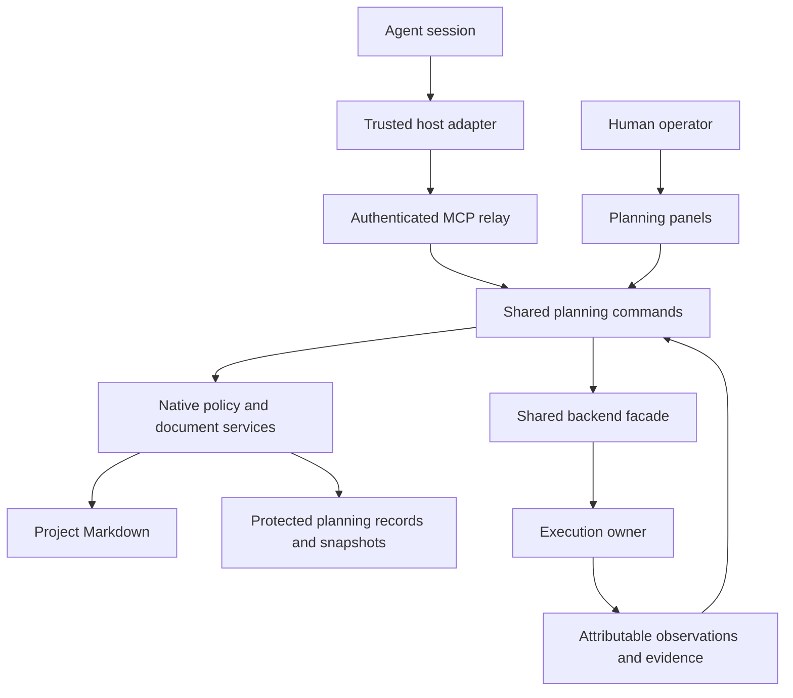
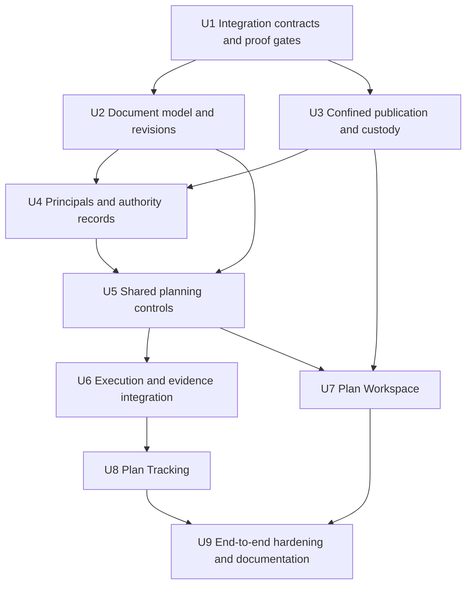

# feat: Add agent-native planning lifecycle

## Summary

Build the full planning lifecycle around project Markdown: authoring, reviewable feedback, revision-bound approval, explicit Start, and unit-level execution tracking. Mothership owns protected planning records and immutable revision snapshots; the connected execution backend owns actual agent/session activity. A trusted host adapter supplies authenticated agent identity and execution observations without making the app an execution engine.

This is a Deep plan with blocking integration gates. It is not authorization to modify authentication, add dependencies, or change CI. Dependent functionality stays disabled until the relevant host and filesystem guarantees are demonstrated.

## Problem Frame

The existing application exposes shared UI/MCP session controls, but not document authoring, durable approval authority, or revision-qualified unit tracking. Its shared bridge credential cannot distinguish agent sessions. Session status and agent-authored todo lists cannot establish which approved unit is executing or whether its acceptance criteria passed.

The origin defines the product behavior. This plan supplies ownership, integration contracts, implementation boundaries, and verification without reducing that scope to a document viewer.

## Requirements Trace

| Origin | Planned outcome | Units |
|---|---|---|
| R1 | Human/agent creation, opening, and editing through shared controls | U2, U3, U5, U7 |
| R2 | Canonical, externally editable project Markdown | U2, U3, U7 |
| R3 | Review proposals with accept/edit/reject outcomes | U2, U5, U7 |
| R4 | Human approval or checked agent approval delegation | U1, U4, U5 |
| R5 | Approval bound to an immutable reviewed revision | U2, U4, U5 |
| R6 | Changed content requires its own approval | U2, U3, U5 |
| R7 | Feedback/progress updates do not change approval-bearing content | U2, U5, U6 |
| R8 | Approval never dispatches execution | U5, U7, U8 |
| R9 | Explicit Start with an approved revision and target | U5, U6, U8 |
| R10 | Approved unit-boundary handoff with preserved history | U1, U2, U6, U8 |
| R11 | Separate, revocable agent Start authority | U1, U4, U5 |
| R12 | Stable units and declared dependencies | U2, U6, U8 |
| R13 | Revision-qualified unit/session associations | U6, U8 |
| R14 | Inspectable blockers and dependency links | U6, U8 |
| R15 | Passing evidence and an authorized verifier, not self-report alone | U1, U4, U6, U8 |
| R16 | Work status, verification, and freshness remain distinct | U6, U8, U9 |
| R17 | External-edit comparison and preservation | U3, U7, U9 |
| R18 | Explicit concurrent-edit resolution without silent loss | U3, U7, U9 |

F1 is realized by U2/U3/U5/U7; F2 by U4/U5/U7; F3 by U1/U5/U6/U8; F4 by U3/U7. Origin acceptance examples are carried into the corresponding unit scenarios below.

## Scope Boundaries

- Full lifecycle, including authoring, feedback, approval, Start, redirect, and evidence-backed tracking.
- Native application panels, not an MCP Apps host, general source-code editor, or automation-flow designer.
- No embedded model, independent app scheduler, or duplicate authoritative agent/session database.
- No automatic execution, cancellation, replay, or approval caused by editing, reconnecting, or reopening a panel.
- No default identity provider, approval quorum, or new credential-expiry policy.
- The security boundary covers callers constrained to the exposed interfaces. It does not contain arbitrary processes running as the same OS user.

### Deferred to Separate Tasks

- Release readiness and issue #19's development-time Impeccable hook remain separate workstreams.
- Unrelated session-tool cleanup, release workflow changes, and general editor features are excluded.

## Context & Research

### Reusable Code and Patterns

- `src/ide/executor.ts`: target resolution, `registerSessionTool`, `runSessionTool`, dispatch validation, and exact-message reconciliation. Reuse these boundaries without expanding this file into the implementation of the entire planning domain.
- `src/ide/views.ts`: allowlisted output views and explicit untrusted-content boundaries.
- `src/layout/bridge.ts` and `src/layout/bridge-protocol.ts`: authenticated relay, typed requests/results, and disconnect semantics.
- `src/layout/bootstrap.ts`, `registry.ts`, and `DockviewShell.tsx`: panel registration and component-type-based live-parameter injection on add/restore.
- `src/promptbar/dispatch.ts`: existing target selection and dispatch behavior.
- `src/server/session-store.ts`: reconcilable observation cache, not durable execution authority.
- `src/panels/audit-log/audit-store.ts`: bounded in-memory display history, not an approval ledger.
- `src-tauri/src/workspace_fs.rs`: read-only filesystem seams. Confined writes are new work.
- `src-tauri/src/ide_sidecar.rs`: protected rendezvous custody and launch lifecycle, not storage of agent sessions.
- `sidecar/ide-server/index.ts`, `http-auth.ts`, and `ws-bridge.ts`: existing HTTP/WS authentication. Channel authentication is not agent identity.

### Version and Capability Baseline

The inspected checkout is `e08335493c7f4f66300c5948d42d69d3656bfcb8`, with documentation-only local changes. Installed dependencies include Tiptap core/StarterKit 3.30.3, MCP SDK 1.29.0, and space-bus 0.15.0. The Markdown extension is not installed.

The current bridge forwards tool names and arguments with a shared bearer; it supplies no verified agent principal. SDK transport session identifiers and request metadata are not sufficient substitutes. U1 source identification maps `@fro.bot/harness@1.18.29-harness.88b6b5fb` to wrapper commit `cb4a1425bda9b6f422798381db467ec5ffa2777b` and runtime integration commit `88b6b5fb768ab106a5dc4f11e8ec8dd8ec30cadb` in `fro-bot/agent`. At the integration commit, `SessionTools.resolve` has per-call runtime context, while `McpCatalog.convertTool` constructs no agent-principal assertion. See `docs/architecture/planning-host-contract.md` for source paths and evidence limits; an authenticated adapter and the identity of a currently running binary remain unproven.

No typed plan-unit, approval-grant, or verification contract was established in the inspected backend surface. Do not reinterpret id-less todos or session idleness as those capabilities. The managed backend is authenticated, and the related repositories are controlled; neither fact supplies the missing contracts.

### Institutional Learnings

- `docs/solutions/documentation-gaps/opencode-server-sse-contract-facts-2026-07-04.md`: reconcile missed observations; do not assume SSE replay or use global session lookup as ownership proof.
- `docs/solutions/documentation-gaps/mothership-phase1-tracer-deviations-2026-07-04.md`: rich document surfaces were deferred, not an existing editor to enable.
- `docs/solutions/integration-issues/tauri-dragdrop-swallows-dockview-dnd-2026-07-04.md`: preserve native-webview behavior and do not introduce browser-popout assumptions.
- Existing hybrid polling and one active-directory SSE remain the connection model; planning must not introduce one permanent stream per unit or panel.

## Prior-Art Survey

```json
{
  "schema_version": 2,
  "verdict": "extend",
  "scope": ".",
  "freshness": {
    "vcs_reference": "2f330265633a537b76a2d7b4388e173edee252e8",
    "scope_baseline": "U2 refresh at mothership@2f33026: U1 untrusted planning wire contracts are present; no document/unit/revision model exists yet. Existing DOM-free helpers and reconcilable observations are patterns, not Markdown parsers or revision authority."
  },
  "budget": {
    "max_search_passes": 2,
    "max_candidate_inspections": 8,
    "exhausted": false
  },
  "candidates": [
    {
      "path_or_symbol": "src/planning/contracts.ts",
      "description": "Existing planning-domain wire definitions; extend the planning area with pure models without treating these raw schemas as authority.",
      "disposition": "reuse"
    },
    {
      "path_or_symbol": "src/planning/contracts.test.ts",
      "description": "Existing strict-input and source-string preservation test patterns for planning contracts.",
      "disposition": "reuse"
    },
    {
      "path_or_symbol": "src/promptbar/serialize.ts",
      "description": "DOM-free serialization helper pattern only; its plain-text output is not a lossless Markdown model and is not modified by U2.",
      "disposition": "reuse"
    },
    {
      "path_or_symbol": "src/promptbar/controller.ts",
      "description": "Existing non-destructive failure-preservation pattern for user-authored input; not a new execution dependency of the pure model.",
      "disposition": "reuse"
    },
    {
      "path_or_symbol": "src/promptbar/dispatch.ts",
      "description": "Explicit target-resolution pattern; does not own document revision identity or proposal application.",
      "disposition": "reuse"
    },
    {
      "path_or_symbol": "src/server/session-store.ts",
      "description": "Reconcilable observation pattern, not an immutable revision store; U2 does not add planning state here.",
      "disposition": "reuse"
    },
    {
      "path_or_symbol": "docs/plans/2026-09-07-001-feat-agent-native-planning-plan.md:U2",
      "description": "Source-preserving document, unit, revision, and proposal boundaries and their test corpus.",
      "disposition": "reuse"
    },
    {
      "path_or_symbol": "docs/brainstorms/2026-09-07-agent-native-planning-lifecycle-requirements.md:R12-R18",
      "description": "Stable units, revision-qualified outcomes, and preservation requirements; observed progress is not execution authority.",
      "disposition": "reuse"
    }
  ],
  "excluded_scopes": []
}
```

## Key Technical Decisions

| Decision | Direction and rationale |
|---|---|
| KTD1. Ownership | Protected native planning records hold revisions, approvals, grants, and execution associations. Backend observations remain observations, never an app-owned execution state machine. |
| KTD2. Agent identity | A trusted host adapter supplies authenticated per-agent context over shared connections. A connector token, display name, transport session, or model argument alone is not a principal. |
| KTD3. Authority | Native policy checks separate approval and Start grants at invocation. Human operator actions do not require agent grants. Never infer authority from Markdown or editor state. |
| KTD4. Revision input | Retain immutable full source snapshots with SHA-256 identity over the entire canonical UTF-8 Markdown source. Execution receives the selected snapshot, not a mutable pathname. |
| KTD5. Metadata separation | Feedback and progress use separate typed metadata outside Markdown. Every Markdown edit, including manual checkbox or comment changes, changes content identity; metadata-only updates do not. |
| KTD6. Publication | A native confined publication service preserves versions and fails closed on unsupported safety guarantees. Hash-check-plus-rename is not advertised as atomic CAS against other editors. |
| KTD7. Unit identity | Visible stable unit keys survive renaming/reordering; results are qualified by revision. Duplicate/missing keys and invalid dependencies are errors, not invitations to fuzzy matching. |
| KTD8. Execution integration | Compatible host/backend contracts supply boundary acknowledgments and attributable observations. Session idleness and unbound todo text are insufficient. |
| KTD9. Editor | Tiptap is an interaction view over canonical Markdown. Preserve unsupported regions and review source changes; do not make editor JSON authoritative. |
| KTD10. UI composition | Two panel types, Plan Workspace and Plan Tracking, with in-panel review/detail modes. Reuse the transcript panel for session inspection. |

### Document and Unit Contract

Use a documented Markdown dialect with readable unit keys, named dependency references, and explicit acceptance criteria. Support the repository's visible Unit/U conventions; do not silently insert hidden HTML identifiers. Units retain logical identity across revisions, while definition fingerprints and evidence bindings remain revision-specific.

U2 implements the explicit `## Implementation Units` section with column-zero `- [ ] **U1. Title**` markers (including checked variants). Keys are positive decimal `U` identifiers without leading zeros. Dependency declarations precede the first period or semicolon; trailing explanatory prose is not another dependency declaration. Use explicit keys, not ranges. Field labels at column zero delimit fields; literal labels in examples belong inside fenced or indented regions. Frontmatter, fenced code, comments, and indented code are masked for structural recognition but remain in the original source. A returned unit list with diagnostics is not a valid tracking graph; consumers must require zero issues.

The parser produces a source-preserving model, not a replacement serialization of the file. Feedback and progress live in separate typed metadata; there are no in-file exemptions from approval hashing. A manual checkbox or HTML-comment edit changes canonical Markdown content and requires approval of that new revision.

Opening an unsupported document remains a read/edit operation. Approval, Start, and structured tracking require a valid unit contract; show actionable validation results rather than inventing units. Proposed normalization is a reviewable content edit requiring approval.

### Trusted Host Contract

The host integration must establish the authenticated host, actual calling agent/session, and the applicable workspace association independently of model arguments. Mothership validates that context and stamps its internal principal before domain execution. Forwarding arbitrary metadata unchanged is not host attestation.

Each approval, Start, and evidence submission resolves its principal from the authenticated request and checks current authority for that action and target revision. A previous successful action, panel instance, or shared connection cannot carry an authorization decision forward. This is request-bound authorization, not a requirement for a new identity or token per action.

U1 records the exact host source/release mapping and integration owner in `docs/architecture/planning-host-contract.md`. The adapter must be tested with differently authorized agents sharing a connection, including spoofed arguments and metadata. It must not expose its credential through prompts, tool arguments, read views, or logs. Existing shared-credential access is not silently upgraded to planning authority.

The same compatibility contract must establish attributable unit observations, a real unit-boundary handoff, and retrievable evidence provenance. These require producer-owned implementation evidence. U1 identifies the runtime context and outbound MCP seams, plus existing runtime MCP test targets, in the host contract; that source inventory is not proof that the new adapter or execution contracts are implemented.

### Protected Records and Publication

Keep authority records and immutable snapshots outside agent-editable plan roots, using native app-data custody. The browser's localStorage and existing in-memory audit log are not trust anchors. Native services validate logical document references, actor context, and permitted project roots before accessing files.

Approval records reference immutable content and remain historical after later edits. Durable writes must distinguish acknowledged commits from interrupted operations, including revocation. Reopening the app restores records and reconciles observations; it never replays an action. Corrupt or incomplete authority state fails closed rather than restoring an uncertain grant.

Protected records have one native transaction owner. Authority-bearing updates and execution-association updates carry an expected record version or equivalent compare-and-reject condition; stale updates conflict rather than replacing newer state. Resolve current grants and commit the corresponding authority decision within that serialized boundary, so a racing update cannot resurrect a revoked grant or lose an approval. Acknowledgment follows durable commit. This boundary applies to protected native records only; it is not a transaction spanning project-file publication or backend dispatch.

For project files, retain the local draft and expected external version, serialize app-originated writers, and detect conflicts before publication. U3 must additionally prove preservation when another writer changes the file between the final check and publication. Atomic replacement, advisory locks, and watchers are not sufficient proof on their own. If the selected filesystem cannot meet the origin's preservation and explicit-resolution contract, writes remain unavailable pending an approved resolution; do not ship an optimistic overwrite fallback.

Each publication intent binds its authenticated actor, validated logical document, expected external version, and candidate content identity. Re-resolve the enrolled destination and validate that binding at invocation. A stale or mismatched intent cannot silently merge or overwrite. Repeating an operation never performs another write: an exact duplicate may return its recorded receipt, while a conflicting reuse is rejected.

| Publication condition | Required outcome |
|---|---|
| Invalid actor, enrollment, path, or unavailable safety capability | Reject before publication; retain the draft and identify the unmet condition. |
| External version differs before publication | Preserve local and external versions; return a conflict requiring comparison and explicit resolution. |
| Valid binding and a proven publication path | Publish once and acknowledge only the durable, recorded outcome. |
| External write in the final publication window | Do not report an ordinary success. The U3 proof must establish preservation and the origin's explicit-resolution behavior; otherwise this publication path remains disabled. |
| Interruption or uncertain publication outcome | Recover from preserved versions and the operation record. Expose uncertainty; do not automatically retry, restore, or overwrite another version. |

This outcome table does not supply the missing filesystem primitive. Capability activation still depends on proving the complete preservation contract, including the final publication window.

### Start, Handoff, and Evidence

Record an authorized Start intent, selected immutable revision, target, and precise reconciliation identity before possible delivery. Verify or extend the shared facade's ability to preserve that identity; do not assume it accepts caller-supplied message IDs. The adapter must prove receipt through exact backend message/operation identity, not matching titles or prompt prose.

Keep `not_sent` distinct from `indeterminate`. Missing acknowledgment does not authorize another dispatch. Reconcile read-only; retain unresolved delivery as unresolved when no precise proof exists. New execution attempts require a new explicit action and cannot silently replace history.

| Start attempt outcome | Binding, evidence, and available action |
|---|---|
| Pending | Intent is recorded but delivery is not established. Show pending; do not expose redirect against an assumed running execution. |
| Not sent | No execution is attributed to this attempt. A separate explicit Start may create a new attempt after current preconditions are checked. |
| Indeterminate | Preserve intent and correlation; expose inspection and read-only reconciliation, not an automatic retry or redirect. Uncorrelated observations cannot become verified outcomes for this attempt. |
| Confirmed | An acknowledgment or exact backend identity proof establishes the execution binding. Attributable evidence may be assessed against its unit/revision; redirect requires a confirmed binding and an approved destination. |

Confirmation is not proof that a unit is running or complete. Observations arriving before confirmation remain unassociated until their exact execution identity is established; precise reconciliation may confirm the attempt, but matching titles, labels, or prompt prose may not.

A redirect is a requested handoff until the execution owner acknowledges a unit boundary. Already-running and completed records remain bound to their old revision. Pending units use the approved destination only after acknowledgment. Compare stable keys and definitions; ambiguous mappings or redefinition of already-executed work require explicit resolution or separately declared new work, never automatic replay or borrowed verification.

Dependencies may reference the preserved history of unchanged logical prerequisites, but the UI must show which revision supplied that result. Changed prerequisite definitions are not satisfied merely by an old matching key. Late results attach to their original revision; they do not create verification for another revision.

## High-Level Technical Design

> This illustrates the intended approach and is directional guidance for review, not implementation specification.



The relay carries validated principal context but does not acquire filesystem, subprocess, or backend-credential access. Native custody does not turn stored observations into execution truth. Both UI and MCP paths call the same policy-bearing services.

## Implementation Units

The gates in U1 and U3 are dependencies, not optional follow-ups. Prototype or characterization results produced during implementation must be reviewed before the dependent capabilities are enabled.

U1 establishes contracts, external ownership, and the proof plan. The producing units below supply the actual implementation proofs; U1 does not depend on their completion. Pure model work and disabled integration fixtures may proceed before proof, but registration is not permission to activate a capability.

| Capability gate | Proof owner | Named proof targets | Activation consequence |
|---|---|---|---|
| Revision and unit eligibility | U2 | `src/planning/document.test.ts`, `units.test.ts`, `revisions.test.ts` | Invalid or ambiguous structure cannot enter structured approval/Start/tracking. |
| Confined publication and durable custody | U3 | `src-tauri/tests/planning_publication.rs`; inline tests in `plan_fs.rs` and `planning_store.rs` | Project writes and authority persistence stay unavailable until preservation/recovery passes. |
| Authenticated principal and current grants | U4 | `sidecar/ide-server/planning-principal.integration.test.ts`; `src/planning/authority.test.ts`; inline native authority tests | Privileged actions stay unavailable until real host binding and native authorization pass. |
| Correlated execution, boundary acknowledgment, and evidence | U6 | `src/planning/execution.integration.test.ts`, `execution.test.ts`, `evidence.test.ts` | No successful Start/handoff/verification claim without the corresponding backend proof. |
| Human/agent convergence | U9 | `src/planning/lifecycle.integration.test.ts`, `sidecar/ide-server/planning.integration.test.ts` | Full-lifecycle completion requires real restricted-controller and UI evidence. |



- [x] **U1. Establish host and filesystem integration contracts**

**Goal:** Establish the external contracts and executable proof gates before depending on unverified capabilities.

**Requirements:** R4, R9–R11, R13, R15–R18; F2–F4; AE3, AE5–AE12.

**Dependencies:** None. Authentication, dependency, and native-write changes require the repository's implementation approval gates.

**Files:**
- Create: `docs/architecture/planning-host-contract.md`, `docs/architecture/planning-publication-contract.md`.
- Create: `src/planning/contracts.ts`, `src/planning/contracts.test.ts`.
- Test: `sidecar/ide-server/mcp-server.test.ts`, `src/layout/bridge.test.ts`.
- External prerequisite: identify and record the exact controlled host source, adapter owner, file targets, and release carrying the contract; do not guess them from an unrelated checkout.

**Approach:** Define capability negotiation for authenticated actor context, precise dispatch correlation, unit-boundary acknowledgment, and evidence provenance. Define the confined-publication failure/recovery contract. Lock the real host integration route and supported filesystem proof before dependent features activate; a fixture-only adapter is not a completed integration.

**Patterns:** Existing bridge schemas, result normalization, target ownership validation, and the restricted-controller dogfood contract.

**Execution note:** Characterize the actual host and filesystem boundary before implementing dependent behavior; use `test-driven-development` for new contracts.

**Test scenarios:**
- U1 wire fixtures: well-formed raw invocation reports, capability advertisements, and publication intents round-trip without acquiring authority.
- U1 boundary fixtures: reject malformed versions, control characters, invalid IDs/hashes, duplicate capabilities, and extra trust/credential fields; preserve valid source strings unchanged.
- U4 producer target: differently authorized agents sharing a connection receive distinct approval/Start decisions; missing or forged binding cannot enable privileged actions.
- U4 producer target: demonstrate non-model-controlled principal propagation through the real connector using the exact source/release identified here.
- U3 producer target: exercise an external write after the final revision check and interrupted publication without weakening preservation.

**Verification:** Contracts, external ownership, and compatibility evidence are recorded. Unsupported capabilities fail closed. Unresolved source or safety guarantees remain explicit blockers, not claimed implementation readiness.

**Gate responsibility:** Record contract acceptance and external source ownership here; retain implementation-proof ownership in U2/U3/U4/U6. Do not mark their capabilities ready merely because U1's contract fixtures pass.

**Discovery deliverable and stop condition:** `docs/architecture/planning-host-contract.md` records the target repository, exact source reference and release relationship, integration owner, external file/test targets, trusted caller-context injection point, and available versus missing correlation/boundary/evidence capabilities. Each entry cites its source. Discovery is complete only when these items identify an implementable adapter route; an unavailable source or unidentified owner is a named blocker, not permission to substitute an adjacent version or continue an open-ended search. U1 reports that blocker before dependent capability activation.

**Completed U1 evidence:**
- Source and ownership are recorded in `docs/architecture/planning-host-contract.md`: runtime context exists in `SessionTools.resolve`, but the pinned `McpCatalog.convertTool` does not construct an agent-principal assertion. Wrapper provenance and runtime integration provenance are distinguished.
- `docs/architecture/planning-publication-contract.md` defines the confined-publication outcomes, recovery obligations, and U3 proof matrix without claiming a working filesystem algorithm.
- `src/planning/contracts.ts` and `contracts.test.ts` provide three strict, untrusted wire schemas and 43 passing contract tests. The schemas are imported only by their tests, not by runtime code.
- Final repository checks: 1,104 tests passed; typecheck, lint, and diff checks exited zero. Scoped diagnostics reported no errors or warnings. Existing design-check evidence remains applicable because no UI/style behavior changed.
- Authenticated host binding, native publication, and actual execution/boundary/evidence integration remain pending U3/U4/U6 producer proofs. U1 completion does not activate them or advance U2.

- [x] **U2. Implement source-preserving documents, unit identity, and revisions**

**Goal:** Model editable Markdown, immutable approval-bearing revisions, proposals, and stable units without losing source content.

**Requirements:** R1–R3, R5–R7, R10, R12, R15; F1–F3; AE1, AE4, AE5, AE8, AE11.

**Dependencies:** U1 contract definitions; no requirement to enable filesystem mutation while modeling fixtures.

**Files:**
- Create: `src/planning/document.ts`, `document.test.ts`, `units.ts`, `units.test.ts`.
- Create: `src/planning/revisions.ts`, `revisions.test.ts`, `proposals.ts`, `proposals.test.ts`.
- Create: `src/planning/fixtures/` with representative plan Markdown and unsupported-syntax cases.

**Approach:** Parse readable stable keys, dependencies, and acceptance criteria while retaining original ranges and bytes. Preserve unknown regions. Progress and feedback use separate typed metadata outside canonical Markdown; the approval-bearing identity hashes the entire Markdown source. Manually editing a checkbox or comment in that file is a content change requiring reapproval, not an exempt observation update. Proposals identify their base revision and cannot silently apply to a different draft. Native storage in U3 retains full revision bytes; this unit owns only pure models and validation, with no filesystem writes or runtime registration.

**Patterns:** DOM-free panel view modules, discriminated command schemas, and the origin's content-versus-observation distinction.

**Execution note:** Implement pure behavior test-first.

**Test scenarios:**
- Happy path: existing and newly created Markdown plans produce stable units and revision identities.
- Edge: rename/reorder a unit without changing its key; history remains associated correctly.
- Edge: frontmatter, tables, fenced JSON/Mermaid, comments, Unicode, and unknown syntax survive no-op round trips.
- Error: duplicate/missing keys, invalid dependencies, or unsupported tracking structure produce explicit validation results, not inferred units.
- Error: a proposal targeting an older base cannot overwrite newer edits.
- Integration: content edits require new approval, while a supported progress/annotation update preserves the approval-bearing identity; unknown field edits do not receive this exemption.

**Verification:** The corpus retains source content and yields deterministic identities. Missing historical bytes cannot be papered over by opening the current path.

**Completed U2 evidence:** The four pure model modules retain canonical UTF-8 source and immutable revision/metadata values, reject stale proposals, and parse the actual nine-unit plan without diagnostics. Planning tests total 128; the repository suite passes 1,189 tests. Typecheck, lint, and diff checks exit zero, and the pinned design detector returns `[]`. Regression coverage includes initial metadata-array mutation, multiline criteria, comment-mask intersections, and deep dependency chains/cycles. Comment masking uses a forward-only scan; dependency traversal uses an explicit stack. Source offsets use UTF-16 code units; hashes cover the full UTF-8 source. This narrow tracking grammar is not a general CommonMark renderer. No filesystem, UI, authority, or execution integration is enabled.

- [ ] **U3. Add confined publication and protected native custody**

**Goal:** Safely edit enrolled project documents and durably store snapshots and planning authority records.

**Requirements:** R1, R2, R5–R7, R17, R18; F1, F4; AE1, AE4, AE7, AE12.

**Dependencies:** U1 publication contract. Production writes remain gated until its filesystem guarantees pass.

**Files:**
- Create: `src-tauri/src/plan_fs.rs`, `src-tauri/src/planning_store.rs`, with inline unit tests.
- Create: `src-tauri/tests/planning_publication.rs` for real filesystem interleavings and recovery.
- Modify: `src-tauri/src/lib.rs`; `src-tauri/Cargo.toml` only for explicitly approved dependency needs.
- Create: `src/planning/native.ts`, `native.test.ts`.

**Approach:** Resolve logical document references to enrolled Markdown under validated roster roots. Keep authority and snapshot storage outside those roots. Confine native commands to trusted application entry points, not caller-supplied UI flags. Preserve drafts and external versions, distinguish pre-publication conflicts from uncertain publication outcomes, and make crash recovery explicit. Select the publication primitive only after the U1/U3 proof; refuse unsupported operations rather than claiming portable CAS. Protect acknowledged record commits and revocations across crashes.

**Registration:** Register only the confined native commands through `src-tauri/src/lib.rs` and their typed frontend adapters. There is no general-purpose write command or path-based access to protected storage. Command presence and capability readiness are separate checks.

**Patterns:** Existing Rust read seams and rendezvous custody, extended without exposing general filesystem access through the sidecar.

**Execution note:** Begin with failing filesystem and crash-recovery integration cases, not a mock-only save test.

**Test scenarios:**
- Happy path: create/update an enrolled plan; its immutable snapshot remains readable after later edits.
- Edge: external writer changes the destination between check and publication; preserve both versions and surface the required resolution rather than silently succeeding.
- Error: symlink escape, traversal, stale enrollment, protected-store alias, wrong file type, and unauthorized window/caller are rejected.
- Error: unsupported filesystem guarantees disable publication without a destructive fallback.
- Integration: interrupt record/publication commits at each durable boundary; acknowledged records survive and uncertain operations recover conservatively.
- Integration: race protected-record updates with revocation or a newer association version; stale writes conflict and cannot resurrect prior authority or replace newer records.
- Integration: concurrent app and external edits preserve both candidates for an explicit comparison/merge choice.

**Verification:** Actual filesystem tests establish the preservation contract. A write gate cannot be marked complete by atomic-rename documentation alone. Update the native permission/custody design only with explicit implementation approval.

- [ ] **U4. Bind principals and enforce durable per-action authority**

**Goal:** Make approval and Start authorization attributable, revocable, and independent of mutable content.

**Requirements:** R4, R5, R8, R11, R15; F2, F3; AE2, AE3, AE9–AE11.

**Dependencies:** U1's accepted host identity contract and identified integration owner, U2 revision model, U3 protected custody. U4 owns the end-to-end principal/authorization proof before activation.

**Files:**
- Create: `src-tauri/src/planning_authority.rs` with inline tests.
- Create: `src/planning/authority.ts`, `authority.test.ts`.
- Create: `sidecar/ide-server/planning-principal.integration.test.ts`.
- Modify/Test: `sidecar/ide-server/http-auth.ts`, `http-auth.test.ts`, `ws-bridge.ts`, `ws-bridge.test.ts`, `index.ts`.
- Modify/Test: `src/layout/bridge-protocol.ts`, `bridge.test.ts`, `scripts/ide-mcp-bridge.ts`, `scripts/ide-mcp-bridge.test.ts`.
- Modify: `src-tauri/src/ide_sidecar.rs`, `src-tauri/src/lib.rs`.

**Approach:** Validate the trusted host envelope, bind a principal independently of tool arguments, and carry that context to native policy. Keep native operator/webview trust distinct from delegated MCP access. Check current actor/grant state for each approval or Start; browser caches are display hints only. Preserve historical approval records while new content remains unapproved. Verification submissions also identify an authorized source, rather than accepting arbitrary self-reported success.

**Registration:** Wire the validated principal through HTTP authentication, bridge request decoding, shared command dispatch, and native policy. Register native authority commands in `src-tauri/src/lib.rs`; no unvalidated or legacy channel implicitly becomes a privileged principal.

**Patterns:** First-frame authentication, transport generation replacement, explicit target resolution, and generic non-echoing failures.

**Execution note:** Implement authority behavior test-first, including malicious requests through the actual protocol boundary.

**Test scenarios:**
- Happy path: human approval/Start succeeds without agent grants; a delegated agent succeeds only for its granted action and target.
- Edge: revoke a grant between observations and invocation; the next action is denied.
- Error: a valid connector credential plus a forged agent ID or UI source cannot acquire authority.
- Error: a delegated caller cannot authenticate as the trusted webview or mint its own privileged context.
- Integration: differently authorized agents on one connection cannot borrow each other's grants; test real host injection rather than hand-built trusted fixtures alone.
- Integration: restart, reconnect, corrupt authority state, and stale credential generations preserve the fail-closed boundary without replay.

**Verification:** Origin AE3/AE9/AE10 pass through UI and MCP paths. Grants and credentials never appear in tool arguments, transcript text, read serializers, or logs. No same-OS-user sandbox claim is made.

- [ ] **U5. Expose shared planning commands and allowlisted views**

**Goal:** Give humans and agents equivalent planning outcomes through one policy-bearing command layer.

**Requirements:** R1, R3–R11, R17, R18; F1–F4; AE1–AE5, AE7, AE9, AE10, AE12.

**Dependencies:** U2, U3, U4.

**Files:**
- Create: `src/planning/commands.ts`, `commands.test.ts`, `executor.ts`, `executor.test.ts`, `views.ts`, `views.test.ts`.
- Modify/Test: `src/layout/bridge.ts`, `bridge-protocol.ts`, `bridge.test.ts`.
- Modify/Test: `sidecar/ide-server/mcp-server.ts`, `mcp-server.test.ts`.
- Modify/Test: `src/panels/audit-log/audit-store.ts`, `audit-store.test.ts`.

**Approach:** Add planning-domain primitives for document discovery/read/edit, proposal review, revision comparison/approval, execution intent, and bounded observation reads. Reuse target resolution and result normalization without mixing all planning implementation into the existing session executor. Native policy remains authoritative under both callers. Render safe metadata separately from opaque user-authored content; do not expose arbitrary paths, stored credentials, or protected-record mutation primitives.

**Registration:** Register every planning command and its result view in the shared dispatcher, bridge schema/decoder, and MCP definition table. Keep existing domains compatible. A registered handler still checks capability readiness and authority at invocation; registration cannot bypass a gate.

**Patterns:** `registerSessionTool`/`runSessionTool`, allowlisted views, source-aware audit emission, and delivery-class normalization.

**Execution note:** Start with contract tests covering both entry paths.

**Test scenarios:**
- Happy path: UI and MCP create/edit/review the same document and observe the same revision and decision.
- Edge: comments/progress preserve approval while accepted proposal content creates a new unapproved revision.
- Error: unknown document/project, stale revision, missing target, or denied authority prevents dispatch and produces an actionable result.
- Error: injected plan/proposal text cannot alter routing, principal, or audit identity.
- Integration: discovery and read results remain bounded and path-safe; sensitive records cannot be written through document operations.
- Integration: approval emits an approval result and audit event, never a backend prompt.

**Verification:** A UI-to-agent outcome map covers every new visible action. Existing layout/session tools retain their behavior and failure distinctions.

- [ ] **U6. Integrate Start, boundary handoffs, and evidence observations**

**Goal:** Bind approved work to actual backend activity without inventing execution truth.

**Requirements:** R8–R16; F3; AE2, AE5, AE6, AE8, AE9, AE11.

**Dependencies:** U1 compatible backend contracts, U4 authority, U5 commands.

**Files:**
- Create: `src/planning/execution.ts`, `execution.test.ts`, `observations.ts`, `observations.test.ts`, `evidence.ts`, `evidence.test.ts`.
- Create: `src/planning/execution.integration.test.ts` for actual correlation, handoff, and evidence contracts.
- Modify/Test: `src/server/bus.ts`, `bus.test.ts`, `src/ide/executor.ts`, `executor.test.ts` only at shared integration seams.
- External prerequisite: host/backend adapter delivery for correlation, actual boundary acknowledgments, and attributable unit/evidence data, with source/file ownership recorded in U1.

**Approach:** Persist authorized intent and correlation before possible delivery. Dispatch the immutable approved input through the shared facade. Reconcile using exact backend identities; preserve unresolved delivery and never auto-retry. A handoff remains pending until the execution owner acknowledges its boundary. Store revision-qualified associations and observations, including source/freshness, while deriving actual activity from the backend. Recorded failed checks remain failed verification even when an evidence record exists.

**Progression boundary:** Only the execution owner advances work. Mothership can display observations, request authorized actions, correlate results, and record authorized verifier outcomes; local UI state, dependency displays, timers, and freshness cannot autonomously dispatch or advance units.

**Patterns:** `dispatchPromptHandler`, `reconcileDispatchFailure`, session ownership resolution, bounded reconciliation, and hybrid poll/SSE.

**Execution note:** Use transport and backend integration characterization before enabling lifecycle claims.

**Test scenarios:**
- Happy path: approved Start binds the exact snapshot, target, principal, and resulting session without approval causing an earlier dispatch.
- Error: disconnect after send retains indeterminate delivery; restart does not resend or bind by title/prose similarity.
- Edge: edit the current path after Start; running work still uses the immutable approved input.
- Edge: rename/reorder/add/remove pending units during handoff; preserve old history and reject ambiguous or unsafe remapping rather than replay completed work.
- Error: a changed prerequisite cannot satisfy the new contract solely through an old matching unit key.
- Integration: real execution-owner acknowledgment precedes adoption of the new revision; UI observation alone cannot advance the boundary.
- Integration: late/failed/unauthorized evidence does not verify another revision; source loss preserves last-known information with freshness, not fabricated completion.

**Verification:** Real backend traces demonstrate the association and handoff contract. Generic todos, mocked boundary acknowledgments, and idle sessions are insufficient evidence of completion.

- [ ] **U7. Build the Plan Workspace panel**

**Goal:** Provide native authoring, proposal review, revision comparison, approval, and conflict resolution.

**Requirements:** R1–R8, R17, R18; F1, F2, F4; AE1, AE3, AE4, AE7, AE10, AE12.

**Dependencies:** U2/U3 document services, U5 shared commands. Rendering prototypes do not waive the publication gate.

**Files:**
- Create: `src/panels/plan-workspace/index.ts`, `PlanWorkspacePanel.tsx`, `plan-workspace-view.ts`, `plan-workspace-view.test.ts`.
- Create: `src/panels/plan-workspace/markdown-view.ts`, `markdown-view.test.ts`, `review-view.ts`, `review-view.test.ts`.
- Modify/Test: `src/layout/bootstrap.ts`, `DockviewShell.tsx`, `DockviewShell.test.ts`.
- Modify: `package.json` and lockfile only after an explicit compatible Markdown/diff dependency decision and approval.

**Approach:** Follow the existing design system. Keep a primary document surface with in-panel proposal/comparison/history modes. Preserve unsupported Markdown as visible source regions with targeted editing. Show revision, save/conflict state, and approval separately. All mutations call U5. Current content and its approval must never be confused with historical approval.

**Registration:** Register the panel type in `src/layout/bootstrap.ts` through the existing registry; extend component-type live-parameter injection and restore tests. MCP opening exposes the same panel, not a bypass around planning authority or publication readiness.

| Review or conflict action | Document and approval outcome |
|---|---|
| Accept or edit a proposal | Apply only against its validated base; changed content becomes an unapproved revision. |
| Reject a proposal | Record the proposal outcome; leave baseline content and its existing approval unchanged. |
| Withhold candidate approval | Create no approval or execution. A candidate without approval remains unapproved; historical records are preserved. |
| Choose external content | Adopt the freshly validated external version while retaining the local draft for recovery; do not overwrite the external file merely to adopt it. |
| Choose local content | Explicitly authorize publication against the external version just compared; another external change produces another conflict, not a force overwrite. Retain the external candidate. |
| Merge | Build a reviewable candidate from both versions, retain both inputs, and publish through the same version/safety checks. Changed content requires its own approval. |

Leaving the conflict unresolved preserves both versions and does not publish a resolution. The comparison remains available rather than turning a rejected proposal or a cancelled interaction into discarded work.

**Patterns:** DOM-free view models, component-type live-parameter injection, existing tokens, and independently removable panel registration.

**Execution note:** View behavior is test-first; visual implementation belongs to a design specialist.

**Test scenarios:**
- Happy path: create or open a plan, request feedback, accept/edit/reject proposals, compare revisions, and approve the displayed candidate.
- Edge: frontmatter, comments, fences, tables, and unknown regions remain intact through no-op and targeted edits.
- Error: conflict or unsupported publication preserves draft/external text and presents explicit next actions.
- Integration: a concurrent agent edit updates the panel without silently replacing local work.
- Integration: keyboard-only review, narrow/wide Dockview sizes, focus restoration, reduced motion, and non-color status cues.
- Integration: dynamically opened/restored panels receive current context without persisting grants or live dependencies in layout state.

**Verification:** Screenshots or a short visual verification note cover ordinary, denied, stale, unsupported-syntax, and conflict states. The pinned design detector remains clean. Start is not triggered by approval.

- [ ] **U8. Build the Plan Tracking panel**

**Goal:** Make execution binding, unit progress, evidence, and uncertainty legible without duplicating transcript or scheduler behavior.

**Requirements:** R8–R16; F3; AE2, AE5, AE6, AE8–AE11.

**Dependencies:** U5/U6; reuse U7's document/revision navigation rather than duplicating it.

**Files:**
- Create: `src/panels/plan-tracking/index.ts`, `PlanTrackingPanel.tsx`, `plan-tracking-view.ts`, `plan-tracking-view.test.ts`.
- Create: `src/panels/plan-tracking/unit-detail-view.ts`, `unit-detail-view.test.ts`.
- Modify/Test: `src/layout/bootstrap.ts`, `DockviewShell.tsx`, `DockviewShell.test.ts`.

**Approach:** Use an execution-binding header, dense keyboard-navigable unit rows, and an in-panel detail view. Keep work status, verification, and freshness distinct. Link dependencies and existing transcript panels; do not duplicate session content storage. Display pending versus acknowledged handoff and exact old/new revision bindings. Show why Start is unavailable without adding a per-unit Start gate.

**Registration:** Register the panel and component-type live dependencies in the same bootstrap/restore paths as U7. Verify both dynamic MCP opening and persisted-layout restoration without granting execution authority through panel parameters.

| Blocked Start reason | Visible recovery path |
|---|---|
| No approved selected revision | Open the candidate/revision comparison and request or perform an authorized approval. Approval still does not press Start. |
| No execution target | Select a valid target, then explicitly invoke Start. |
| Missing or revoked agent authority | Show the denied action and provide the operator delegation/review path; do not acquire or restore a grant automatically. |
| Unsupported host or unmet integration gate | Show the missing capability and its setup/proof requirement; do not fall back to unidentified execution. |
| Pending or indeterminate prior attempt | Inspect its recorded binding and reconcile delivery before offering actions that assume an execution exists. |

The header leads with selected revision and target, then delivery/handoff state. Unit rows lead with work status: unstarted, running, waiting/blocked, reported finished, failed, or cancelled. Separate labeled indicators show verification (unverified, passing, failed) and freshness (current, stale, disconnected, or unknown); neither overwrites work status. Unit detail exposes the stable key, bound revision, session, dependencies, evidence, and verifier. A pending handoff and its acknowledged destination are distinct header states.

**Patterns:** Existing roster/session/transcript view modules, shared focus commands, token-only styling, and explicit empty/error states.

**Execution note:** State projection is test-first; visual implementation belongs to a design specialist.

**Test scenarios:**
- Happy path: choose an approved revision and target, explicitly Start, inspect units, dependencies, sessions, and evidence.
- Edge: reported finished with failed verification remains distinguishable from a passing verified unit.
- Error: missing/revoked Start authority, missing approval/target, and unsupported backend capability show distinct blocked actions.
- Integration: delayed observations retain last-known status plus freshness, including after panel close/reopen.
- Integration: handoff preserves old-revision records and never visually resets running work to Approved.
- Integration: keyboard navigation, narrow Dockview layout, focus, contrast, and restored/dynamic panel context remain correct.

**Verification:** Visual evidence covers reported/verified/failed/stale/unknown states. Session links converge with existing focus/transcript behavior under UI and MCP actions.

- [ ] **U9. Verify the complete lifecycle and document the boundaries**

**Goal:** Demonstrate the full human/agent workflow and record the new custody, capability, and failure contracts.

**Requirements:** R1–R18; F1–F4; AE1–AE12.

**Dependencies:** U1, U2, U3, U4, U5, U6, U7, U8, including actual host/publication gate evidence.

**Files:**
- Create: `src/planning/lifecycle.integration.test.ts`, `sidecar/ide-server/planning.integration.test.ts`.
- Extend: `src-tauri/tests/planning_publication.rs`, relevant bridge and panel tests.
- Modify: `AGENTS.md`, `ARCHITECTURE.md`, `STRUCTURE.md`, `README.md`.
- Create: `docs/architecture/planning-lifecycle.md` with custody, compatibility, recovery, and UI/MCP capability mapping.

**Approach:** Exercise real shared services, native custody, transport, and the compatible host. Record the narrow app-owned planning-data exception without weakening backend execution ownership. Document how operators enroll plans, delegate/revoke actions, recover conflicts or uncertain delivery, and distinguish an observation from verified evidence.

**Patterns:** Existing restricted-controller dogfood, failure-class tests, source-safe views, and the project verification gates.

**Test scenarios:**
- Integration: a genuinely MCP-only controller performs the supported lifecycle while a separately authorized reviewer approves; it cannot self-escalate or Start with approval-only authority.
- Integration: human and agent actions converge on document revisions, approval, execution bindings, and audit views.
- Integration: revoke, restart, disconnect, external edit, conflicting proposal, and late verification at their relevant boundaries.
- Error: spoof host/principal/target/revision/evidence, attempt protected-store/path escape, and attempt native-webview impersonation.
- Integration: preservation corpus, real publication interleavings, snapshots, handoffs, and outcome evidence remain inspectable after recovery.

**Verification:** Applicable TypeScript/Rust checks and design gates pass; UI evidence and a real restricted-controller transcript establish the outcome. Record any unsupported host/filesystem as unsupported rather than claiming the entire lifecycle is verified there. No release or public repository operation is implied.

## System-Wide Impact

| Surface | Impact and invariant |
|---|---|
| Host/connector | Adds trusted actor and execution contracts; shared credentials alone retain no new authority. Compatibility must be proven against the actual host build. |
| Sidecar/bridge | Carries validated principal context and normalized planning results without acquiring filesystem, subprocess, or backend-credential access. |
| Native core | Adds confined document writes and protected planning custody. Caller provenance, durable authority, and recovery become security-critical. |
| Shared commands | UI and MCP share target resolution, current grant checks, revision validation, and failure semantics. No UI-only authorization shortcut. |
| Execution facade | Preserves precise correlation and backend ownership. Extensions require an explicit published/source-verified contract before consumer activation. |
| Panels/layout | Adds two registered panel types; layout saves only logical references and UI preferences. Dynamic and restored panels receive live dependencies by component type. |

Approval, dispatch, and verification are separate events. Failure after possible delivery cannot be recast as not-sent. Filesystem publication uncertainty cannot be recast as a successful save. Read views expose safe identifiers and bounded content; user-authored Markdown remains untrusted data, not routing or authority.

The current hybrid polling/SSE model remains intact. Observation caches may retain timestamps and last-known values but cannot become an independent execution ledger. Grant decisions are checked at use, not inferred from a cached panel state.

Execution progression and completion observations originate from the execution owner. Recording a verifier's assessment is a separate planning outcome, not an instruction to advance work. No UI state transition, dependency projection, or reconnect timer emits autonomous work transitions.

## Risks & Dependencies

| Risk | Required mitigation or gate |
|---|---|
| Runtime source is identified but the adapter/protocol is not implemented | Use U1's exact source/owner mapping, then require U4's authenticated shared-connection proof. No privileged fallback based on claimed IDs. |
| External writer races with publication | U3 tests the publication window and crash recovery against real files. Preserve both versions or refuse the operation; a watcher is not proof. |
| Authority tampering through mutable documents | Keep authority outside exposed plan roots; validate native references and grants. Do not trust frontmatter or browser storage. |
| Missing snapshots after recovery | Block actions needing those bytes; do not execute the current mutable path as a historical revision. |
| Unknown backend delivery creates duplicate work | Durable intent and exact correlation, read-only reconciliation, and explicit new attempts only. |
| Unit/evidence primitives are absent or lossy | Require a compatible execution-owner contract. Never infer verified completion from idle sessions, todos, or matching prose. |
| Rich-text normalization loses content | Source-preserving model, opaque-region handling, and fixture corpus before selecting/approving the Markdown extension. |
| Reused unit keys hide changed work | Compare revision-qualified definitions and preserve old evidence; incompatible handoffs require explicit resolution, not replay or automatic verification transfer. |
| New dependencies or native/auth changes exceed approval | Obtain explicit implementation approval; no dependency, lockfile, CI, or security change is performed by this plan. |
| Same-user process compromise | State the limit honestly. File modes and MCP policy are not an OS sandbox against that actor. |

## Open Questions

### Resolved During Planning

- **Record ownership:** Mothership owns protected planning artifacts/security metadata and associations; actual execution remains backend-owned.
- **Principal direction:** use a trusted host adapter, not an assumption that a bridge connection is an agent.
- **Editing direction:** canonical Markdown with a source-preserving rich view and visible unsupported regions.
- **Unit identity:** readable stable keys with revision-qualified definitions/results; no hidden identifiers or fuzzy remapping.
- **UI composition:** two native panels with internal review/detail modes.
- **Safety posture:** host identity and publication guarantees are blocking integration gates. Unsupported behavior stays unavailable rather than silently weakening the origin.

### Deferred to Implementation

- **Authenticated adapter implementation and release:** U1 identifies the configured source mapping and context handoff in the host contract. Implement and prove the adapter against that authority before enabling U4 consumers; do not treat raw reports or current request metadata as authenticated principals.
- **Filesystem publication primitive and supported filesystems:** choose only after the U1/U3 adversarial preservation and recovery proof. A failure requires an explicit resolution before writes enable.
- **Markdown extension compatibility/license and source preservation:** evaluate the pinned compatible version against the corpus before dependency approval; current installation has no Markdown extension.
- **Backend evidence and boundary transport:** implement or extend the recorded shared contract with its owner; verify actual evidence availability rather than inventing endpoints or fields.
- **Native persistence mechanics:** choose the smallest crash-consistent representation satisfying protected custody, immutable history, and acknowledged revocation; no new quorum or identity framework is implied.

These are implementation entry gates, not evidence that dependent functionality already works. If a gate cannot satisfy the confirmed contract, stop that branch of work and surface the blocker; do not narrow the feature silently.

## Documentation and Operational Notes

- Update `AGENTS.md` to name the approved planning-artifact/security-metadata exception narrowly; agent/session/execution ownership remains unchanged.
- Extend `ARCHITECTURE.md` with trust boundaries, authoritative versus observational data, restart/revocation behavior, and a complete UI/MCP outcome map.
- Update `STRUCTURE.md` and panel registration guidance with the new domain and native seams.
- Document host enrollment/compatibility without publishing credentials or implying support for unidentified shared clients.
- Document safe-save conflict/recovery behavior and explicitly unsupported filesystems/hosts based on implementation evidence.
- Add dependencies only after checking their compatibility/license and obtaining approval. Do not alter CI or release workflows merely to create the plan's first verification evidence.
- No model credentials, signing credentials, release operations, publication, or telemetry are introduced by this planning work.

## Sources & References

- **Origin:** `docs/brainstorms/2026-09-07-agent-native-planning-lifecycle-requirements.md`.
- **Product and constraints:** `PRODUCT.md`, `DESIGN.md`, `AGENTS.md`, `ARCHITECTURE.md`.
- **Existing session contract:** `docs/plans/2026-07-17-001-feat-agent-native-session-tools-plan.md`, `src/ide/executor.ts`, `src/ide/views.ts`, installed `@fro.bot/space-bus` 0.15.0 declarations.
- **Current transport:** `scripts/ide-mcp-bridge.ts`, `sidecar/ide-server/index.ts`, `http-auth.ts`, `ws-bridge.ts`, and installed MCP SDK 1.29.0 request-context declarations.
- **U1 source and proof contracts:** `docs/architecture/planning-host-contract.md`, `docs/architecture/planning-publication-contract.md`.
- **Editor:** installed Tiptap 3.30.3 manifests and `src/promptbar/serialize.ts`; official Markdown documentation at `https://tiptap.dev/docs/editor/markdown`. General Markdown support is not a lossless-preservation or package-license proof.
- **Native file semantics:** Rust documentation at `https://doc.rust-lang.org/std/fs/fn.rename.html` and `https://doc.rust-lang.org/std/fs/fn.canonicalize.html`. Neither canonicalization nor atomic replacement establishes the complete concurrent-publication contract.

## Implementation Readiness

U1's contract/source work and U2's pure document models are complete. Host principal propagation, safe publication, and backend execution/evidence integration remain unproven until their named producing units supply the required evidence; dependent capabilities must not activate beforehand. Remaining units are not implicitly authorized by these completions. This document does not establish runtime integration correctness or authorize dependency, authentication, native-write, CI, or release changes.
