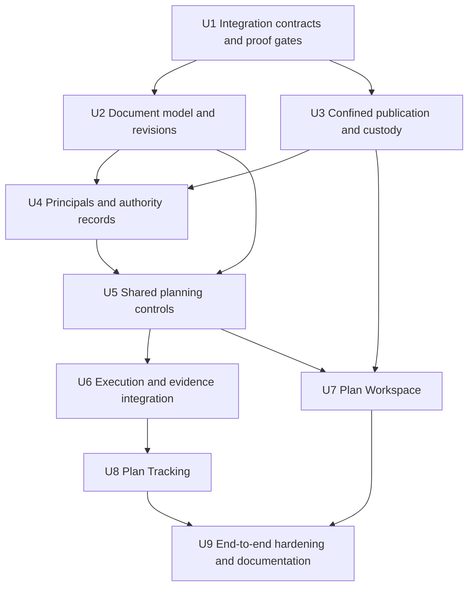

# feat: fixture wrapper

## Summary

Wrapper section that must not be scanned for units.

## Implementation Units

The gates in U1 and U3 are dependencies, not optional follow-ups. Prototype or characterization results produced during implementation must be reviewed before the dependent capabilities are enabled.

U1 establishes contracts, external ownership, and the proof plan. The producing units below supply the actual implementation proofs; U1 does not depend on their completion. Pure model work and disabled integration fixtures may proceed before proof, but registration is not permission to activate a capability.

| Capability gate | Proof owner | Named proof targets | Activation consequence |
|---|---|---|---|
| Revision and unit eligibility | U2 | `src/planning/document.test.ts`, `units.test.ts`, `revisions.test.ts` | Invalid or ambiguous structure cannot enter structured approval/Start/tracking. |
| Confined publication and durable custody | U3 | `src-tauri/tests/planning_publication.rs`; inline tests in `plan_fs.rs` and `planning_store.rs` | Project writes and authority persistence stay unavailable until preservation/recovery passes. |
| Authenticated principal and current grants | U4 | `sidecar/ide-server/planning-principal.integration.test.ts`; `src/planning/authority.test.ts`; inline native authority tests | Privileged actions stay unavailable until real host binding and native authorization pass. |
| Correlated execution, boundary acknowledgment, and evidence | U6 | `src/planning/execution.integration.test.ts`, `execution.test.ts`, `evidence.test.ts` | No successful Start/handoff/verification claim without the corresponding backend proof. |
| Human/agent convergence | U9 | `src/planning/lifecycle.integration.test.ts`, `sidecar/ide-server/planning.integration.test.ts` | Full-lifecycle completion requires real restricted-controller and UI evidence. |

- [x] **U1. Establish host and filesystem integration contracts**

**Goal:** Establish the external contracts and executable proof gates before depending on unverified capabilities.

**Requirements:** R4, R9–R11, R13, R15–R18; F2–F4; AE3, AE5–AE12.

**Dependencies:** None. Authentication, dependency, and native-write changes require the repository's implementation approval gates.

**Files:**
- Create: `docs/architecture/planning-host-contract.md`, `docs/architecture/planning-publication-contract.md`.
- Create: `src/planning/contracts.ts`, `src/planning/contracts.test.ts`.
- Test: `sidecar/ide-server/mcp-server.test.ts`, `src/layout/bridge.test.ts`.
- External prerequisite: identify and record the exact controlled host source, adapter owner, file targets, and release carrying the contract; do not guess them from an unrelated checkout.

**Approach:** Define capability negotiation for authenticated actor context, precise dispatch correlation, unit-boundary acknowledgment, and evidence provenance. Define the confined-publication failure/recovery contract. Lock the real host integration route and supported filesystem proof before dependent features activate; a fixture-only adapter is not a completed integration.

**Patterns:** Existing bridge schemas, result normalization, target ownership validation, and the restricted-controller dogfood contract.

**Execution note:** Characterize the actual host and filesystem boundary before implementing dependent behavior; use `test-driven-development` for new contracts.

**Test scenarios:**
- U1 wire fixtures: well-formed raw invocation reports, capability advertisements, and publication intents round-trip without acquiring authority.
- U1 boundary fixtures: reject malformed versions, control characters, invalid IDs/hashes, duplicate capabilities, and extra trust/credential fields; preserve valid source strings unchanged.
- U4 producer target: differently authorized agents sharing a connection receive distinct approval/Start decisions; missing or forged binding cannot enable privileged actions.
- U4 producer target: demonstrate non-model-controlled principal propagation through the real connector using the exact source/release identified here.
- U3 producer target: exercise an external write after the final revision check and interrupted publication without weakening preservation.

**Verification:** Contracts, external ownership, and compatibility evidence are recorded. Unsupported capabilities fail closed. Unresolved source or safety guarantees remain explicit blockers, not claimed implementation readiness.

**Gate responsibility:** Record contract acceptance and external source ownership here; retain implementation-proof ownership in U2/U3/U4/U6. Do not mark their capabilities ready merely because U1's contract fixtures pass.

**Discovery deliverable and stop condition:** `docs/architecture/planning-host-contract.md` records the target repository, exact source reference and release relationship, integration owner, external file/test targets, trusted caller-context injection point, and available versus missing correlation/boundary/evidence capabilities. Each entry cites its source. Discovery is complete only when these items identify an implementable adapter route; an unavailable source or unidentified owner is a named blocker, not permission to substitute an adjacent version or continue an open-ended search. U1 reports that blocker before dependent capability activation.

**Completed U1 evidence:**
- Source and ownership are recorded in `docs/architecture/planning-host-contract.md`: runtime context exists in `SessionTools.resolve`, but the pinned `McpCatalog.convertTool` does not construct an agent-principal assertion. Wrapper provenance and runtime integration provenance are distinguished.
- `docs/architecture/planning-publication-contract.md` defines the confined-publication outcomes, recovery obligations, and U3 proof matrix without claiming a working filesystem algorithm.
- `src/planning/contracts.ts` and `contracts.test.ts` provide three strict, untrusted wire schemas and 43 passing contract tests. The schemas are imported only by their tests, not by runtime code.
- Final repository checks: 1,104 tests passed; typecheck, lint, and diff checks exited zero. Scoped diagnostics reported no errors or warnings. Existing design-check evidence remains applicable because no UI/style behavior changed.
- Authenticated host binding, native publication, and actual execution/boundary/evidence integration remain pending U3/U4/U6 producer proofs. U1 completion does not activate them or advance U2.

- [ ] **U2. Implement source-preserving documents, unit identity, and revisions**

**Goal:** Model editable Markdown, immutable approval-bearing revisions, proposals, and stable units without losing source content.

**Requirements:** R1–R3, R5–R7, R10, R12, R15; F1–F3; AE1, AE4, AE5, AE8, AE11.

**Dependencies:** U1 contract definitions; no requirement to enable filesystem mutation while modeling fixtures.

**Files:**
- Create: `src/planning/document.ts`, `document.test.ts`, `units.ts`, `units.test.ts`.
- Create: `src/planning/revisions.ts`, `revisions.test.ts`, `proposals.ts`, `proposals.test.ts`.
- Create: `src/planning/fixtures/` with representative plan Markdown and unsupported-syntax cases.

**Approach:** Parse readable stable keys, dependencies, and acceptance criteria while retaining original ranges and bytes. Preserve unknown regions. Progress and feedback use separate typed metadata outside canonical Markdown; the approval-bearing identity hashes the entire Markdown source. Manually editing a checkbox or comment in that file is a content change requiring reapproval, not an exempt observation update. Proposals identify their base revision and cannot silently apply to a different draft. Native storage in U3 retains full revision bytes; this unit owns only pure models and validation, with no filesystem writes or runtime registration.

**Patterns:** DOM-free panel view modules, discriminated command schemas, and the origin's content-versus-observation distinction.

**Execution note:** Implement pure behavior test-first.

**Test scenarios:**
- Happy path: existing and newly created Markdown plans produce stable units and revision identities.
- Edge: rename/reorder a unit without changing its key; history remains associated correctly.
- Edge: frontmatter, tables, fenced JSON/Mermaid, comments, Unicode, and unknown syntax survive no-op round trips.
- Error: duplicate/missing keys, invalid dependencies, or unsupported tracking structure produce explicit validation results, not inferred units.
- Error: a proposal targeting an older base cannot overwrite newer edits.
- Integration: content edits require new approval, while a supported progress/annotation update preserves the approval-bearing identity; unknown field edits do not receive this exemption.

**Verification:** The corpus retains source content and yields deterministic identities. Missing historical bytes cannot be papered over by opening the current path.

- [ ] **U3. Add confined publication and protected native custody**

**Goal:** Safely edit enrolled project documents and durably store snapshots and planning authority records.

**Requirements:** R1, R2, R5–R7, R17, R18; F1, F4; AE1, AE4, AE7, AE12.

**Dependencies:** U1 publication contract. Production writes remain gated until its filesystem guarantees pass.

**Files:**
- Create: `src-tauri/src/plan_fs.rs`, `src-tauri/src/planning_store.rs`, with inline unit tests.
- Create: `src-tauri/tests/planning_publication.rs` for real filesystem interleavings and recovery.
- Modify: `src-tauri/src/lib.rs`; `src-tauri/Cargo.toml` only for explicitly approved dependency needs.
- Create: `src/planning/native.ts`, `native.test.ts`.

**Approach:** Resolve logical document references to enrolled Markdown under validated roster roots. Keep authority and snapshot storage outside those roots. Confine native commands to trusted application entry points, not caller-supplied UI flags. Preserve drafts and external versions, distinguish pre-publication conflicts from uncertain publication outcomes, and make crash recovery explicit. Select the publication primitive only after the U1/U3 proof; refuse unsupported operations rather than claiming portable CAS. Protect acknowledged record commits and revocations across crashes.

**Registration:** Register only the confined native commands through `src-tauri/src/lib.rs` and their typed frontend adapters. There is no general-purpose write command or path-based access to protected storage. Command presence and capability readiness are separate checks.

**Patterns:** Existing Rust read seams and rendezvous custody, extended without exposing general filesystem access through the sidecar.

**Execution note:** Begin with failing filesystem and crash-recovery integration cases, not a mock-only save test.

**Test scenarios:**
- Happy path: create/update an enrolled plan; its immutable snapshot remains readable after later edits.
- Edge: external writer changes the destination between check and publication; preserve both versions and surface the required resolution rather than silently succeeding.
- Error: symlink escape, traversal, stale enrollment, protected-store alias, wrong file type, and unauthorized window/caller are rejected.
- Error: unsupported filesystem guarantees disable publication without a destructive fallback.
- Integration: interrupt record/publication commits at each durable boundary; acknowledged records survive and uncertain operations recover conservatively.
- Integration: race protected-record updates with revocation or a newer association version; stale writes conflict and cannot resurrect prior authority or replace newer records.
- Integration: concurrent app and external edits preserve both candidates for an explicit comparison/merge choice.

**Verification:** Actual filesystem tests establish the preservation contract. A write gate cannot be marked complete by atomic-rename documentation alone. Update the native permission/custody design only with explicit implementation approval.

- [ ] **U4. Bind principals and enforce durable per-action authority**

**Goal:** Make approval and Start authorization attributable, revocable, and independent of mutable content.

**Requirements:** R4, R5, R8, R11, R15; F2, F3; AE2, AE3, AE9–AE11.

**Dependencies:** U1's accepted host identity contract and identified integration owner, U2 revision model, U3 protected custody. U4 owns the end-to-end principal/authorization proof before activation.

**Files:**
- Create: `src-tauri/src/planning_authority.rs` with inline tests.
- Create: `src/planning/authority.ts`, `authority.test.ts`.
- Create: `sidecar/ide-server/planning-principal.integration.test.ts`.
- Modify/Test: `sidecar/ide-server/http-auth.ts`, `http-auth.test.ts`, `ws-bridge.ts`, `ws-bridge.test.ts`, `index.ts`.
- Modify/Test: `src/layout/bridge-protocol.ts`, `bridge.test.ts`, `scripts/ide-mcp-bridge.ts`, `scripts/ide-mcp-bridge.test.ts`.
- Modify: `src-tauri/src/ide_sidecar.rs`, `src-tauri/src/lib.rs`.

**Approach:** Validate the trusted host envelope, bind a principal independently of tool arguments, and carry that context to native policy. Keep native operator/webview trust distinct from delegated MCP access. Check current actor/grant state for each approval or Start; browser caches are display hints only. Preserve historical approval records while new content remains unapproved. Verification submissions also identify an authorized source, rather than accepting arbitrary self-reported success.

**Registration:** Wire the validated principal through HTTP authentication, bridge request decoding, shared command dispatch, and native policy. Register native authority commands in `src-tauri/src/lib.rs`; no unvalidated or legacy channel implicitly becomes a privileged principal.

**Patterns:** First-frame authentication, transport generation replacement, explicit target resolution, and generic non-echoing failures.

**Execution note:** Implement authority behavior test-first, including malicious requests through the actual protocol boundary.

**Test scenarios:**
- Happy path: human approval/Start succeeds without agent grants; a delegated agent succeeds only for its granted action and target.
- Edge: revoke a grant between observations and invocation; the next action is denied.
- Error: a valid connector credential plus a forged agent ID or UI source cannot acquire authority.
- Error: a delegated caller cannot authenticate as the trusted webview or mint its own privileged context.
- Integration: differently authorized agents on one connection cannot borrow each other's grants; test real host injection rather than hand-built trusted fixtures alone.
- Integration: restart, reconnect, corrupt authority state, and stale credential generations preserve the fail-closed boundary without replay.

**Verification:** Origin AE3/AE9/AE10 pass through UI and MCP paths. Grants and credentials never appear in tool arguments, transcript text, read serializers, or logs. No same-OS-user sandbox claim is made.

- [ ] **U5. Expose shared planning commands and allowlisted views**

**Goal:** Give humans and agents equivalent planning outcomes through one policy-bearing command layer.

**Requirements:** R1, R3–R11, R17, R18; F1–F4; AE1–AE5, AE7, AE9, AE10, AE12.

**Dependencies:** U2, U3, U4.

**Files:**
- Create: `src/planning/commands.ts`, `commands.test.ts`, `executor.ts`, `executor.test.ts`, `views.ts`, `views.test.ts`.
- Modify/Test: `src/layout/bridge.ts`, `bridge-protocol.ts`, `bridge.test.ts`.
- Modify/Test: `sidecar/ide-server/mcp-server.ts`, `mcp-server.test.ts`.
- Modify/Test: `src/panels/audit-log/audit-store.ts`, `audit-store.test.ts`.

**Approach:** Add planning-domain primitives for document discovery/read/edit, proposal review, revision comparison/approval, execution intent, and bounded observation reads. Reuse target resolution and result normalization without mixing all planning implementation into the existing session executor. Native policy remains authoritative under both callers. Render safe metadata separately from opaque user-authored content; do not expose arbitrary paths, stored credentials, or protected-record mutation primitives.

**Registration:** Register every planning command and its result view in the shared dispatcher, bridge schema/decoder, and MCP definition table. Keep existing domains compatible. A registered handler still checks capability readiness and authority at invocation; registration cannot bypass a gate.

**Patterns:** `registerSessionTool`/`runSessionTool`, allowlisted views, source-aware audit emission, and delivery-class normalization.

**Execution note:** Start with contract tests covering both entry paths.

**Test scenarios:**
- Happy path: UI and MCP create/edit/review the same document and observe the same revision and decision.
- Edge: comments/progress preserve approval while accepted proposal content creates a new unapproved revision.
- Error: unknown document/project, stale revision, missing target, or denied authority prevents dispatch and produces an actionable result.
- Error: injected plan/proposal text cannot alter routing, principal, or audit identity.
- Integration: discovery and read results remain bounded and path-safe; sensitive records cannot be written through document operations.
- Integration: approval emits an approval result and audit event, never a backend prompt.

**Verification:** A UI-to-agent outcome map covers every new visible action. Existing layout/session tools retain their behavior and failure distinctions.

- [ ] **U6. Integrate Start, boundary handoffs, and evidence observations**

**Goal:** Bind approved work to actual backend activity without inventing execution truth.

**Requirements:** R8–R16; F3; AE2, AE5, AE6, AE8, AE9, AE11.

**Dependencies:** U1 compatible backend contracts, U4 authority, U5 commands.

**Files:**
- Create: `src/planning/execution.ts`, `execution.test.ts`, `observations.ts`, `observations.test.ts`, `evidence.ts`, `evidence.test.ts`.
- Create: `src/planning/execution.integration.test.ts` for actual correlation, handoff, and evidence contracts.
- Modify/Test: `src/server/bus.ts`, `bus.test.ts`, `src/ide/executor.ts`, `executor.test.ts` only at shared integration seams.
- External prerequisite: host/backend adapter delivery for correlation, actual boundary acknowledgments, and attributable unit/evidence data, with source/file ownership recorded in U1.

**Approach:** Persist authorized intent and correlation before possible delivery. Dispatch the immutable approved input through the shared facade. Reconcile using exact backend identities; preserve unresolved delivery and never auto-retry. A handoff remains pending until the execution owner acknowledges its boundary. Store revision-qualified associations and observations, including source/freshness, while deriving actual activity from the backend. Recorded failed checks remain failed verification even when an evidence record exists.

**Progression boundary:** Only the execution owner advances work. Mothership can display observations, request authorized actions, correlate results, and record authorized verifier outcomes; local UI state, dependency displays, timers, and freshness cannot autonomously dispatch or advance units.

**Patterns:** `dispatchPromptHandler`, `reconcileDispatchFailure`, session ownership resolution, bounded reconciliation, and hybrid poll/SSE.

**Execution note:** Use transport and backend integration characterization before enabling lifecycle claims.

**Test scenarios:**
- Happy path: approved Start binds the exact snapshot, target, principal, and resulting session without approval causing an earlier dispatch.
- Error: disconnect after send retains indeterminate delivery; restart does not resend or bind by title/prose similarity.
- Edge: edit the current path after Start; running work still uses the immutable approved input.
- Edge: rename/reorder/add/remove pending units during handoff; preserve old history and reject ambiguous or unsafe remapping rather than replay completed work.
- Error: a changed prerequisite cannot satisfy the new contract solely through an old matching unit key.
- Integration: real execution-owner acknowledgment precedes adoption of the new revision; UI observation alone cannot advance the boundary.
- Integration: late/failed/unauthorized evidence does not verify another revision; source loss preserves last-known information with freshness, not fabricated completion.

**Verification:** Real backend traces demonstrate the association and handoff contract. Generic todos, mocked boundary acknowledgments, and idle sessions are insufficient evidence of completion.

- [ ] **U7. Build the Plan Workspace panel**

**Goal:** Provide native authoring, proposal review, revision comparison, approval, and conflict resolution.

**Requirements:** R1–R8, R17, R18; F1, F2, F4; AE1, AE3, AE4, AE7, AE10, AE12.

**Dependencies:** U2/U3 document services, U5 shared commands. Rendering prototypes do not waive the publication gate.

**Files:**
- Create: `src/panels/plan-workspace/index.ts`, `PlanWorkspacePanel.tsx`, `plan-workspace-view.ts`, `plan-workspace-view.test.ts`.
- Create: `src/panels/plan-workspace/markdown-view.ts`, `markdown-view.test.ts`, `review-view.ts`, `review-view.test.ts`.
- Modify/Test: `src/layout/bootstrap.ts`, `DockviewShell.tsx`, `DockviewShell.test.ts`.
- Modify: `package.json` and lockfile only after an explicit compatible Markdown/diff dependency decision and approval.

**Approach:** Follow the existing design system. Keep a primary document surface with in-panel proposal/comparison/history modes. Preserve unsupported Markdown as visible source regions with targeted editing. Show revision, save/conflict state, and approval separately. All mutations call U5. Current content and its approval must never be confused with historical approval.

**Registration:** Register the panel type in `src/layout/bootstrap.ts` through the existing registry; extend component-type live-parameter injection and restore tests. MCP opening exposes the same panel, not a bypass around planning authority or publication readiness.

| Review or conflict action | Document and approval outcome |
|---|---|
| Accept or edit a proposal | Apply only against its validated base; changed content becomes an unapproved revision. |
| Reject a proposal | Record the proposal outcome; leave baseline content and its existing approval unchanged. |
| Withhold candidate approval | Create no approval or execution. A candidate without approval remains unapproved; historical records are preserved. |
| Choose external content | Adopt the freshly validated external version while retaining the local draft for recovery; do not overwrite the external file merely to adopt it. |
| Choose local content | Explicitly authorize publication against the external version just compared; another external change produces another conflict, not a force overwrite. Retain the external candidate. |
| Merge | Build a reviewable candidate from both versions, retain both inputs, and publish through the same version/safety checks. Changed content requires its own approval. |

Leaving the conflict unresolved preserves both versions and does not publish a resolution. The comparison remains available rather than turning a rejected proposal or a cancelled interaction into discarded work.

**Patterns:** DOM-free view models, component-type live-parameter injection, existing tokens, and independently removable panel registration.

**Execution note:** View behavior is test-first; visual implementation belongs to a design specialist.

**Test scenarios:**
- Happy path: create or open a plan, request feedback, accept/edit/reject proposals, compare revisions, and approve the displayed candidate.
- Edge: frontmatter, comments, fences, tables, and unknown regions remain intact through no-op and targeted edits.
- Error: conflict or unsupported publication preserves draft/external text and presents explicit next actions.
- Integration: a concurrent agent edit updates the panel without silently replacing local work.
- Integration: keyboard-only review, narrow/wide Dockview sizes, focus restoration, reduced motion, and non-color status cues.
- Integration: dynamically opened/restored panels receive current context without persisting grants or live dependencies in layout state.

**Verification:** Screenshots or a short visual verification note cover ordinary, denied, stale, unsupported-syntax, and conflict states. The pinned design detector remains clean. Start is not triggered by approval.

- [ ] **U8. Build the Plan Tracking panel**

**Goal:** Make execution binding, unit progress, evidence, and uncertainty legible without duplicating transcript or scheduler behavior.

**Requirements:** R8–R16; F3; AE2, AE5, AE6, AE8–AE11.

**Dependencies:** U5/U6; reuse U7's document/revision navigation rather than duplicating it.

**Files:**
- Create: `src/panels/plan-tracking/index.ts`, `PlanTrackingPanel.tsx`, `plan-tracking-view.ts`, `plan-tracking-view.test.ts`.
- Create: `src/panels/plan-tracking/unit-detail-view.ts`, `unit-detail-view.test.ts`.
- Modify/Test: `src/layout/bootstrap.ts`, `DockviewShell.tsx`, `DockviewShell.test.ts`.

**Approach:** Use an execution-binding header, dense keyboard-navigable unit rows, and an in-panel detail view. Keep work status, verification, and freshness distinct. Link dependencies and existing transcript panels; do not duplicate session content storage. Display pending versus acknowledged handoff and exact old/new revision bindings. Show why Start is unavailable without adding a per-unit Start gate.

**Registration:** Register the panel and component-type live dependencies in the same bootstrap/restore paths as U7. Verify both dynamic MCP opening and persisted-layout restoration without granting execution authority through panel parameters.

| Blocked Start reason | Visible recovery path |
|---|---|
| No approved selected revision | Open the candidate/revision comparison and request or perform an authorized approval. Approval still does not press Start. |
| No execution target | Select a valid target, then explicitly invoke Start. |
| Missing or revoked agent authority | Show the denied action and provide the operator delegation/review path; do not acquire or restore a grant automatically. |
| Unsupported host or unmet integration gate | Show the missing capability and its setup/proof requirement; do not fall back to unidentified execution. |
| Pending or indeterminate prior attempt | Inspect its recorded binding and reconcile delivery before offering actions that assume an execution exists. |

The header leads with selected revision and target, then delivery/handoff state. Unit rows lead with work status: unstarted, running, waiting/blocked, reported finished, failed, or cancelled. Separate labeled indicators show verification (unverified, passing, failed) and freshness (current, stale, disconnected, or unknown); neither overwrites work status. Unit detail exposes the stable key, bound revision, session, dependencies, evidence, and verifier. A pending handoff and its acknowledged destination are distinct header states.

**Patterns:** Existing roster/session/transcript view modules, shared focus commands, token-only styling, and explicit empty/error states.

**Execution note:** State projection is test-first; visual implementation belongs to a design specialist.

**Test scenarios:**
- Happy path: choose an approved revision and target, explicitly Start, inspect units, dependencies, sessions, and evidence.
- Edge: reported finished with failed verification remains distinguishable from a passing verified unit.
- Error: missing/revoked Start authority, missing approval/target, and unsupported backend capability show distinct blocked actions.
- Integration: delayed observations retain last-known status plus freshness, including after panel close/reopen.
- Integration: handoff preserves old-revision records and never visually resets running work to Approved.
- Integration: keyboard navigation, narrow Dockview layout, focus, contrast, and restored/dynamic panel context remain correct.

**Verification:** Visual evidence covers reported/verified/failed/stale/unknown states. Session links converge with existing focus/transcript behavior under UI and MCP actions.

- [ ] **U9. Verify the complete lifecycle and document the boundaries**

**Goal:** Demonstrate the full human/agent workflow and record the new custody, capability, and failure contracts.

**Requirements:** R1–R18; F1–F4; AE1–AE12.

**Dependencies:** U1, U2, U3, U4, U5, U6, U7, U8, including actual host/publication gate evidence.

**Files:**
- Create: `src/planning/lifecycle.integration.test.ts`, `sidecar/ide-server/planning.integration.test.ts`.
- Extend: `src-tauri/tests/planning_publication.rs`, relevant bridge and panel tests.
- Modify: `AGENTS.md`, `ARCHITECTURE.md`, `STRUCTURE.md`, `README.md`.
- Create: `docs/architecture/planning-lifecycle.md` with custody, compatibility, recovery, and UI/MCP capability mapping.

**Approach:** Exercise real shared services, native custody, transport, and the compatible host. Record the narrow app-owned planning-data exception without weakening backend execution ownership. Document how operators enroll plans, delegate/revoke actions, recover conflicts or uncertain delivery, and distinguish an observation from verified evidence.

**Patterns:** Existing restricted-controller dogfood, failure-class tests, source-safe views, and the project verification gates.

**Test scenarios:**
- Integration: a genuinely MCP-only controller performs the supported lifecycle while a separately authorized reviewer approves; it cannot self-escalate or Start with approval-only authority.
- Integration: human and agent actions converge on document revisions, approval, execution bindings, and audit views.
- Integration: revoke, restart, disconnect, external edit, conflicting proposal, and late verification at their relevant boundaries.
- Error: spoof host/principal/target/revision/evidence, attempt protected-store/path escape, and attempt native-webview impersonation.
- Integration: preservation corpus, real publication interleavings, snapshots, handoffs, and outcome evidence remain inspectable after recovery.

**Verification:** Applicable TypeScript/Rust checks and design gates pass; UI evidence and a real restricted-controller transcript establish the outcome. Record any unsupported host/filesystem as unsupported rather than claiming the entire lifecycle is verified there. No release or public repository operation is implied.

## System-Wide Impact

Trailing section; the Implementation Units section must end before here.
